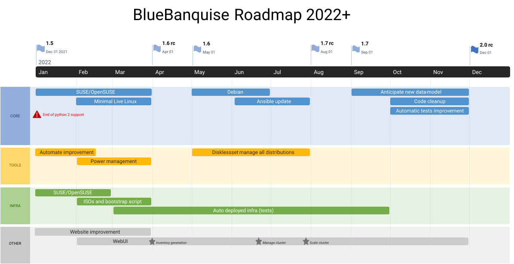

# ROADMAP  :steam_locomotive::railway_car::railway_car::railway_car:

Roadmap only describes major objectives. Small objectives are developed as stream.

## 1.6

### Main objectives, mandatory

#### Core

- Suse/OpenSuse integration
- Minimal Live Linux integration (as a tool)

#### Tools/Infrastructure

- Suse/OpenSuse integration into infrastructure
- Suse/OpenSuse integration into bootset tool
- Automate improvement
- Power management tool
- Provides ISOs and bootstrap scripts
- Start working on the full test infrastructure (look for hardware)

### Optional objectives

#### Community

- Integrate https://github.com/neilmunday/slurm-mail to Slurm Community role
- K8S Hybrid cluster