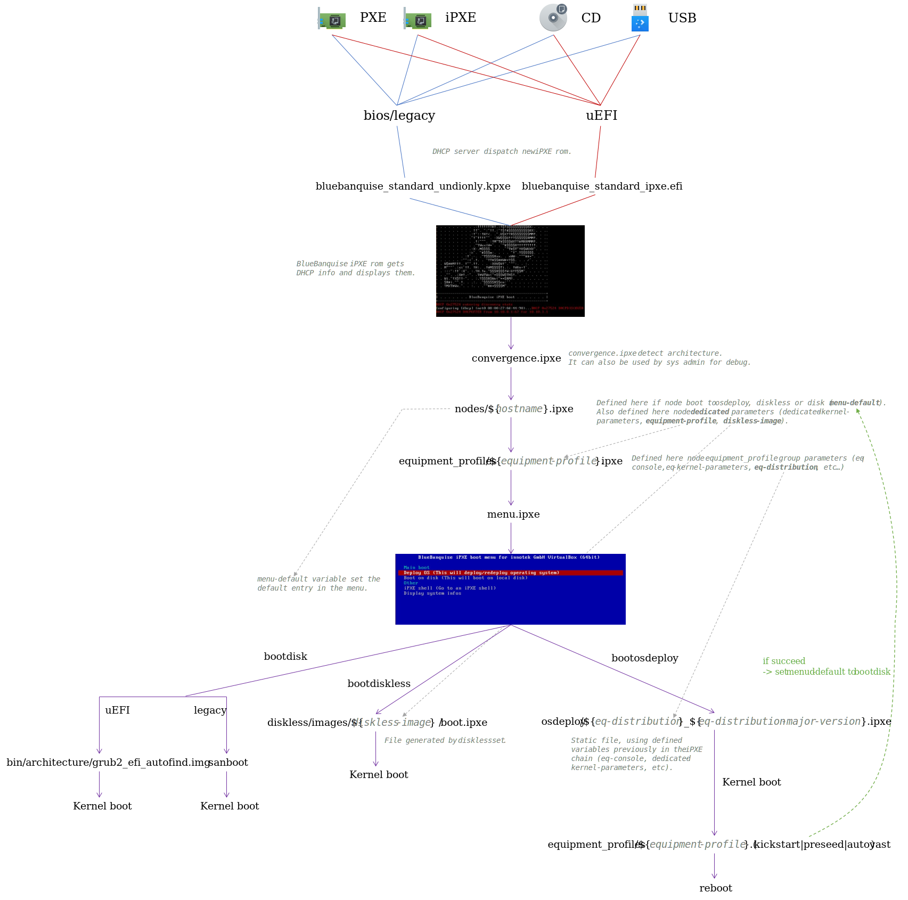

# PXE Stack

## Description

This role provides the whole PXE stack needed to deploy computers over the network (assuming coupled with a dhcp server).
This role is one of the major role of the BlueBanquise project.

## Data Model

This role relies on [data model](https://github.com/bluebanquise/bluebanquise/blob/master/resources/data_model.md):
* Section 1 (Networks)
* Section 2 (Hosts definition)
* Section 3.1 (Managements Groups)
* Section 3.2 (Equipment Groups)

## Quick start

This quick start assume an x86_64 system booting over EFI PXE.

1. Ensure dhcp server target filename `x86/standard_snponly_ipxe.efi`, or if using a custom iPXE, that it chains to `http://yournextserverip/pxe/convergence.ipxe`.
2. If needed, configure target console using `pxe_stack_ep_console` parameter.

```yaml
pxe_stack_ep_console: console=ttyS0,115200
```

3. Set the target Linux distribution to deploy, using `pxe_stack_ep_operating_system dict`:

```yaml
pxe_stack_ep_operating_system:
  distribution: ubuntu
  distribution_version: 22.04
  distribution_major_version: 22
  repositories_environment:
```

4. If not using default partitioning, configure `pxe_stack_ep_partitioning`, providing your target Linux distribution autoinstall partitioning raw syntax (kickstart, autoyast, preseed, curtin, etc.).
4. Deploy the role


## Detailed Instructions

This role will deploy all the needed files, binaries, and scripts to deploy
remote hosts using PXE (or even USB and CD boot to trigger PXE on non PXE able systems).

The role takes place just after the dhcp in the PXE deployment, and will
configure all the iPXE chain needed after dhcp provided hosts with next-server
ip address and filename to use.

### Files location

* PXE boot files are located in `{{ pxe_stack_htdocs_path }}/pxe/`, with path depending of the operating system.
   * `bin/` directory contains some needed bin files, typically grub2 files for EFI boot.
   * `equipments/` directory contains equipments related files, i.e. ipxe file with group variables, and os configuration files (kickstart, preseed, autoyast).
   * `nodes/` directory contains hosts dedicated files, i.e. ipxe file with hosts dedicated variables.
   * `osdeploy/` directory contains static files, with patterns to boot each kind of supported distributions.
* Basic configuration files are located in /etc/bluebanquise/bootset.
   * `nodes_parameters.yml` contains all nodes PXE needed parameters.
   * `pxe_parameters.yml` contains needed values for scripts to adapt to **current pxe server host** (these parameters do not apply to PXE booted hosts !!).
* Scripts are located in /usr/bin/.

### Inventory configuration

This role will rely on multiple parts of the inventory, and is probably the most "invasive" role of the whole collection.

* equipment parameters are used for each equipment group. All
  boot configuration is made relying on it (operating system, cpu architecture,
  console, kernel parameters, etc.). It is recommended to ensure coherency of
  the equipment files.
* authentication parameters are used to provide admin password and default ssh
  authorized key.
* hosts **network_interfaces** dedicated variables, to be able to force static
  ip address at kernel boot.

### bluebanquise-bootset usage

Once the role is deployed, and hosts gathered into `/etc/bluebanquise/bootset/nodes_parameters.yml`, the **bluebanquise-bootset** tool can be used to manipulate remote hosts PXE boot. By default, 3 states can be defined for each host:

* osdeploy: the remote host will deploy/redeploy its operating system, using inventory equipment parameters of its equipment profile group.
* disk: the remote host will boot on disk. This parameter is automatically set after a successful **osdeploy**.
* diskless: the remote host will boot using a diskless mechanism. This diskless boot is generic, and is handled by an optional external role.

Again, consider that if you set an host to osdeploy, and that it succeed its deployment, stack will automatically set the host into disk boot for next boot, to avoid infinite reinstallation loop.

To get bluebanquise-bootset help, use:

```
bluebanquise-bootset -h
```

To ask an host to deploy/redeploy its operating system, use:

```
bluebanquise-bootset -n c001 -b osdeploy
```

With c001 the target host to be redeployed.

To set this host to boot on disk, use:

```
bluebanquise-bootset -n c001 -b disk
```

It is also possible to work on a range of host, using nodeset formatting:

```
bootset-bootset -n c001,c002,c[010-020],login1 -b disk
```

If some inventory parameters related to the host have been updated recently, it may be required to force files regeneration instead of simply modifying them. To do so, use:

```
bootset-bootset -n c001 -b osdeploy -f update
```

Also, on some "difficult" networks, system administrator may require to force static ip at boot. This can be achieved using:

```
bootset-bootset -n c001 -b osdeploy -f network
```

Or in combination with update, using comma separated:

```
bootset-bootset -n c001 -b osdeploy -f update,network
```

The tool is relatively verbose, and should provide all needed information on the fly on what it is doing.

Last part, regarding diskless. An image name need to be provided:

```
bootset-bootset -n c001 -b diskless -i myimage
```

This part should be covered in a diskless related role, and is not in the scope of this role.

### iPXE chain

PXE part of the **BlueBanquise** stack relies heavily on iPXE, and its chain mechanism. This chain has multiple purposes:

* Most important, it is verbose, and can be manually manipulated or followed (watching http server logs).
* It is flexible, and can adapt to nearly any configuration (disk boot, os deployment, diskless, ...).
* It can operate on all hardware, from server to laptop. It can even be started from USB or CD image for non PXE able systems.

Some steps may seems weird or unnecessary, but are here on purpose: verbosity and debug, as PXE part is always the trickiest.

Some vocabulary: in the following document, **chain* or **chaining** refers to the iPXE mechanism that download and execute a new file, after the current one.

Also, all files root is assumed `/var/www/html/preboot_execution_environnement` on the next-server (the server on which this pxe_stack role has been deployed).

The whole process can be resumed in one detailed schema:



To be macroscopic:

#. The remote host boot over PXE, in EFI/legacy-bios, using its own PXE/iPXE rom.
#. The dhcp deployed by BlueBanquise will provide the host with the **BlueBanquise** iPXE rom. This iPXE rom contains an EMBED script that will display the logo, get an ip from the dhcp server, show some information, and chain to file *convergence.ipxe*.
#. *convergence.ipxe* will simply get the current architecture. This operation cannot be done into the EMBED script has it needs some logic, that could bug. Sys admin need to easily debug this without the need to rebuild iPXE roms. Then iPXE chain to *nodes/${hostname}.ipxe* with *hostname* the hostname provided by the dhcp server.
#. *nodes/${hostname}.ipxe* will define all host dedicated parameters, and also what host should do: boot on disk, deploy os, or boot in diskless. Then iPXE chain to *equipments/${equipment-profile}.ipxe*, with *equipment-profile* a variable defined in the current file.
#. *equipments/${equipment-profile}.ipxe* contains the host equipment profile group parameters, like operating system, console, kernel parameters, etc. Then iPXE chain to *menu.ipxe*.
#. *menu.ipxe* will display a basic menu on screen, with default set to what node is expected to do (this was gathered in *nodes/${hostname}.ipxe*). Timeout is 10s by default before host execute the expected action. Then, iPXE chain to:

   * *osdeploy/${eq-distribution}_${eq-distribution-major-version}.ipxe* if host needs to deploy/redeploy its operating system. These osdeploy files are dynamic, and adapt to parameters gathered in host dedicated file and host equipment file.
   * *diskless/images/${diskless-image}/boot.ipxe* if host needs to boot in diskless.
   * *sanboot --no-describe --drive 0x80* if host is legacy/bios/pcbios based. This is a simple command that boot on disk.
   * *bin/${arch}/grub2_efi_autofind.img* if host is EFI based. This grub2 image will look for a disk with a know operating system, and boot on it.

In case of an OS deployment, if this deployment succeed, in the post install script section, remote host will ask, using a curl command on its side and an CGI python script on server side (*/var/www/cgi-bin/bootswitch.cgi*), to boot next to disk. This CGI python script will simply edit *node/${hostname}.ipxe* file and change its default boot to **bootdisk**.

All files are manually editable. Also, note that an unregistered host (so no hostnames provided by the dhcp) will try to load *nodes/.ipxe* file. By default, this file will simply provide an iPXE shell, but system administrator can tune this file to specific purposes.

To follow the deployment process, simply tail -f logs of http server, and see the whole process occurring.

### Optional parameters

It is possible to force the main network interface for bootset -f network usage, by setting ``pxe_stack_node_main_network_interface``
for a group of hosts or even at hostvars level.

## Changelog

* 1.8.2: RedHat missing rpm. Alexandra Darrieutort <alexandra.darrieurtort@u-bordeaux.fr>, Pierre Gay <pierre.gay@u-bordeaux.fr>
* 1.8.1: Update to BB 2.0 format again. Alexandra Darrieutort <alexandra.darrieurtort@u-bordeaux.fr>, Pierre Gay <pierre.gay@u-bordeaux.fr>
* 1.8.0: Update to BB 2.0 format. Benoit Leveugle <benoit.leveugle@gmail.com>
* 1.7.0: Add force main NIC and fix gateway. Benoit Leveugle <benoit.leveugle@gmail.com>
* 1.6.4: Improve idempotency of role pxe_stack. #sla31
* 1.6.3: Prevent crash when empty ep group. Benoit Leveugle <benoit.leveugle@gmail.com>
* 1.6.2: Added pxe_stack_opensuse_preserve_sources_list variable to handle activation of online repos in autoyast files. Neil Munday <neil@mundayweb.com>
* 1.6.1: Updated to work with both SLES and OpenSUSE and install sudo package if sudo use is enabled. Neil Munday <neil@mundayweb.com>
* 1.6.0: Allow to choose between root or sudo user. Benoit Leveugle <benoit.leveugle@gmail.com>
* 1.5.0: Update to pip Ansible. Benoit Leveugle <benoit.leveugle@gmail.com>
* 1.4.1: Extend bootset support for custom htdocs path. Benoit Leveugle <benoit.leveugle@gmail.com>
* 1.4.0: Added OpenSuSE support. Neil Munday <neil@mundayweb.com>
* 1.3.7: Allow manipulating sources list in autoinstall on Ubuntu. Benoit Leveugle <benoit.leveugle@gmail.com>
* 1.3.6: Fix missing efi check in auto install files. Benoit Leveugle <benoit.leveugle@gmail.com>
* 1.3.5: Fix missing tftp path for Ubuntu. Benoit Leveugle <benoit.leveugle@gmail.com>
* 1.3.4: Fix missing efi bootorder management for Ubuntu. johnnykeats <johnny.keats@outlook.com>
* 1.3.3: Add bootset as package. Benoit Leveugle <benoit.leveugle@gmail.com>
* 1.3.2: Prevent unsorted ranges. Benoit Leveugle <benoit.leveugle@gmail.com>
* 1.3.1: Adapt role to handle multiple distributions. Benoit Leveugle <benoit.leveugle@gmail.com>
* 1.3.0: Add Ubuntu support. Benoit Leveugle <benoit.leveugle@gmail.com>
* 1.2.0: Add compatibility for multiple OS distributions (RedHat like). Benoit Leveugle <benoit.leveugle@gmail.com>
* 1.1.7: Update configuration files path, to prevent issues with multiple icebergs. Benoit Leveugle <benoit.leveugle@gmail.com>
* 1.1.6: Add ability to install other tftp server than atftp. Benoit Leveugle <benoit.leveugle@gmail.com>
* 1.1.5: Update role to match $basearch, add status feat to bootset. Benoit Leveugle <benoit.leveugle@gmail.com>
* 1.1.4: Update to new network_interfaces syntax. Benoit Leveugle <benoit.leveugle@gmail.com>
* 1.1.3: Clean. johnnykeats <johnny.keats@outlook.com>
* 1.1.2: Add support of major distribution version. Bruno <devel@travouillon.fr>
* 1.1.1: bootset.py refactoring. Adrien Ribeiro <adrien.ribeiro@atos.net>
* 1.1.0: Rewamped the whole role. Benoit Leveugle <benoit.leveugle@gmail.com>
* 1.0.2: Add Ubuntu 18.04 compatibility. johnnykeats <johnny.keats@outlook.com>
* 1.0.1: Documentation. johnnykeats <johnny.keats@outlook.com>
* 1.0.0: Role creation. Benoit Leveugle <benoit.leveugle@gmail.com>
