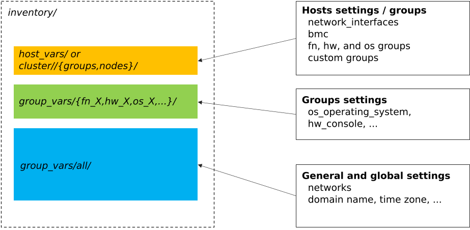
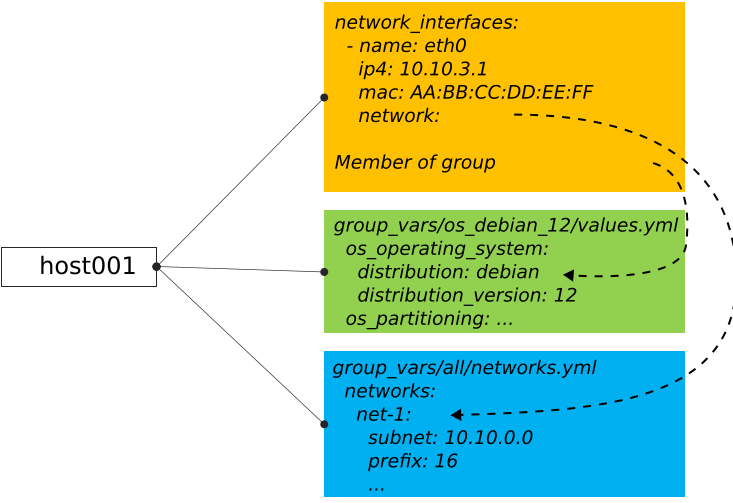

======================
Configure BlueBanquise
======================

The first step is to prepare the future cluster inventory.
This part can be done "offsite" in advance, meaning you can already create and assemble 
all the future inventory before having the hardware at disposal.

You should however have at disposal Ansible to ease your task.

Install Ansible
===============

Simply install python3 and pip3 for your operating system.
Also make sure your python3 installation supports venv (virtual python environments).
This part even works in Microsoft Windows, since python3 is available on win64 systems.

Once python3 is installed, create a virtual environment and install Ansible and its dependencies using:

.. code-block::

  python3 -m venv ansible_venv
  source ansible_venv/bin/activate
  python3 -m pip install --upgrade pip
  pip3 install setuptools setuptools_rust
  pip3 install ansible

Note that in the future, to use this Ansible installation, you will have to always source the virtual environment.

Test Ansible is working (refer to `this Ansible tutorial if you do not know Ansible. <https://bluebanquise.com/tutorials/sysadmin_ansible/>`_).

Create now the future inventory.

Create inventory
================

It is important to understand inventory structure.

By default, main location are the following (assuming relative to ``inventory/``):

|

* ``cluster/nodes/`` and ``cluster/groups/``: this is where nodes are listed, with their dedicated network parameters, and linked to desired groups
* ``group_vars/my_group_name/``: this is where groups are described (OS to be used, kernel parameters, partitioning, iPXE settings, etc.)
* ``group_vars/all/``: this is where stack global values are set (logical networks, domain name, etc.)

Then, each described node will inherit from these settings. It is important to understand that some settings are linked. For example,
a node set as member of group ``os_debian_12`` will inherit this group parameters. Also, if a network interface of this node is 
linked to logical network ``net-1``, it will inherit all ``net-1`` network parameters. Etc.

|

Create needed folders first:

.. code-block::

  mkdir -p inventory/group_vars/all/
  mkdir -p inventory/cluster/nodes
  mkdir inventory cluster/groups

We are now going to populate inventory for the following basic example cluster:

.. image:: images/clusters/documentation_example_single_island.svg
   :align: center

Add first management node
-------------------------

Let's add the first node, ``management1``. This is a special node, as it will be the manager of the cluster.

Create file ``cluster/nodes/management.yml`` (YAML file) and add the following content inside:

.. code-block:: yaml

  all:
    hosts:
      management1:

.. note::
  We create here one file per function, as it seems easier to maintain. However, all these files are flattened by
  Ansible during execution, which means we could create a single ``nodes.yml`` file that would contain all the nodes in once.
  It is up to you.

Now create file ``cluster/groups/fn`` (INI file) with the following content:

.. code-block:: ini

  [fn_management]
  management1

We will assume in this example that this server is a supermicro_X10DRT and that we are going to deploy AlmaLinux 9 on it.

Create file ``cluster/groups/hw`` (INI file) with the following content:

.. code-block:: ini

  [hw_supermicro_X10DRT]
  management1

Then create file ``cluster/groups/os`` (INI file) with the following content:

.. code-block:: ini

  [os_almalinux_9]
  management1

Now check the result:

.. code-block:: text

  (pydevs) oxedions@prima:~/tmp_devs$ ansible-inventory -i inventory/ --graph
  @all:
    |--@ungrouped:
    |--@fn_management:
    |  |--management1
    |--@hw_supermicro_X10DRT:
    |  |--management1
    |--@os_almalinux_9:
    |  |--management1
  (pydevs) oxedions@prima:~/tmp_devs$ 

We can see that our management1 host is part of 3 groups: ``fn_management`` which is its function (a management node),
``hw_supermicro_X10DRT`` which is the hardware definition, and ``os_almalinux_9`` which is the os definition.
This creates a new equipment profile (see vocabulary section of this documentatio).

Add network
-----------

Lets now add the network. All our hosts will be connected to a network ``10.10.0.0/16`` called ``net-1``.

Create file ``group_vars/all/networks.yml`` with the following content:

.. code-block:: yaml

  networks:
    net-1:
      subnet: 10.10.0.0
      prefix: 16

In BlueBanquise, nodes are connected together through networks. Most
of the time, logical networks will match your physical network, but for advanced
networking, it can be different.

All networks are defined in ``group_vars/all/networks.yml`` file.

It is **IMPORTANT** to understand that the prefix ``net-`` means to the stack "this is a administration network".

In BlueBanquise there are two kind of networks: **administration networks**, and **simple networks**.

Any network starting its name with prefix ``net-`` will be considered an admininstration network. All other networks will be considered simple networks.

An **administration network** is used to deploy and manage the nodes. It will be for
example used to run a DHCP server, handle the PXE stack, etc, and also all the
Ansible ssh connections. Administration networks have a strict naming
convention, which by default is: ``net-``.

Connect node to network
-----------------------

Now connect management1 to this network. Edit file ``cluster/nodes/management.yml`` and add management1
network interface:

.. code-block:: yaml

  all:
    hosts:
      management1:
        network_interfaces:
          - interface: enp0s3
            ip4: 10.10.0.1
            mac: 08:00:27:dc:f8:f5
            network: net-1

It should not be too difficult to understand this file.

What is essential here is to understand that order network interfaces are
defined under *network_interfaces* variable matters. Rules are the following:

- The first interface in the list is the **resolution interface**. This is the one a ping will try to reach.
- The first interface attached to a management network is the **main network interface** (remember, management networks are the ones prefixed ``net-``). This is the one ssh and so Ansible will use to connect to the node.

If these rules do not comply with your needs, remember that the stack logic can
be precedenced: simply define logic variables like ``j2_node_main_resolution_network`` or
``j2_node_main_network`` manually under host.

.. note::
  You may not already know the interface name, or even the MAC address.
  You will be able to update it later, once server is reachable.

Set services endpoint
---------------------

We need to define our services endpoint on the net-1 network.
This endpoint is the ip address to be targeted by clients on the network (dns server ip, time server ip, etc).
The stack allows to define different ips or hostnames for each kind of service,
but a magic value exists and allows to define all of them at once with the same value: ``services_ip``
This is enough for our example cluster.

Edit ``group_vars/all/networks.yml`` and add the key under net-1 network:

.. code-block:: yaml

  networks:
    net-1:
      subnet: 10.10.0.0
      prefix: 16
      services_ip: 10.10.0.1

Configure hardware and os
-------------------------

management1 is part of ``hw_supermicro_X10DRT`` and ``os_almalinux_9`` groups.
We now need to define its hardware and operating system settings.

Create file ``group_vars/hw_supermicro_X10DRT/settings.yml`` with the following content:

.. code-block:: yaml

  hw_equipment_type: server

  hw_specs:
    cpu:
      name: Intel E5-2667 v4
      cores: 32 # 2 sockets x 1 cpu that contains 8 cores with 2 threads each
      cores_per_socket: 8
      sockets: 2
      threads_per_core: 2
    gpu:

  hw_console: console=tty0 console=ttyS1,115200
  hw_kernel_parameters: nomodeset

  hw_board_authentication: # Authentication to BMC
    - protocol: IPMI
      user: ADMIN
      password: ADMIN

  # You can even add custom variables if it helps later
  # Like adding a link to page where manual can be found
  hw_vendor_url: https://www.supermicro.com/en/products/motherboard/X10DRT-L

These are hardware related settings.
Tune this content according to your needs. For example, if you are testing the stack in VMs, do not set a console (or leave it empty), etc.

.. note::
  **This is an example.** The only mandatory value here is ``hw_equipment_type`` as it is needed for the stack to identify the hardware as a server.
  The full list of available parameters is given into the variables description page. BENNNNNNNNNNNN

Now create file ``group_vars/os_almalinux_9/settings.yml`` with the following content:

.. code-block:: yaml

  os_operating_system:
    distribution: almalinux
    distribution_major_version: 9

  os_access_control: enforcing
  os_firewall: true

  os_keyboard_layout: us
  os_system_language: en_US.UTF-8

  os_partitioning:
    clearpart --all --initlabel
    autopart --type=plain --fstype=ext4

  os_admin_password_sha512: $6$JLtp9.SYoijB3T0Q$q43Hv.ziHgC9mC68BUtSMEivJoTqUgvGUKMBQXcZ0r5eWdQukv21wHOgfexNij7dO5Mq19ZhTR.JNTtV89UcH0

.. note::
  The password here is "rootroot".
  **PLEASE**, do not use that password in production. Generate your own strong password using python3 command:
  ``python3 -c 'import crypt,getpass; print(crypt.crypt(getpass.getpass(), crypt.mksalt(crypt.METHOD_SHA512)))'``

.. note::
  **This is again an example.** The only mandatory value here is ``os_operating_system`` as it is needed 
  for the stack to identify the operating system to be deployed on the target via PXE.
  The full list of available parameters is given into the variables description page. BENNNNNNNNNNNN

That is all for our management1 server. We can now define the other servers.

Add remaining nodes
-------------------

Proceed as with management1 node. We will do computes1 to compute4, other nodes can then be added the same way.

First create file ``cluster/nodes/compute.yml`` (YAML file) and add the following content inside:

.. code-block:: yaml

  all:
    hosts:
      compute1:
        network_interfaces:
          - interface: eno1
            ip4: 10.10.3.1
            mac: 08:00:27:dc:f8:a1
            network: net-1
      compute2:
        network_interfaces:
          - interface: eno1
            ip4: 10.10.3.2
            mac: 08:00:27:dc:f8:a2
            network: net-1
      compute3:
        network_interfaces:
          - interface: eno1
            ip4: 10.10.3.3
            mac: 08:00:27:dc:f8:a3
            network: net-1
      compute4:
        network_interfaces:
          - interface: eno1
            ip4: 10.10.3.4
            mac: 08:00:27:dc:f8:a4
            network: net-1

Now edit file ``cluster/groups/fn`` (INI file) with the following content:

.. code-block:: ini

  [fn_management]
  management1

  [fn_compute]
  compute[1:4]

We will assume in this example that these servers are supermicro_X13QEH and that we are going to deploy AlmaLinux 9 (like management1) on it.
So it means these servers will share the same os group than management1, but will have a different hw group.

Edit file ``cluster/groups/hw`` (INI file) with the following content:

.. code-block:: ini

  [hw_supermicro_X10DRT]
  management1

  [hw_supermicro_X13QEH]
  compute[1:4]

Then Edit file ``cluster/groups/os`` (INI file) with the following content:

.. code-block:: ini

  [os_almalinux_9]
  management1
  compute[1:4]

Now check the result:

.. code-block:: text

  (pydevs) oxedions@prima:~/tmp_devs$ ansible-inventory -i inventory/ --graph
  @all:
    |--@ungrouped:
    |--@fn_management:
    |  |--management1
    |--@fn_compute:
    |  |--compute1
    |  |--compute2
    |  |--compute3
    |  |--compute4
    |--@hw_supermicro_X10DRT:
    |  |--management1
    |--@hw_supermicro_X13QEH:
    |  |--compute1
    |  |--compute2
    |  |--compute3
    |  |--compute4
    |--@os_almalinux_9:
    |  |--management1
    |  |--compute1
    |  |--compute2
    |  |--compute3
    |  |--compute4
  (pydevs) oxedions@prima:~/tmp_devs$ 

Finally, create the new hw profile. Create file ``group_vars/hw_supermicro_X13QEH/settings.yml`` with the following content:

.. code-block:: yaml

  hw_equipment_type: server

  hw_specs:
    cpu:
      name: Intel 6416H
      cores: 144
      cores_per_socket: 18
      sockets: 4
      threads_per_core: 2
    gpu:

  hw_console: console=tty0 console=ttyS1,115200

  hw_board_authentication: # Authentication to BMC
    - protocol: IPMI
      user: ADMIN
      password: ADMIN

You can check which parameters are linked to a specific node using the ansible-inventory command:

.. code-block:: text

  (pydevs) oxedions@prima:~/tmp_devs$ ansible-inventory -i inventory/ --host management1 --yaml
  hw_board_authentication:
  - password: ADMIN
    protocol: IPMI
    user: ADMIN
  hw_console: console=tty0 console=ttyS1,115200
  hw_equipment_type: server
  hw_kernel_parameters: nomodeset
  hw_specs:
    cpu:
      cores: 32
      cores_per_socket: 8
      name: Intel E5-2667 v4
      sockets: 2
      threads_per_core: 2
    gpu: null
  hw_vendor_url: https://www.supermicro.com/en/products/motherboard/X10DRT-L
  os_access_control: enforcing
  os_admin_password_sha512: $6$JLtp9.SYoijB3T0Q$q43Hv.ziHgC9mC68BUtSMEivJoTqUgvGUKMBQXcZ0r5eWdQukv21wHOgfexNij7dO5Mq19ZhTR.JNTtV89UcH0
  os_firewall: true
  os_keyboard_layout: us
  os_operating_system:
    distribution: almalinux
    distribution_major_version: 9
  os_partitioning: clearpart --all --initlabel autopart --type=plain --fstype=ext4
  os_system_language: en_US.UTF-8
  (pydevs) oxedions@prima:~/tmp_devs$ 

Proceed the same way to add all nodes to the inventory.

Set global settings
-------------------

The last step in building the inventory is to set global settings.
This includes the name of the cluster, the domain name of the cluster, and the time zone of the cluster.

Create file ``group_vars/all/global.yml`` with the following content:

.. code-block:: yaml

  bb_domain_name: bluebanquise-cluster.local
  bb_time_zone: Europe/Brussels
  bb_cluster_name: bluebanquise-cluster

Tune these values according to your needs.

Your basic inventory is now ready. Refer to the variables description page for more parameters available.
