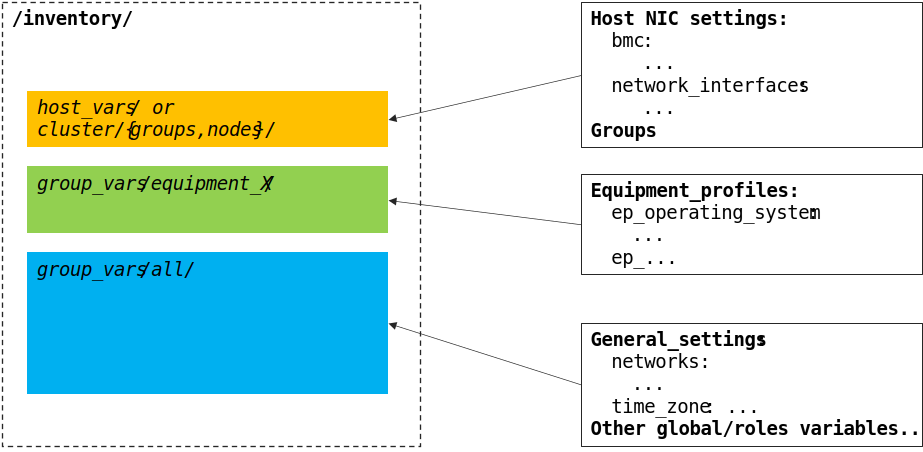
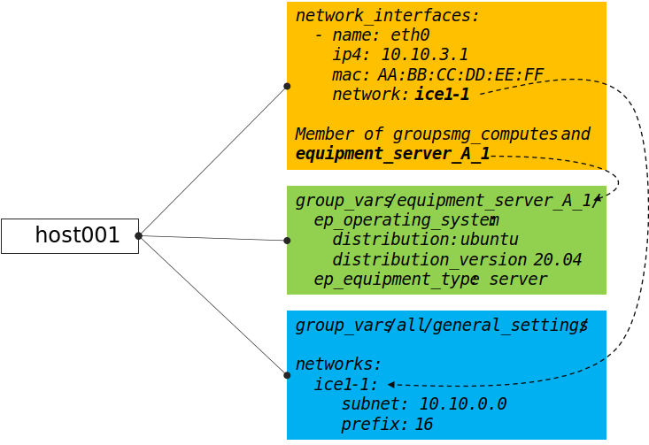

======================
Configure BlueBanquise
======================

The first step is to prepare the future cluster inventory.
This part can be done "offsite" in advance, meaning you can already create and assemble 
all the future inventory before having the hardware at disposal.

You should however have at disposal Ansible to ease your task.

Install Ansible
===============

Simply install python3 and pip3 for your operating system.
Also make sure your python3 installation supports venv (virtual python environments).
This part even works in Microsoft Windows, since python3 is available on win64 systems.

Once python3 is installed, create a virtual environment and install Ansible and its dependencies using:

.. code-block::

  python3 -m venv ansible_venv
  source ansible_venv/bin/activate
  python3 -m pip install --upgrade pip
  pip3 install setuptools setuptools_rust
  pip3 install ansible

Note that in the future, to use this Ansible installation, you will have to always source the virtual environment.

Test Ansible is working (refer to `this Ansible tutorial if you do not know Ansible. <https://bluebanquise.com/tutorials/sysadmin_ansible/>`_).

Create now the future inventory.

Create inventory
================

It is important to understand inventory structure.

By default, main location are the following (assuming relative to ``inventory/``):

* ``cluster/nodes/`` and ``cluster/groups/``: this is where nodes are listed, with their dedicated network parameters, and linked to desired groups
* ``group_vars/my_group_name/``: this is where groups are described (OS to be used, kernel parameters, partitioning, iPXE settings, etc.)
* ``group_vars/all/``: this is where stack global values are set (logical networks, domain name, etc.)

Then, each described node will inherit from these settings. It is important to understand that some settings are linked. For example,
a node set as member of group ``os_debian_12`` will inherit this group parameters. Also, if a network interface of this node is 
linked to logical network ``net-1``, it will inherit all ``net-1`` network parameters. Etc.

Create needed folders first:

.. code-block::

  mkdir -p inventory/group_vars/all/
  mkdir -p inventory/cluster/nodes
  mkdir inventory cluster/groups

We are now going to populate inventory for the following basic example cluster:

.. image:: images/clusters/documentation_example_single_island.svg
   :align: center

Add first management node
-------------------------

Let's add the first node, ``management1``. This is a special node, as it will be the manager of the cluster.

Create file ``cluster/nodes/management.yml`` (YAML file) and add the following content inside:

.. code-block:: yaml

  all:
    hosts:
      management1:

.. note::
  We create here one file per function, as it seems easier to maintain. However, all these files are flattened by
  Ansible during execution, which means we could create a single ``nodes.yml`` file that would contain all the nodes in once.
  It is up to you.

Now create file ``cluster/groups/fn`` (INI file) with the following content:

.. code-block:: ini

  [fn_management]
  management1

We will assume in this example that this server is a supermicro_X10DRT and that we are going to deploy AlmaLinux 9 on it.

Create file ``cluster/groups/hw`` (INI file) with the following content:

.. code-block:: ini

  [hw_supermicro_X10DRT]
  management1

Then create file ``cluster/groups/os`` (INI file) with the following content:

.. code-block:: ini

  [os_almalinux_9]
  management1

Now check the result:

.. code-block:: text

  (pydevs) oxedions@prima:~/tmp_devs$ ansible-inventory -i inventory/ --graph
  @all:
    |--@ungrouped:
    |--@fn_management:
    |  |--management1
    |--@hw_supermicro_X10DRT:
    |  |--management1
    |--@os_almalinux_9:
    |  |--management1
  (pydevs) oxedions@prima:~/tmp_devs$ 

We can see that our management1 host is part of 3 groups: ``fn_management`` which is its function (a management node),
``hw_supermicro_X10DRT`` which is the hardware definition, and ``os_almalinux_9`` which is the os definition.
This creates a new equipment profile (see vocabulary section of this documentatio).

Add network
-----------

Lets now add the network. All our hosts will be connected to a network ``10.10.0.0/16`` called ``net-1``.

Create file ``group_vars/all/networks.yml`` with the following content:

.. code-block:: yaml

  networks:
    net-1:
      subnet: 10.10.0.0
      prefix: 16

In BlueBanquise, nodes are connected together through networks. Most
of the time, logical networks will match your physical network, but for advanced
networking, it can be different.

All networks are defined in ``group_vars/all/networks.yml`` file.

It is **IMPORTANT** to understand that the prefix ``net-`` means to the stack "this is a administration network".

In BlueBanquise there are two kind of networks: **administration networks**, and **simple networks**.

Any network starting its name with prefix ``net-`` will be considered an admininstration network. All other networks will be considered simple networks.

An **administration network** is used to deploy and manage the nodes. It will be for
example used to run a DHCP server, handle the PXE stack, etc, and also all the
Ansible ssh connections. Administration networks have a strict naming
convention, which by default is: ``net-``.

Connect node to network
-----------------------

Now connect management1 to this network. Edit file ``cluster/nodes/management.yml`` and add management1
network interface:

.. code-block:: yaml

  all:
    hosts:
      management1:
        network_interfaces:
          - interface: enp0s3
            ip4: 10.10.0.1
            mac: 08:00:27:dc:f8:f5
            network: net-1

It should not be too difficult to understand this file.

What is essential here is to understand that order network interfaces are
defined under *network_interfaces* variable matters. Rules are the following:

- The first interface in the list is the **resolution interface**. This is the one a ping will try to reach.
- The first interface attached to a management network is the **main network interface** (remember, management networks are the ones prefixed ``net-``). This is the one ssh and so Ansible will use to connect to the node.

If these rules do not comply with your needs, remember that the stack logic can
be precedenced: simply define logic variables like ``j2_node_main_resolution_network`` or
``j2_node_main_network`` manually under host.

.. note::
  You may not already know the interface name, or even the MAC address.
  You will be able to update it later, once server is reachable.

Set services endpoint
---------------------

We need to define our services endpoint on the net-1 network.
This endpoint is the ip address to be targeted by clients on the network (dns server ip, time server ip, etc).
The stack allows to define different ips or hostnames for each kind of service,
but a magic value exists and allows to define all of them at once with the same value: ``services_ip``
This is enough for our example cluster.

Edit ``group_vars/all/networks.yml`` and add the key under net-1 network:

.. code-block:: yaml

  networks:
    net-1:
      subnet: 10.10.0.0
      prefix: 16
      services_ip: 10.10.0.1

Configure hardware and os
-------------------------

management1 is part of ``hw_supermicro_X10DRT`` and ``os_almalinux_9`` groups.
We now need to define its hardware and operating system settings.

Create file ``group_vars/hw_supermicro_X10DRT/settings.yml`` with the following content:

.. code-block:: yaml

  hw_equipment_type: server

  hw_specs:
    cpu:
      name: Intel E5-2667 v4
      cores: 32 # 2 sockets x 1 cpu that contains 8 cores with 2 threads each
      cores_per_socket: 8
      sockets: 2
      threads_per_core: 2
    gpu:

  hw_console: console=tty0 console=ttyS1,115200
  hw_kernel_parameters: nomodeset

  hw_board_authentication: # Authentication to BMC
    - protocol: IPMI
      user: ADMIN
      password: ADMIN

  # You can even add custom variables if it helps later
  # Like adding a link to page where manual can be found
  hw_vendor_url: https://www.supermicro.com/en/products/motherboard/X10DRT-L

These are hardware related settings.
Tune this content according to your needs. For example, if you are testing the stack in VMs, do not set a console (or leave it empty), etc.

.. note::
  **This is an example.** The only mandatory value here is ``hw_equipment_type`` as it is needed for the stack to identify the hardware as a server.
  The full list of available parameters is given into the variables description page. BENNNNNNNNNNNN

Now create file ``group_vars/os_almalinux_9/settings.yml`` with the following content:

.. code-block:: yaml

  os_operating_system:
    distribution: almalinux
    distribution_major_version: 9

  os_access_control: enforcing
  os_firewall: true

  os_keyboard_layout: us
  os_system_language: en_US.UTF-8

  os_partitioning:
    clearpart --all --initlabel
    autopart --type=plain --fstype=ext4

  os_admin_password_sha512: $6$JLtp9.SYoijB3T0Q$q43Hv.ziHgC9mC68BUtSMEivJoTqUgvGUKMBQXcZ0r5eWdQukv21wHOgfexNij7dO5Mq19ZhTR.JNTtV89UcH0

.. note::
  The password here is "rootroot".
  **PLEASE**, do not use that password in production. Generate your own strong password using python3 command:
  ``python3 -c 'import crypt,getpass; print(crypt.crypt(getpass.getpass(), crypt.mksalt(crypt.METHOD_SHA512)))'``

.. note::
  **This is again an example.** The only mandatory value here is ``os_operating_system`` as it is needed 
  for the stack to identify the operating system to be deployed on the target via PXE.
  The full list of available parameters is given into the variables description page. BENNNNNNNNNNNN

That is all for our management1 server. We can now define the other servers.

Add remaining nodes
-------------------

Proceed as with management1 node. We will do computes1 to compute4, other nodes can then be added the same way.

First create file ``cluster/nodes/compute.yml`` (YAML file) and add the following content inside:

.. code-block:: yaml

  all:
    hosts:
      compute1:
        network_interfaces:
          - interface: eno1
            ip4: 10.10.3.1
            mac: 08:00:27:dc:f8:a1
            network: net-1
      compute2:
        network_interfaces:
          - interface: eno1
            ip4: 10.10.3.2
            mac: 08:00:27:dc:f8:a2
            network: net-1
      compute3:
        network_interfaces:
          - interface: eno1
            ip4: 10.10.3.3
            mac: 08:00:27:dc:f8:a3
            network: net-1
      compute4:
        network_interfaces:
          - interface: eno1
            ip4: 10.10.3.4
            mac: 08:00:27:dc:f8:a4
            network: net-1

Now edit file ``cluster/groups/fn`` (INI file) with the following content:

.. code-block:: ini

  [fn_management]
  management1

  [fn_compute]
  compute[1:4]

We will assume in this example that these servers are supermicro_X13QEH and that we are going to deploy AlmaLinux 9 (like management1) on it.
So it means these servers will share the same os group than management1, but will have a different hw group.

Edit file ``cluster/groups/hw`` (INI file) with the following content:

.. code-block:: ini

  [hw_supermicro_X10DRT]
  management1

  [hw_supermicro_X13QEH]
  compute[1:4]

Then Edit file ``cluster/groups/os`` (INI file) with the following content:

.. code-block:: ini

  [os_almalinux_9]
  management1
  compute[1:4]

Now check the result:

.. code-block:: text

  (pydevs) oxedions@prima:~/tmp_devs$ ansible-inventory -i inventory/ --graph
  @all:
    |--@ungrouped:
    |--@fn_management:
    |  |--management1
    |--@fn_compute:
    |  |--compute1
    |  |--compute2
    |  |--compute3
    |  |--compute4
    |--@hw_supermicro_X10DRT:
    |  |--management1
    |--@hw_supermicro_X13QEH:
    |  |--compute1
    |  |--compute2
    |  |--compute3
    |  |--compute4
    |--@os_almalinux_9:
    |  |--management1
    |  |--compute1
    |  |--compute2
    |  |--compute3
    |  |--compute4
  (pydevs) oxedions@prima:~/tmp_devs$ 

Finally, create the new hw profile. Create file ``group_vars/hw_supermicro_X13QEH/settings.yml`` with the following content:

.. code-block:: yaml

  hw_equipment_type: server

  hw_specs:
    cpu:
      name: Intel 6416H
      cores: 144
      cores_per_socket: 18
      sockets: 4
      threads_per_core: 2
    gpu:

  hw_console: console=tty0 console=ttyS1,115200

  hw_board_authentication: # Authentication to BMC
    - protocol: IPMI
      user: ADMIN
      password: ADMIN

You can check which parameters are linked to a specific node using the ansible-inventory command:

.. code-block:: text

  (pydevs) oxedions@prima:~/tmp_devs$ ansible-inventory -i inventory/ --host management1 --yaml
  hw_board_authentication:
  - password: ADMIN
    protocol: IPMI
    user: ADMIN
  hw_console: console=tty0 console=ttyS1,115200
  hw_equipment_type: server
  hw_kernel_parameters: nomodeset
  hw_specs:
    cpu:
      cores: 32
      cores_per_socket: 8
      name: Intel E5-2667 v4
      sockets: 2
      threads_per_core: 2
    gpu: null
  hw_vendor_url: https://www.supermicro.com/en/products/motherboard/X10DRT-L
  os_access_control: enforcing
  os_admin_password_sha512: $6$JLtp9.SYoijB3T0Q$q43Hv.ziHgC9mC68BUtSMEivJoTqUgvGUKMBQXcZ0r5eWdQukv21wHOgfexNij7dO5Mq19ZhTR.JNTtV89UcH0
  os_firewall: true
  os_keyboard_layout: us
  os_operating_system:
    distribution: almalinux
    distribution_major_version: 9
  os_partitioning: clearpart --all --initlabel autopart --type=plain --fstype=ext4
  os_system_language: en_US.UTF-8
  (pydevs) oxedions@prima:~/tmp_devs$ 

Proceed the same way to add all nodes to the inventory.

Set global settings
-------------------

The last step in building the inventory is to set global settings.
This includes the name of the cluster, the domain name of the cluster, and the time zone of the cluster.

Create file ``group_vars/all/global.yml`` with the following content:

.. code-block:: yaml

  bb_domain_name: bluebanquise-cluster.local
  bb_time_zone: Europe/Brussels
  bb_cluster_name: bluebanquise-cluster

Tune these values according to your needs.

Your basic inventory is now ready. Refer to the variables description page for more parameters available.

At this point, you should have an operating system with Ansible installed on it,
and basic OS repositories. You also have installed BlueBanquise cloned and its
dependencies.

Understand Environment
======================

By default, Ansible will check presence of configuration file at multiple
locations:

1. Environment variable **ANSIBLE_CONFIG**
2. ansible.cfg in the current working directory
3. .ansible.cfg in the home directory
4. /etc/ansible/ansible.cfg

The first found is used as main configuration.

The bootstrap script created an entry in your bluebanquise user .bashrc 
file that export ANSIBLE_CONFIG variable:

.. code-block::

  ANSIBLE_CONFIG=$HOME/bluebanquise/ansible.cfg

The script also created 2 other exports:

.. code-block::

  export PATH=/home/bluebanquise/.local/bin:$PATH
  export PYTHONPATH=$(pip3 show ClusterShell | grep Location | awk -F ' ' '{print $2}')

First one add ansible and ansible related binaries into PATH to be usable from shell.
Second one ensure your PYTHONPATH will be exported later when excuting commands as sudo.

You can also check the /etc/sudoers file. The script added the line:

.. code-block::

  Defaults env_keep += "PYTHONPATH"

This ensure your PYTHONPATH is exported into sudo environment.

Check example inventory
-----------------------

An inventory example as been copied by script into your bluebanquise folder.
If needed, other examples can be found in ``resources/examples/``.

The example copied matchs the cluster exposed previously.

.. warning::
  Ansible will read **ALL** files in the inventory. **NEVER do a backup of a file
  here!**
  Backup in another location, outside of ~/bluebanquise/inventory.

Review groups
-------------

In BlueBanquise, there are 3 main types of groups, apart of user's custom groups.

Use command ansible-inventory to display current groups in the inventory:

.. code-block:: text

  bluebanquise@localhost:~/ ansible-inventory --graph
  @all:
    |--@internal:
    |  |--dummy
    |--@mg_computes:
    |  |--@equipment_typeC:
    |  |  |--compute1
    |  |  |--compute2
    |  |  |--compute3
    |  |  |--compute4
    |--@mg_logins:
    |  |--@equipment_typeL:
    |  |  |--login1
    |--@mg_managements:
    |  |--@equipment_typeM:
    |  |  |--management1
    |--@mg_storages:
    |  |--@equipment_typeS:
    |  |  |--storage1
    |--@rack_1:
    |  |--compute1
    |  |--compute2
    |  |--compute3
    |  |--compute4
    |  |--login1
    |  |--management1
    |  |--storage1
    |--@ungrouped:

In this example inventory, you can see **mg_** groups, and **equipment_** groups.
*rack_1* group is a user's custom group and is not important for the stack to
operate properly.

**mg_** groups are called master groups, and define global
purpose of their nodes: storages, managements, logins, computes, etc.

**equipment_** groups are called equipment profile groups, and define equipment
related settings of their nodes. These groups are linked to the hardware of
nodes. For example, if in **mg_computes** group, your cluster contains 2 type of
nodes, for example model_A and model_B servers, then you need to create 2
equipment profile groups, called equipment_model_A and equipment_model_B, that
contain their related nodes.

Equipment profiles are subgroups of master groups.

Review nodes
------------

First step is to review the provided example configuration, and adapt it to your
configuration. The following part assume all path are relative to
~/bluebanquise/inventory/ folder.

Management node
^^^^^^^^^^^^^^^

Open file cluster/nodes/managements.yml, and visualize content:

.. code-block:: yaml

  mg_managements:
    children:
      equipment_typeM:
        hosts:
          management1:
            bmc:
              name: bmanagement1
              ip4: 10.10.100.1
              mac: 08:00:27:dc:f8:f6
              network: ice1-1
            network_interfaces:
              - interface: enp0s3
                ip4: 10.10.0.1
                mac: 08:00:27:dc:f8:f5
                network: ice1-1
              - interface: ib0
                ip4: 10.20.0.1
                network: interconnect-1

This file contains our management node configuration. Let’s review it, to
understand it.

First, the groups:

.. code-block:: yaml

  mg_managements:         # This is the master group (also called main group), it is very useful with advanced configuration
    children:             # This is an Ansible instruction, indicating the below group is included in mg_managements group
      equipment_typeM:    # This is the equipment group of the management node. It always starts by 'equipment_'
        hosts:            # This is an Ansible instruction, to list below the hosts member of this group
          management1:    # This is the hostname

Now the BMC (if exist):

.. code-block:: yaml

  mg_managements:
    children:
      equipment_typeM:
        hosts:
          management1:
            bmc:                      # This instruction defines an attached BMC
              name: bmanagement1      # This is the hostname of the BMC
              ip4: 10.10.100.1        # This is the ipv4 of the BMC
              mac: 08:00:27:dc:f8:f6  # This is the MAC hardware address of the BMC (for DHCP)
              network: ice1-1         # This is the logical network this interface is connected to. Logical networks will be seen later.

Then the network interfaces and their associated networks:

.. code-block:: yaml

  mg_managements:
    children:
      equipment_typeM:
        hosts:
          management1:
            bmc:
              name: bmanagement1
              ip4: 10.10.100.1
              mac: 08:00:27:dc:f8:f6
              network: ice1-1
            network_interfaces:         # This is an instruction, to define bellow all host's NIC (Network Interface Controllers)
              - interface: enp0s3       # This is the NIC name ('ip a' command to get NIC list)
                ip4: 10.10.0.1          # This is the expected ipv4 for this NIC
                mac: 08:00:27:dc:f8:f5  # This is the NIC MAC address, for the DHCP
                network: ice1-1         # This is the logical network this NIC is linked to
              - interface: ib0          # This is another NIC, not in the dhcp so no MAC is provided
                ip4: 10.20.0.1
                network: interconnect-1

.. note::
  More network features and configurations are available, see the **nic** role
  readme file for more information.

Other nodes
^^^^^^^^^^^

Now, review computes, logins and storages nodes in their respective
*cluster/nodes/computes.yml*, *cluster/nodes/logins.yml* and
*cluster/nodes/storages.yml* files. Same rules apply.
You can also add more nodes, or if you have for example multiple type
of equipment for computes nodes, add other equipment groups
this way:

.. code-block:: yaml

  mg_computes:
    children:
      equipment_typeC:
        hosts:
          compute1:
          [...]
      equipment_typeD:
        hosts:
          compute5:
          [...]
      equipment_typeE:
        hosts:
          compute10:
          [...]

Now, let's have a look at the logical networks.

Review logical networks
-----------------------

Open file *group_vars/all/general_settings/network.yml* and let's check part of
its content:

.. code-block:: yaml

  networks:                                             # This defines the list of networks
    ice1-1:                                             # Network name
      subnet: 10.10.0.0                                 # Network subnet
      prefix: 16                                        # Network prefix
      netmask: 255.255.0.0                              # Network netmask, must comply with prefix
      broadcast: 10.10.255.255                          # Broadcast, deduced from subnet and prefix/netmask
      dhcp_unknown_range: 10.10.254.1 10.10.254.254     # Optional, this is the range of ip where unknown nodes (i.e. not in the inventory) will be placed if asking for an ip
      gateway: 10.10.0.1                                # Optional, define a gateway
      is_in_dhcp: true                                  # If you want this network to be in the dhcp (only apply to management networks)
      is_in_dns: true                                   # If you want this network to be in the dns
      services_ip:                                      # IPs or virtual IPs to bind to for each service. In our case, all services will be running on management1 so 10.10.0.1 for all
        pxe_ip: 10.10.0.1
        dns_ip: 10.10.0.1
        repository_ip: 10.10.0.1
        time_ip: 10.10.0.1
        log_ip: 10.10.0.1

All explanations are given above.

One note about ``services_ip``: it is used if services are spread over multiple
managements, or in case of High Availability with virtual IPs. Ansible is not
able to gather this information alone from playbooks (it could, but this would
end up with a way too much complex stack), and so we have to provide it manually.
You can also set here an IP address from another subnet if your system has
network routing.

Now check content of the second network, ``interconnect-1`` in file
*group_vars/all/general_settings/network.yml* . As this is **not** an
administration network, its configuration is easy.

That is all for basic networking. General network parameters are set in
*group_vars/all/general_settings/network.yml* file, and nodes parameters are
defined in the node’s files.
Nodes ``network_interfaces`` are linked to logical networks.

Now, let's have a look at the general configuration.

Review general configuration
----------------------------

General configuration is made in *group_vars/all/general_settings*.

Externals
^^^^^^^^^

File *group_vars/all/general_settings/external.yml* allows to configure external
resources. It should be self understandable.

Network
^^^^^^^

File *group_vars/all/general_settings/network.yml* allows to configure network
related parameters, and detail all networks of the cluster.

Repositories
^^^^^^^^^^^^

File *group_vars/all/general_settings/repositories.yml* configure repositories to
use for all nodes (using groups and variable precedence, repositories can be
tuned for each group of nodes, or even each node).

It is important to set correct repositories to avoid issues during deployments.

By default, recommanded settings are:

* RHEL like system:

.. raw:: html

  

  <b>RHEL</b> , <b>CentOS</b> , <b>RockyLinux</b> , <b>OracleLinux</b> , <b>CloudLinux</b> , <b>AlmaLinux</b> 
  
  

.. code-block:: yaml

  repositories:
    - os            # Will bind to OS iso for BaseOS and AppStream base repositories
    - bluebanquise  # Will bind to bluebanquise repository

* Ubuntu system:

.. raw:: html

  

  <b>Ubuntu</b> 
  
  

.. code-block:: yaml

  repositories:
    # No need for os, as Ubuntu directly grab packages from the web
    - bluebanquise  # Will bind to bluebanquise repository

See the repositories_client role part of the documentation for advanced
configurations (list accept basic repos naming, but also advanced paterns).

Note also that if you wish to define different repositories per equipment, you
can easily use variable precedence mechanism seen in the Ansible tutorial to
define repositories variable in each equipment group, or even for each node.

NFS
^^^

File *group_vars/all/general_settings/nfs.yml* allows to set NFS shared folders
inside the cluster. Comments in the file should be enough to understand this
file.

Tune this file according to your need, or remove it if you do not plan to use NFS.

General
^^^^^^^

File *group_vars/all/general_settings/general.yml* configure few main parameters:

* Time zone (very important, should match the one of your current management server)

Do not bother right now about the other parameters.

And that is all for general configuration. Finally, let’s check the equipment
default parameters.

Review equipment default parameters
-----------------------------------

Last part, and probably the most complex, are equipment profile groups default
parameters. As seen before, equipment profile groups are groups related to the
hardware, the models, of the nodes. Variables related to these groups will
define parameters related to hardware, but also operating system deployed on
them, etc.

Equipment variables are defined at a global level, then redefined if needed for
each equipment.

Remember Ansible precedence mechanism. All variables in *group_vars/all/* have
less priority, while variables in *group_vars/** have a higher priority.

The idea here is the following: *group_vars/all/equipment_all/* folder contains
equipment default/global parameters for all nodes. Here authentication, and
equipment_profile. You have to tune these parameters to match your exact
"global" need, and then copy (if needed) part of these files into dedicated
group_vars folder for each equipment group, and tune them according to these
equipment specific parameters.

.. note::
  You can copy the whole equipment_profile.yml content from equipment_all to
  equipment_X folders, **or better**, create a new file in equipment_X and only
  set the parameters that are different from the global parameters.

For example, open file
*group_vars/all/equipment_all/equipment_profile.yml*,
and check access_control variable. It is set to enforcing:

.. code-block:: yaml

  ep_access_control: enforcing

Ok, but so all nodes will get this value. Let's check computes nodes, that are
in equipment_typeC group. Let's check compute1:

.. code-block:: bash

  [root@]# ansible-inventory --host compute1 --yaml | grep ep_access_control
    ep_access_control: enforcing
  [root@]#

Lets say this is not good, and we want to disable access_control on computes.
We need to change that.

Open file *group_vars/equipment_typeC/equipment_profile.yml* and set
``access_control`` to  *disabled*.

Now check again:

.. code-block:: bash

  [root@]# ansible-inventory --host compute1 --yaml | grep ep_access_control
    ep_access_control: disabled
  [root@]#

Same apply for all equipment_profile parameters. You define a global set of
parameters in equipment_all, which act as a global/default set, and then copy
(all or a part of them) and tune this set for each equipment group if needed.

.. image:: images/misc/warning.svg
   :align: center
|
.. warning::
  **IMPORTANT**: equipment_profile variables and authentication variables **are
  not standard**. It is **STRICTLY FORBIDDEN** to tune them outside default
  (group_vars/all/equipment_all/equipment_profile.yml) or an equipment group
  (group_vars/equipment_*). For example, you cannot create a custom group and
  define some equipment_profile parameters for this group. If you really need to
  do that, add more equipment groups and tune this way. If you do not respect this
  rule, unexpected behavior will happen during configuration deployment.

Equipment profile variables
^^^^^^^^^^^^^^^^^^^^^^^^^^^

Equipment profiles are variables dedicated to groups of nodes equipment. These
variables cover most of the hardware, operating system, PXE needs, etc. of the
related nodes.

Except for operating system and partitioning, default values should match for
a simple cluster with standard hardware.

Lets review them:

PXE
"""

* **ep_ipxe_driver**
   * Possible values:
      * default
      * snp
      * snponly
   * Notes:
     See https://ipxe.org/appnote/buildtargets.
     Most of servers should accept default driver, but snp or snponly can be required on some (with many NICs for example).
* **ep_ipxe_platform**
   * Possible values:
      * pcbios
      * efi
   * Notes:
     This is the BIOS firmware type.
     Should be detected automatically, but some roles need to force it.
* **ep_ipxe_embed**
   * Possible values:
      * standard
      * dhcpretry
      * noshell
   * Notes:
     standard is ok for most cases. dhcpretry is to be used on networks where
     link on switch may take some time to go up. In dhcpretry mode, the iPXE rom
     will indefinitely try to get an ip from the dhcp.
     noshell is similar to standard, but without shell in case of issues. This
     allows "exit" EFI boot, for specific devices (like Nvidia DGX).

* **ep_preserve_efi_first_boot_device**
   * Possible values:
      * true
      * false
   * Notes:
     Try to force grub to restore EFI boot order during OS deployment. Allows to
     keep PXE first for example.

Kernel settings
"""""""""""""""

* **ep_console**
   * Notes:
     Custom value: the server console to be used. For example: console=tty0 console=ttyS1,115200n8

* **ep_kernel_parameters**
   * Notes:
     Custom value: additional kernel parameters to be added on kernel line.

* **ep_sysctl**
   * Notes:
     Custom value: additional sysctl kernel parameters.

Security
""""""""

* **ep_access_control**
   * Possible values:
      * enforcing
      * permissive
      * disabled
   * Notes:
     Activate or not the access control (SELinux, etc.).

* **ep_firewall**
   * Possible values:
      * true
      * false
   * Notes:
     Activate or not the firewall (firewalld, etc.).

Operating system setup
""""""""""""""""""""""

* **ep_partitioning**
   * Notes:
     Custom value: contains the partitioning multiple lines to be used. It is
     expected here native distribution syntax. For example, for RHEL/CentOS, use
     plain kickstart partitioning syntax (allows full custom partitioning).

* **ep_autoinstall_pre_script**
   * Notes:
     To add a multiple lines %pre script in the auto deployment file (kickstart,
     autoyast, preseed, etc.)

* **ep_autoinstall_post_script**
   * Notes:
     To add a multiple lines %post script in the auto deployment file (kickstart,
     autoyast, preseed, etc.)

* **ep_operating_system**
   * **distribution**
      * Notes:
        Custom value: set the distribution to be used here. This will be
        directly related to the repository used. Standard values are: centos,
        redhat, debian, ubuntu, opensuse, etc.
   * **distribution_major_version**
      * Notes:
        Custom value: set the distribution major version number or string.
   * **distribution_version**
      * Notes:
        Custom and optional value: set the distribution minor/custom version to
        be used. This will force repositories and PXE to use a minor version
        instead of relying on a major.
   * **repositories_environment**
      * Notes:
        Custom and optional value: set a production environment, to prepend all
        paths to be used (see repositories_client role documentation). For
        example: production, staging, test, etc.

* **ep_configuration**
   * keyboard_layout**
      * Possible values:
         * us
         * fr
         * etc.
      * Notes:
        Set the keyboard layout.
   * system_language**
      * Possible values:
         * en_US.UTF-8
         * etc.
      * Notes:
        Set the system locals. It is strongly recommended to keep en_US.UTF-8.

Hardware
""""""""

* **ep_equipment_type**
   * Possible values:
      * server
      * any other custom values but not "server"
   * Notes:
     If server, then PXE files will be generated by the pxe_stack role. If not,
     then value can be custom (and no PXE files will be generated).

* **ep_hardware**
   * Notes:
     Multiple fields to define system architecture. Some addon roles (like slurm)
     may rely on these values.

Board credentials (BMC, controller, other)
""""""""""""""""""""""""""""""""""""""""""

* **ep_equipment_authentication**
   * **user**
      * Notes:
        Custom value: set the BMC, storage bay controller, switch, etc. user.
   * **password**
      * Notes:
        Custom value: set the BMC, storage bay controller, switch, etc. password.

Authentication
^^^^^^^^^^^^^^

Authentication file allows to define default root password for all nodes, and
default public ssh keys lists.

To generate an sha512 password, use the following command (python >3.3):

.. code-block:: text

  python -c 'import crypt,getpass; print(crypt.crypt(getpass.getpass(), crypt.mksalt(crypt.METHOD_SHA512)))'

We need to ensure our management1 node ssh public key is set here.

Get the content of */root/.ssh/id_ed25519.pub* and add it in this file. At the
same time, **remove the ssh key provided here as example**.

It is possible to do it automatically using the following command:

.. code-block:: text

  # Copy public key of the mgmt to the inventory
  /usr/bin/sed -i -e "s#- ssh-rsa.*#- $(cat /root/.ssh/id_ed25519.pub)#" \
    ~/bluebanquise/inventory/group_vars/all/equipment_all/authentication.yml

.. warning::
  If you update the managements ssh keys, do not forget to update this file.

-------------

Once done, configuration is ready.

Remember that a data model is available in *resources/data_model.md* on the
BlueBanquise github.

It is time to deploy configuration on management1.
