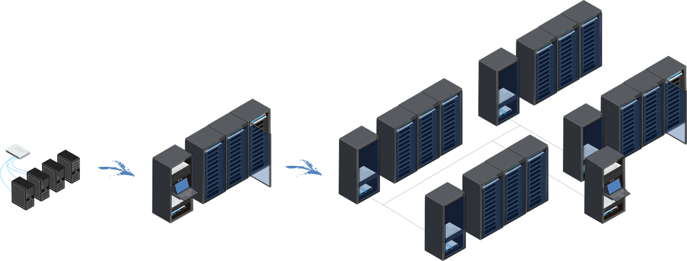

============
Introduction
============

**BlueBanquise** is a collection of Ansible roles, gathered 
with additional packages and tools as a unified stack, 
whose purpose is to deploy and manage clusters of hosts.
These clusters can be from few workstations to very large High Performance Computers,
servers farm clusters, K8S clusters, etc.

**BlueBanquise** is the result of a need for a very simple stack that can keep
simplicity while managing very complex architecture.

The **BlueBanquise** project also aims to train new system administrators to the
deployment of bare metal server's infrastructures.

The stack relies on **Ansible**.
Ansible was chosen for its simplicity.
The Ansible inventory groups/variables mechanism can cover from very simple to
very sophisticated configurations. Ansible is not the fastest tool.
However, it is easy to learn, and widely used today with an
active community.

The **BlueBanquise** stack is made of two main parts:

* The `CORE <https://github.com/bluebanquise/bluebanquise>`_, aimed to deploy operating system and base services on hosts
* The `COMMUNITY <https://github.com/bluebanquise/community>`_, aimed to provide specialized features over the CORE (Monitoring, HPC, render farm, etc.)

------------

This documentation is structured as the following:

* Few basic vocabularies, that can help reading this documentation.
* A quick start on how to bootstrap and deploy a very basic cluster with the stack.
* Detailed instructions on how to bootstrap and deploy a standard cluster.
* Detailed instructions on how to deploy a sophisticated and large cluster.
* Instructions on how to use some community or external roles to enhance cluster.

   * Users management with FreeIPA.
   * Monitoring with Prometheus.
   * HPC job scheduling with Slurm.
   * K8S cluster with Kubespray.

* Instructions on how to use BlueBanquise as an autonomous Ansible collection.

Since one of the main BlueBanquise goals is also to be a training for new Linux system 
administrators, at the end of documentation, few tutorials are provided, for generic knowledge.
Advanced users can skip these parts:

* How to manually deploy a test HPC cluster (generic knowledge, not related to the stack)
* How to use Ansible (generic knowledge, not related to the stack)

* How to use BlueBanquise as an Ansible collection of roles.
* How to boostrap BlueBanquise stack.
* Quick start on how to deploy a basic cluster.
* How to deploy an standard cluster, steps by steps.
* How to deploy a sophisticated and very large cluster.
* Usage of some community or external roles to enhance and specialize cluster.

* How to manually deploy a test HPC cluster (generic knowledge, not related to the stack)
* How to use Ansible (generic knowledge, not related to the stack)

------------

If you encounter any bugs/issues or have any comments, please inform us.

Note also that since BlueBanquise is a multi-distributions based stack, parts of the
documentation may be dedicated to a specific Linux distribution (always
explicitly mentioned).

We hope you will enjoy this stack as much as we do.

If you need help, do not hesitate to use `the discussions tab <https://github.com/bluebanquise/bluebanquise/discussions>`_
of the project's github.

Next step is to grab few basic :ref:`Vocabulary`.
