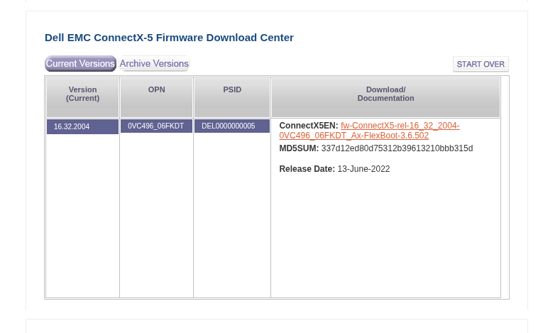

========
Mellanox
========

Before using any Mellanox Infiniband or Ethernet device, it is HIGLY recommanded to upgrade the firmwares (both NIC/HCA and switches).

Get HCA informations
====================

To get a simple list of current HCA parameters, use:

.. code-block:: text

  sudo mlxlink -d mlx5_0 -p 1

Output will be like the following:

.. code-block:: text

    Operational Info
    ----------------
    State                              : Active
    Physical state                     : LinkUp
    Speed                              : IB-SDR
    Width                              : 4x
    FEC                                : No FEC
    Loopback Mode                      : No Loopback
    Auto Negotiation                   : ON

    Supported Info
    --------------
    Enabled Link Speed                 : 0x00000001 (SDR)
    Supported Cable Speed              : 0x00000001 (SDR)

    Troubleshooting Info
    --------------------
    Status Opcode                      : 25
    Group Opcode                       : PHY FW
    Recommendation                     : Cable speed not enabled

    Tool Information
    ----------------
    Firmware Version                   : 16.35.4506
    MFT Version                        : mft 4.30.1-113

To get a full list of current HCA parameters, use:

.. code-block:: text

  sudo mlxconfig -d /dev/mst/mt4119_pciconf0 query

Note: you need to start mst before: sudo mst start

Output will be similar to this:

.. code-block:: text

    Device #1:
    ----------

    Device type:        ConnectX5
    Name:               MCX555A-ECA_Ax_Bx
    Description:        ConnectX-5 VPI adapter card; EDR IB (100Gb/s) and 100GbE; single-port QSFP28; PCIe3.0 x16; tall bracket; ROHS R6
    Device:             /dev/mst/mt4119_pciconf0

    Configurations:                                          Next Boot
            MEMIC_BAR_SIZE                              0
            MEMIC_SIZE_LIMIT                            _256KB(1)
            HOST_CHAINING_MODE                          DISABLED(0)
            HOST_CHAINING_CACHE_DISABLE                 False(0)
            HOST_CHAINING_DESCRIPTORS                   Array[0..7]
            HOST_CHAINING_TOTAL_BUFFER_SIZE             Array[0..7]
            FLEX_PARSER_PROFILE_ENABLE                  0
            FLEX_IPV4_OVER_VXLAN_PORT                   0
            ROCE_NEXT_PROTOCOL                          254
            ESWITCH_HAIRPIN_DESCRIPTORS                 Array[0..7]
            ESWITCH_HAIRPIN_TOT_BUFFER_SIZE             Array[0..7]
            PF_BAR2_SIZE                                0
            PF_NUM_OF_VF_VALID                          False(0)
            NON_PREFETCHABLE_PF_BAR                     False(0)
            VF_VPD_ENABLE                               False(0)
            PF_NUM_PF_MSIX_VALID                        False(0)
            PER_PF_NUM_SF                               False(0)
            STRICT_VF_MSIX_NUM                          False(0)
            VF_NODNIC_ENABLE                            False(0)
            NUM_PF_MSIX_VALID                           True(1)
            NUM_OF_VFS                                  0
            NUM_OF_PF                                   1
            PF_BAR2_ENABLE                              False(0)
            SRIOV_EN                                    False(0)
            PF_LOG_BAR_SIZE                             5
            VF_LOG_BAR_SIZE                             1
            NUM_PF_MSIX                                 63
            NUM_VF_MSIX                                 19
            INT_LOG_MAX_PAYLOAD_SIZE                    AUTOMATIC(0)
            PCIE_CREDIT_TOKEN_TIMEOUT                   0
            ACCURATE_TX_SCHEDULER                       False(0)
            PARTIAL_RESET_EN                            False(0)
            SW_RECOVERY_ON_ERRORS                       False(0)
            RESET_WITH_HOST_ON_ERRORS                   False(0)
            ADVANCED_POWER_SETTINGS                     False(0)
            CQE_COMPRESSION                             BALANCED(0)
            IP_OVER_VXLAN_EN                            False(0)
            MKEY_BY_NAME                                False(0)
            ESWITCH_IPV4_TTL_MODIFY_ENABLE              False(0)
            PRIO_TAG_REQUIRED_EN                        False(0)
            UCTX_EN                                     True(1)
            PCI_ATOMIC_MODE                             PCI_ATOMIC_DISABLED_EXT_ATOMIC_ENABLED(0)
            TUNNEL_ECN_COPY_DISABLE                     False(0)
            LRO_LOG_TIMEOUT0                            6
            LRO_LOG_TIMEOUT1                            7
            LRO_LOG_TIMEOUT2                            8
            LRO_LOG_TIMEOUT3                            13
            LOG_TX_PSN_WINDOW                           7
            LOG_MAX_OUTSTANDING_WQE                     7
            ROCE_ADAPTIVE_ROUTING_EN                    False(0)
            TUNNEL_IP_PROTO_ENTROPY_DISABLE             False(0)
            ICM_CACHE_MODE                              DEVICE_DEFAULT(0)
            TX_SCHEDULER_FWS_REACTIVITY                 DIRECT(1)
            TX_SCHEDULER_BURST                          0
            ZERO_TOUCH_TUNING_ENABLE                    False(0)
            LOG_MAX_QUEUE                               17
            LOG_DCR_HASH_TABLE_SIZE                     11
            MAX_PACKET_LIFETIME                         0
            DCR_LIFO_SIZE                               16384
            LINK_TYPE_P1                                IB(1)
            NUM_OF_PLANES_P1                            0
            IB_PROTO_WIDTH_EN_MASK_P1                   0
            ROCE_CC_PRIO_MASK_P1                        255
            ROCE_CC_CNP_MODERATION_P1                   DEVICE_DEFAULT(0)
            CLAMP_TGT_RATE_AFTER_TIME_INC_P1            True(1)
            CLAMP_TGT_RATE_P1                           False(0)
            RPG_TIME_RESET_P1                           300
            RPG_BYTE_RESET_P1                           32767
            RPG_THRESHOLD_P1                            1
            RPG_MAX_RATE_P1                             0
            RPG_AI_RATE_P1                              5
            RPG_HAI_RATE_P1                             50
            RPG_GD_P1                                   11
            RPG_MIN_DEC_FAC_P1                          50
            RPG_MIN_RATE_P1                             1
            RATE_TO_SET_ON_FIRST_CNP_P1                 0
            DCE_TCP_G_P1                                1019
            DCE_TCP_RTT_P1                              1
            RATE_REDUCE_MONITOR_PERIOD_P1               4
            INITIAL_ALPHA_VALUE_P1                      1023
            MIN_TIME_BETWEEN_CNPS_P1                    4
            CNP_802P_PRIO_P1                            6
            CNP_DSCP_P1                                 48
            LLDP_NB_DCBX_P1                             False(0)
            LLDP_NB_RX_MODE_P1                          OFF(0)
            LLDP_NB_TX_MODE_P1                          OFF(0)
            ROCE_RTT_RESP_DSCP_P1                       0
            ROCE_RTT_RESP_DSCP_MODE_P1                  DEVICE_DEFAULT(0)
            DCBX_IEEE_P1                                True(1)
            DCBX_CEE_P1                                 True(1)
            DCBX_WILLING_P1                             True(1)
            KEEP_ETH_LINK_UP_P1                         True(1)
            KEEP_IB_LINK_UP_P1                          False(0)
            KEEP_LINK_UP_ON_BOOT_P1                     False(0)
            KEEP_LINK_UP_ON_STANDBY_P1                  False(0)
            DO_NOT_CLEAR_PORT_STATS_P1                  False(0)
            AUTO_POWER_SAVE_LINK_DOWN_P1                False(0)
            NUM_OF_VL_P1                                _4_VLs(3)
            NUM_OF_TC_P1                                _8_TCs(0)
            NUM_OF_PFC_P1                               8
            VL15_BUFFER_SIZE_P1                         0
            QOS_TRUST_STATE_P1                          TRUST_PCP(1)
            DUP_MAC_ACTION_P1                           LAST_CFG(0)
            MPFS_MC_LOOPBACK_DISABLE_P1                 False(0)
            MPFS_UC_LOOPBACK_DISABLE_P1                 False(0)
            UNKNOWN_UPLINK_MAC_FLOOD_P1                 False(0)
            SRIOV_IB_ROUTING_MODE_P1                    LID(1)
            IB_ROUTING_MODE_P1                          LID(1)
            PHY_AUTO_NEG_P1                             DEVICE_DEFAULT(0)
            PHY_RATE_MASK_OVERRIDE_P1                   False(0)
            PHY_FEC_OVERRIDE_P1                         DEVICE_DEFAULT(0)
            PF_TOTAL_SF                                 0
            PF_SD_GROUP                                 0
            PF_SF_BAR_SIZE                              0
            PF_NUM_PF_MSIX                              63
            ROCE_CONTROL                                ROCE_ENABLE(2)
            PCI_WR_ORDERING                             per_mkey(0)
            MULTI_PORT_VHCA_EN                          False(0)
            PORT_OWNER                                  True(1)
            ALLOW_RD_COUNTERS                           True(1)
            RENEG_ON_CHANGE                             True(1)
            TRACER_ENABLE                               True(1)
            IP_VER                                      IPv4(0)
            BOOT_UNDI_NETWORK_WAIT                      0
            UEFI_HII_EN                                 True(1)
            BOOT_DBG_LOG                                False(0)
            UEFI_LOGS                                   DISABLED(0)
            BOOT_VLAN                                   1
            LEGACY_BOOT_PROTOCOL                        PXE(1)
            BOOT_INTERRUPT_DIS                          False(0)
            BOOT_LACP_DIS                               True(1)
            BOOT_VLAN_EN                                False(0)
            BOOT_PKEY                                   0
            P2P_ORDERING_MODE                           DEVICE_DEFAULT(0)
            ATS_ENABLED                                 False(0)
            DYNAMIC_VF_MSIX_TABLE                       False(0)
            EXP_ROM_UEFI_x86_ENABLE                     True(1)
            EXP_ROM_PXE_ENABLE                          True(1)
            IBM_TUNNELED_ATOMIC_EN                      False(0)
            IBM_AS_NOTIFY_EN                            False(0)
            ADVANCED_PCI_SETTINGS                       False(0)
            SAFE_MODE_THRESHOLD                         10
            SAFE_MODE_ENABLE                            True(1)

Get Cable informations
======================

To get cables information, start mst, and use cable add:

.. code-block:: text

  sudo mst cable add

Then use mlxcables to get cable informations:

.. code-block:: text

  sudo mlxcables

Output will be similar to:

.. code-block:: text

    Querying Cables ....

    Cable #1:
    ---------
    Cable name    : mt4119_pciconf0_cable_0
    >> No FW data to show
    -------- Cable EEPROM --------
    Identifier                     : QSFP28 (11h)
    Technology                     : Copper cable unequalized (a0h)
    Compliance                     : 40GBASE-CR4, 25GBASE-CR CA-25G-N or 50GBASE-CR2 with no FEC
    Attenuation: 2.5GHz            : 4dB
                5.0GHz            : 6dB
                7.0GHz            : 8dB
                12.9GHz           : 12dB
                25.78GHz          : 0dB
    OUI                            : 0x0002c9
    Vendor                         : Mellanox
    Serial number                  : XXXXXXXXXXXXX
    Part number                    : XXXXXXXXXXXXX
    Revision                       : A2
    Temperature [c]                : N/A
    Digital Diagnostic Monitoring  : NO
    Length [m]                     : 2 m

Change mode to Ethernet or Infiniband
=====================================

Mellanox network cards are able to be in 2 modes: Ethernet or Infiniband.
You might need to change it if your card is not configured the way you need.

To do so, check first the current card configuration using:

.. code-block:: text

  sudo mlxconfig -d /dev/mst/mt4119_pciconf0 query

Look for line LINK_TYPE_P1. It can be either ETH(0) or IB(1).

Then switch from one mode to the other using this command:

.. code-block:: text

  sudo mlxconfig -d /dev/mst/mt4119_pciconf0 set LINK_TYPE_P1=1

LINK_TYPE_P1=1 means Infiniband, while LINK_TYPE_P1=0 means Ethernet.
You will need to reboot the system to apply the changes.

Upgrade firmwares
=================

.. warning::

    Always do firmware upgrades from inside a Tmux running on the target machine, so that in case of network issue, the process can continue to completion.

Switches
--------

Switchs upgrades can be made via web interface when manageable.
As far as I know, switches firmwares and OS updates are not free access, you need an account to download them.
Please contact your vendor to obtain them.

Please consider that you cannot download the latest update and apply it on the switch.
You will need to do small jumps via multiple versions to reach the latest supported one.

HCA/NIC
-------

.. warning::

  NEVER upgrade an HCA based on its name, but use instead the board_id.

To get the board_id, use:

.. code-block:: text

  cat /sys/class/infiniband/mlx5_0/board_id

For example:

.. code-block:: text
    
  root@mgmt:~# cat /sys/class/infiniband/mlx5_0/board_id  
  DEL0000000005
  root@mgmt:~# lspci | grep -i mellanox
  5e:00.0 Infiniband controller: Mellanox Technologies MT27800 Family [ConnectX-5]

If the card is not an Nvidia card, but an OEM/vendor card, in order to get your card Firmware, select the vendor on this Nvidia website: https://network.nvidia.com/support/oem-firmware-downloads/

For example, here, it is a ConnectX-5 Dell card, and so in Dell vendor section, find ConnectX-5, and you can check the board_id matches your need:

If the card is an Nvidia/Mellanox card (not OEM), use the page https://network.nvidia.com/support/firmware/firmware-downloads/ to find your firmware.

Never use a firmware that does not match the board id.

Once firmware has been downloaded, flash the HCA using mstflint, and reset it to have the new firmware running:

.. code-block:: text

  sudo apt install mstflint -y
  sudo mst start
  sudo flint -d /dev/mst/mt4119_pciconf0 -i fw-ConnectX5-rel-16_32_2004-0VC496_06FKDT_Ax-FlexBoot-3.6.502.bin burn
  sudo mlxfwreset -d /dev/mst/mt4119_pciconf0 reset
