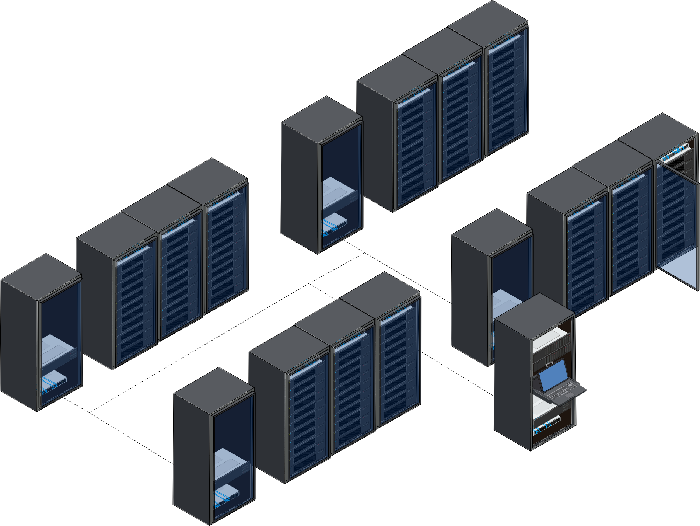
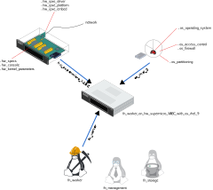

==========
Vocabulary
==========

Lets establish few common terms before going deeper in technical details.

Some words are important in **BlueBanquise**. Most of them are described here.

Ansible vocabulary
==================

Host
----

An Ansible **host** (also often referred as a **node**) is a remote host managed
by Ansible. An **host** can be a physical server, but also a VM, a container or
something else.

.. image:: images/nodes/hosts_example.svg
   :align: center

Hosts are defined in *~/bluebanquise/inventory/cluster/nodes*.

Please do a difference between an **Ansible managed host**, and a **host**.
All equipment that can have an ip address on the network are considered "host",
but only those with an ssh + python capability and on which we will use Ansible
to deploy a configuration are considered "Ansible managed host".
They are declared the same way in the stack inventory.

Note also that sometime the term **node** is used as a replacement word for **host**.

Group
-----

An Ansible **group** is a logical aggregation of hosts.
For example, system administrator can define a group "database_servers" that
would contain hosts "database1" and "database2".

**Groups** allow Ansible to provide dedicated **variables** to member hosts or
execute tasks on a set of hosts.

Note: a host can be part of multiple groups.

Variables
---------

Variables in Ansible follow the YAML structure.

A variable is like in any programming language: a variable name, and a data
related.

Multiple kind of variables exist in Ansible:

Simple
^^^^^^

A simple variable is defined this way:

.. code-block:: yaml

  my_variable_1: hello!
  my_variable_2: 7777

In Jinja2, variables will be accessible directly this way:

.. code-block:: text

  {{ my_variable_1 }}

Output will be:

.. code-block:: text

  hello!

List
^^^^

A list is like an array, and can be iterated over:

.. code-block:: yaml

  my_names_list:
    - bob
    - alice
    - henry

In Jinja2, variables in a list can be iterated over, or a specific value of the
list can be used (like an array):

.. code-block:: text

  
  {{ i }}
  
  {{ my_names_list[0] }}

Note that index start at 0.

Output will be:

.. code-block:: text

  bob
  alice
  henry
  bob

Note also that to check if a list is empty,
it is possible to check the list itself:

.. code-block:: text

  
  the list is not empty
  
  the list is empty
  

Dictionary
^^^^^^^^^^^

A dictionary, is simply a pack of other variables, organized as a tree, and
defined under it (some kind of variables tree):

.. code-block:: yaml

  my_dictionarry_1:
    my_variable_1: hello!
    my_variable_2: 7777
    my_sub_part:
      color: yellow
      font: verdana
    my_names_list:
      - bob
      - alice
      - henry

In Jinja2, dictionary can be access two ways:

.. code-block:: text

  
  {{ i }}
  
  
  {{ i }}
  

  {{ my_dictionarry_1.my_names_list[0] }}
  {{ my_dictionarry_1['my_names_list'][0] }}

Output will be:

.. code-block:: text

  bob
  alice
  henry
  bob
  alice
  henry

  bob
  bob

Jinja2 will be discussed later, do not worry about this point for now.

j2 variables
^^^^^^^^^^^^

These are **BlueBanquise** specific variables.
All variables with name starting by **j2_** are j2 variables.

These variables are here to simplify tasks and templates writing, and centralize
main logic of the stack.
To clarify your mind, you can consider that these variables contain Jinja2 code
as a string, that will be interpreted by Ansible during tasks/templates
execution.

Remember that in any case, if these variables are not providing the expected
value, you can use Ansible variables precedence mechanism to force your values.

Last point, for developers, these j2 variables should be considered as a way to
keep compatibility with roles, while upgrading the logic of the stack. Do not
hesitate to use them in roles, to ensure long term compatibility.

bb variables
^^^^^^^^^^^^

These are **BlueBanquise** specific variables.
All variables with name starting by **bb_** are bb variables.

These variables are transverse variables, which means they will precedence any roles' owned related variables.

Their purpose is to allow a simple centralisation of global values.

A good example is the domain name of the cluster: using roles's variables,
admin would have to define with the exact same value ``pxe_stack_domain_name``,
``dns_server_domain_name``, ``dhcp_server_domain_name``, etc. This would be a pain.
Defining ``bb_domain_name`` can replace all of them at once.

Inventory, roles, and playbooks
-------------------------------

Inventory
^^^^^^^^^

The Ansible inventory is the directory that contains Ansible variables and hosts
definitions. In **BlueBanquise**, default path is ``/var/lib/bluebanquise/inventory``.

Inventory is the **DATA**.

Roles
^^^^^

An Ansible role is a list of tasks to do to achieve a purpose.
For example, there will be a role called dhcp_server, that contains tasks to
install, configure and start the dhcp server.

In **BlueBanquise**, default path is ``/var/lib/bluebanquise/roles``.

Note that Bluebanquise roles are provided via Ansible collections,
and so are managed by your Ansible local installation.

Roles are the **AUTOMATION LOGIC**.

Playbooks
^^^^^^^^^

An Ansible playbook is simply a list of roles to apply on a specific host or
group of hosts. It is a yaml file.

In **BlueBanquise**, default path is ``/var/lib/bluebanquise/playbooks``.

Playbooks are your **LIST OF ROLES TO APPLY on your hosts/targets**.

Variables precedence
--------------------

We are reaching the very important part of the stack.

Ansible has an internal mechanism called **Variables precedence**.
Simply put: you can define the same variables (same name) multiple times, and
using this mechanism, some definitions will have priority above others,
depending of their position.

When a variable is defined in a yml file, the position of the file in the
ansible inventory is key.

For example, a variable defined in ``/var/lib/bluebanquise/inventory/group_vars/all/``
will have the less precedence, and a variable defined in
``/var/lib/bluebanquise/inventory/cluster`` will have a higher precedence, and so win if
variable is used.

The full list of available variables precedence is provided in Ansible
documentation:
`variable precedence list <https://docs.ansible.com/ansible/latest/user_guide/playbooks_variables.html#variable-precedence-where-should-i-put-a-variable>`_

This feature is key to the stack and key for system administrator to manipulate
the **BlueBanquise** stack the way he/she wants, and *force* automatic
values if desired.

For example, values can be set by default, and then redefined for some groups of
hosts without changing the default for all others.
Or it can be used to simply fix a dynamic j2 variable to the desired value in
hosts definitions if dynamic value is not the one expected (you can even
redefine the whole logic of the stack without editing the stack code). Etc.

Inventory can be seen as a giant pizza, in 3D then flatten.

* *Paste* is the variable in /var/lib/bluebanquise/inventory/group_vars/all
* Then *large ingredients* comes from /var/lib/bluebanquise/inventory/group_vars/equipment_myequipment
* Then *small ingredients* above are the /var/lib/bluebanquise/inventory/cluster/nodes/
* And *pepper and tomatoes* (last layer) is the extra-vars at call.

.. image:: images/pizza_example.svg

I like pizza...

Replace
-------

Ansible and BlueBanquise default hash_behaviour is *replace*.

If using *replace*, when a dictionary is impacted by the variable’s precedence
mechanism, Ansible overwrite the **full dictionary** if a variable has a higher
precedence somewhere.

If using *merge*, Ansible will only update the related variable, and keep the
original dictionary and values for all other variables in this dictionary.
However, merge is now considered deprecated and is no more default in
BlueBanquise.

Jinja2
------

Jinja2 is the templating language used by Ansible to render templates in roles.
It is heavily used in the stack, and learning Jinja2 will often be needed to
create custom roles.
(But Jinja2 is simple if you are use to code or especially script with bash).

Full documentation is available in a "single page":
`Jinja2 template designer <https://jinja.palletsprojects.com/en/2.10.x/templates/>`_

Stack vocabulary
================

Icebergs
--------

Icebergs are logical (and often physical) isolation of ethernet management
networks. Most of the time, icebergs are used to:

* Spread load over multiple managements servers (for very large clusters). Icebergs are also often called "islands" in these cases.
* Secure cluster by dividing specific usages, to prevent compromised system to access all the network.

One Iceberg is composed of one or multiple managements servers, **in charge of
the same pool of nodes**.

**BlueBanquise** support many kinds of configurations, but most common are:

One iceberg configuration
^^^^^^^^^^^^^^^^^^^^^^^^^

|

|

For simple systems (small/medium HPC cluster, small enterprise network,
university IT practical session room, etc.), one iceberg scenario is the
standard. One or multiple management will reach the same ethernet administration
networks, and federate the same pool of nodes.

.. image:: images/clusters/single_iceberg_2_single_column.svg
   :align: center

|

Multiple icebergs configuration
^^^^^^^^^^^^^^^^^^^^^^^^^^^^^^^

|

.. image:: images/multiple_icebergs.svg

|

For advanced systems, (large HPC clusters needing load spreading with unified
network, enterprise network, etc.), multiple icebergs scenario can be required.
**BlueBanquise** allows multiple levels of icebergs, for complex needs.

Manipulating order of network_interfaces defined for each host allows to create
a unified network so all nodes from all icebergs can communicate through this
network (most of the time an Interconnect network).

|

Equipment profiles
------------------

In **BlueBanquise**, nodes are, in normal time, part of a at least 3 key Ansible groups.

* 1 **function group**, that defines the purpose of the node. These groups are always prefixed by ``fn_``. For example: ``fn_worker``.
* 1 **hardware group**, that defines the hardware used for the node. These groups are always prefixed by ``hw_``. For example: ``hw_supermicro_X10DRT``.
* 1 **os group**, that defines the os used for the node. These groups are always prefixed by ``os_``. For example: ``os_ubuntu_22.04``.

The conjunction of 3 of these groups (one of each) creates an **equipment profile**.

For example:

* host ``A`` is part of the following groups: ``['fn_management', 'hw_X2', 'os_debian_12']``
* host ``B`` is part of the following groups: ``['fn_worker', 'hw_X1', 'os_debian_12']``
* host ``C`` is part of the following groups: ``['fn_worker', 'hw_X1', 'os_debian_12']``

This configuration has 2 equipment profiles: ``fn_management_on_hw_X2_with_os_debian_12`` and ``fn_worker_on_hw_X1_with_os_debian_12``.

.. image:: images/groups_ep.svg
   :align: center

These groups are used to provide to hosts dedicated parameters
(this includes hosts operating system parameters, kernel parameters,
partitioning, etc.), and other variables if needed like dedicated
authentication parameters.

These are key groups of the stack.

**It is important** to note that hardware groups variables start with prefix ``hw_`` and os groups variables start with prefix ``os_``
and that these variables **MUST NEVER** be used at an upper level than group_vars in variables precedence.
**It can, but you must NOT**, due to special usage of them.

For now, just keep in mind these variables exist. These will be discussed later.
