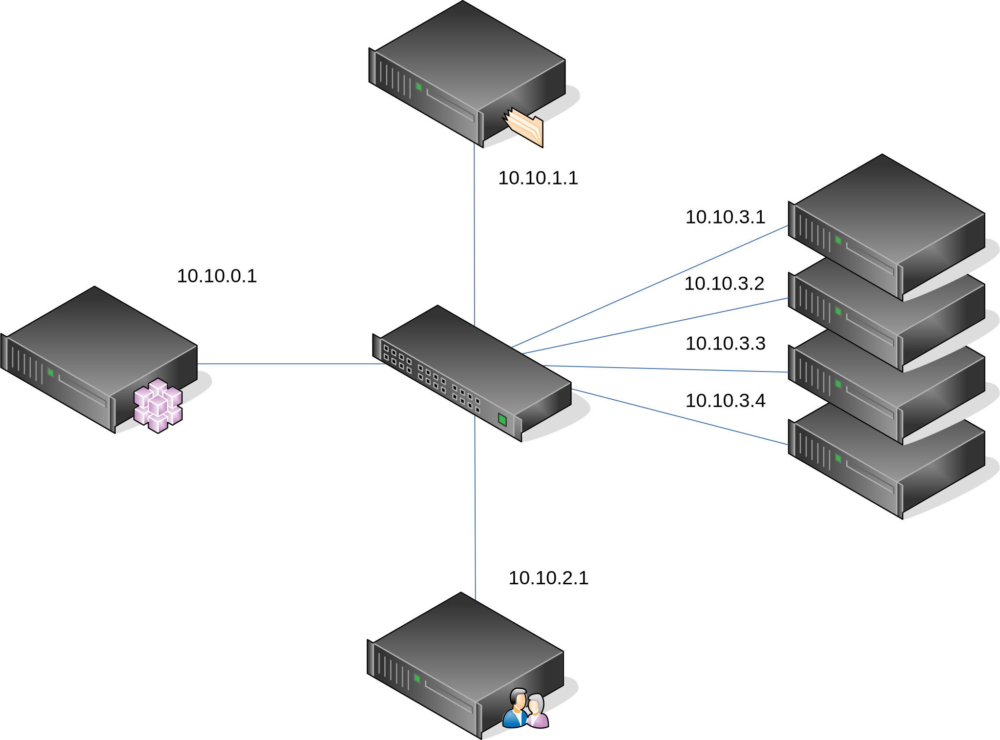

======================
Configure BlueBanquise
======================

At this point, you should have an operating system with Ansible installed on it,
and basic OS repositories.

Get BlueBanquise
================

Install needed basic packages:

.. code-block:: bash

  yum install wget createrepo git

Now, download latest **BlueBanquise** version from git:

.. code-block:: bash

  git clone https://github.com/bluebanquise/bluebanquise.git /etc/bluebanquise

ansible will read ANSIBLE_CONFIG, ansible.cfg in the current working directory,
.ansible.cfg in the home directory or /etc/ansible/ansible.cfg, whichever it
finds first.

To use /etc/bluebanquise/ansible.cfg, either change the current working
directory or set ANSIBLE_CONFIG:

.. code-block:: bash

  export ANSIBLE_CONFIG=/etc/bluebanquise/ansible.cfg
  cd /etc/bluebanquise

Finally, edit /etc/hosts file, and add "management1" (or whatever your current
management node hostname) on localhost line:

.. code-block:: text

  127.0.0.1   localhost localhost.localdomain localhost4 localhost4.localdomain4 management1
  ::1         localhost localhost.localdomain localhost6 localhost6.localdomain6

This will allow us to bootstrap the management configuration.

It is time to configure the inventory to match cluster needs.

Configure inventory
===================

This documentation will cover the configuration of a very simple cluster:

Check example inventory
-----------------------

An inventory example is provided in
/etc/bluebanquise/resources/examples/simple_cluster/ as a base for our work.

This example is based on the picture provided just above.

Lets copy it to use it as our new inventory:

.. code-block:: bash

  cp -a /etc/bluebanquise/resources/examples/simple_cluster/inventory /etc/bluebanquise/inventory

.. warning::
  Ansible will read **ALL** files in the inventory. **NEVER do a backup of a file
  here!**
  Backup in another location, outside of /etc/bluebanquise/inventory.

Review nodes
------------

Time to review the provided example configuration, and adapt it to your
configuration.

First, the nodes.

Management node
^^^^^^^^^^^^^^^

Open file cluster/nodes/managements.yml:

.. code-block:: yaml

  mg_managements:
    children:
      equipment_typeM:
        hosts:
          management1:
            bmc:
              name: bmanagement1
              ip4: 10.10.100.1
              mac: 08:00:27:dc:f8:f6
              network: ice1-1
            network_interfaces:
              - interface: enp0s3
                ip4: 10.10.0.1
                mac: 08:00:27:dc:f8:f5
                network: ice1-1
              - interface: ib0
                ip4: 10.20.0.1
                network: interconnect-1

This file contains our management node configuration. Let’s review it, to
understand it.

First, the groups:

.. code-block:: yaml

  mg_managements:         # This is the main group (also called master group), it is very useful with advanced configuration
    children:             # This is an Ansible instruction, indicating the below group is included in mg_managements group
      equipment_typeM:    # This is the equipment group of the management node. It always starts by 'equipment_'
        hosts:            # This is an Ansible instruction, to list below the hosts member of this group
          management1:    # This is the hostname

Now the BMC (if exist):

.. code-block:: yaml

  mg_managements:
    children:
      equipment_typeM:
        hosts:
          management1:
            bmc:                      # This instruction defines an attached BMC
              name: bmanagement1      # This is the hostname of the BMC
              ip4: 10.10.100.1        # This is the ipv4 of the BMC
              mac: 08:00:27:dc:f8:f6  # This is the MAC hardware address of the BMC (for DHCP)
              network: ice1-1         # This is the logical network this interface is connected to. Logical networks will be seen later.

Then the network interfaces and their associated networks:

.. code-block:: yaml

  mg_managements:
    children:
      equipment_typeM:
        hosts:
          management1:
            bmc:
              name: bmanagement1
              ip4: 10.10.100.1
              mac: 08:00:27:dc:f8:f6
              network: ice1-1
            network_interfaces:         # This is an instruction, to define bellow all host's NIC (Network Interface Controllers)
              - interface: enp0s3       # This is the NIC name ('ip a' command to get NIC list)
                ip4: 10.10.0.1          # This is the expected ipv4 for this NIC
                mac: 08:00:27:dc:f8:f5  # This is the NIC MAC address, for the DHCP
                network: ice1-1         # This is the logical network this NIC is linked to
              - interface: ib0          # This is another NIC, not in the dhcp so no MAC is provided
                ip4: 10.20.0.1
                network: interconnect-1

It should not be too difficult to understand this file.

Other nodes
^^^^^^^^^^^

Now, review compute and login nodes in their respective
cluster/nodes/computes.yml and cluster/nodes/logins.yml files. Same rules
apply. You can also add more nodes, or if you have for example multiple type
of equipment for computes nodes or login nodes, add another equipment group
this way:

.. code-block:: yaml

  mg_computes:
    children:
      equipment_typeC:
        hosts:
          c001:
          [...]
      equipment_typeD:
        hosts:
          c005:
          [...]
      equipment_typeE:
        hosts:
          c010:
          [...]

Now, let's have a look at the logical networks.

Review logical networks
-----------------------

In **BlueBanquise**, nodes are connected together through logical networks. Most
of the time, logical networks will match your physical network, but for advanced
networking, it can be different.

All networks are defined in group_vars/all/general_settings/network.yml file.
In this current example inventory, there are two networks provided:
ice1-1 and interconnect-1.

Before reviewing the file, please read this **IMPORTANT** information: in
**BlueBanquise** there are two kind of networks: administration/management
networks, and the others.

An administration network is used to deploy and manage the nodes. It will be for
example used to run a DHCP server, handle the PXE stack, etc, and also all the
Ansible ssh connections. Administration networks have a strict naming
convention, which by default is: **iceX-Y** with X the iceberg number, and Y the
subnet number in this iceberg X. In our case, we are working on iceberg1
(default when disabling icebergs mechanism), and we only have one subnet, so our
administration network will be ice1-1. If we would need another subnet, its name
would have been ice1-2, etc. Interconnect-1 is not an administration network.

.. note::
  In new versions of the stack, it is now possible to replace the number Y by a
  string compatible with [0-9][a-z][A-Z] regex.

Open file group_vars/all/general_settings/network.yml and let's check part of
its content:

.. code-block:: yaml

  networks:                                             # This defines the list of networks
    ice1-1:                                             # Network name
      subnet: 10.10.0.0                                 # Network subnet
      prefix: 16                                        # Network prefix
      netmask: 255.255.0.0                              # Network netmask, must comply with prefix
      broadcast: 10.10.255.255                          # Broadcast, deduced from subnet and prefix/netmask
      dhcp_unknown_range: 10.10.254.1 10.10.254.254     # This is the range of ip where unknown nodes (i.e. not in the inventory) will be placed if asking for an ip
      gateway: 10.10.0.1                                # Optional, define a gateway
      is_in_dhcp: true                                  # If you want this network to be in the dhcp (only apply to management networks)
      is_in_dns: true                                   # If you want this network to be in the dns
      services_ip:                                      # IPs or virtual IPs to bind to for each service. In our case, all services will be running on management1 so 10.10.0.1 for all
        pxe_ip: 10.10.0.1
        dns_ip: 10.10.0.1
        repository_ip: 10.10.0.1
        authentication_ip: 10.10.0.1
        time_ip: 10.10.0.1
        log_ip: 10.10.0.1

All explanations are given above.

One note about *services_ip*: it is used if services are spread over multiple
managements, or in case of High Availability with virtual IPs. Ansible is not
able to gather this information alone from playbooks (it could, but this would
end up with a way too much complex stack), and so we have to provide it manually.
You can also set here an IP address from another subnet if your system has network
routing.

Then check content of file group_vars/all/networks/interconnect-1.yml . As this
is **not** an administration network, its configuration is easy.

That is all for basic networking. General network parameters are set in
group_vars/all/general_settings/network.yml file, and nodes parameters are
defined in the node’s files.

Now, let's have a look at the general configuration.

Review general configuration
----------------------------

General configuration is made in group_vars/all/general_settings.

Externals
^^^^^^^^^

File group_vars/all/general_settings/external.yml allows to configure external
resources. It should be self understandable.

Network
^^^^^^^

File group_vars/all/general_settings/network.yml allows to configure network
related parameters, and detail all networks of the cluster.

Repositories
^^^^^^^^^^^^

File group_vars/all/general_settings/repositories.yml configure repositories to
use for all nodes (using groups and variable precedence, repositories can be
tuned for each group of nodes, or even each node).

Right now, only *os* and *bluebanquise* are set. This means two or three
(depending of the operating system) repositories will be added to nodes, and
they will bind to repository_ip in ice1-1.yml .

See the repositories_client role part of the documentation for advanced
configurations.

NFS
^^^

File group_vars/all/general_settings/nfs.yml allows to set NFS shared folders
inside the cluster. Comments in the file should be enough to understand this
file.

General
^^^^^^^

File group_vars/all/general_settings/general.yml configure few main parameters:

* Time zone (very important)

Do not bother about the other parameters.

And that is all for general configuration. Finally, let’s check the default
parameters.

Review Default parameters
-------------------------

Last part, and probably the most complicated, are default parameters.

Remember Ansible precedence mechanism. All variables in group_vars/all/ have
less priority, while variables in group_vars/* have a higher priority.

The idea here is the following: group_vars/all/equipment_all/ folder contains
all the default parameters for all nodes. Here authentication, and
equipment_profile. You have to tune these parameters to match your exact
"global" need, and then copy (if needed) these whole files into dedicated
group_vars folder for each equipment group, and tune them according to these
equipment specific parameters.

.. note::
  You can copy the whole equipment_profile.yml content from equipment_all to
  equipment_X folders, **or better**, create a new file in equipment_X and only
  set the parameters that are different from the global parameters.

For example, open file
/etc/bluebanquise/inventory/group_vars/all/equipment_all/equipment_profile.yml,
and check access_control variable. It is set to enforcing:

.. code-block:: yaml

  ep_access_control: enforcing

Ok, but so all nodes will get this value. Let's check computes nodes, that are
in equipment_typeC group. Let's check c001:

.. code-block:: bash

  [root@]# ansible-inventory --host c001 --yaml | grep ep_access_control
    ep_access_control: enforcing
  [root@]#

Not good, we want to disable access_control on computes. We need to change that.

Open file group_vars/equipment_typeC/equipment_profile.yml and set
access_control to disabled.

Now check again:

.. code-block:: bash

  [root@]# ansible-inventory --host c001 --yaml | grep ep_access_control
    ep_access_control: disabled
  [root@]#

Same apply for all equipment_profile parameters. You define a global set of
parameters in equipment_all, which act as a global/default set, and then copy
(all or a part of them) and tune this set for each equipment group if needed.

.. warning::
  **IMPORTANT**: equipment_profile variables and authentication variables are
  not standard. It is **STRICTLY FORBIDDEN** to tune them outside default
  (group_vars/all/equipment_all/equipment_profile.yml) or an equipment group
  (group_vars/equipment_*). For example, you cannot create a custom group and
  define some equipment_profile parameters for this group. If you really need to
  do that, add more equipment groups and tune this way. If you do not respect this
  rule, unexpected behavior will happen during configuration deployment.

Equipment profile
^^^^^^^^^^^^^^^^^

Equipment profiles are variables dedicated to groups of nodes equipment. These
variables cover most of the hardware, operating system, PXE needs, etc. of the
related nodes.

Lets review them:

PXE
"""

* **ep_ipxe_driver**
   * Possible values:
      * default
      * snp
      * snponly
   * Notes:
     See https://ipxe.org/appnote/buildtargets.
     Most of servers should accept default driver, but snp or snponly can be required on some (with many NICs for example).
* **ep_ipxe_platform**
   * Possible values:
      * pcbios
      * efi
   * Notes:
     This is the BIOS firmware type.
     Should be detected automatically, but some roles need to force it.
* **ep_ipxe_embed**
   * Possible values:
      * standard
      * dhcpretry
   * Notes:
     standard is ok for most cases. dhcpretry is to be used on networks where
     link on switch may take some time to go up. In dhcpretry mode, the iPXE rom
     will indefinitely try to get an ip from the dhcp.

* **ep_preserve_efi_first_boot_device**
   * Possible values:
      * true
      * false
   * Notes:
     Try to force grub to restore EFI boot order during OS deployment. Allows to
     keep PXE first for example.

* **ep_console**
   * Notes:
     Custom value: the server console to be used. For example: console=tty0 console=ttyS1,115200n8

* **ep_kernel_parameters**
   * Notes:
     Custom value: additional kernel parameters to be added on kernel line.

* **ep_access_control**
   * Possible values:
      * enforcing
      * permissive
      * disabled
   * Notes:
     Activate or not the access control (SELinux, etc.).

* **ep_firewall**
   * Possible values:
      * true
      * false
   * Notes:
     Activate or not the firewall (firewalld, etc.).

* **ep_partitioning**
   * Notes:
     Custom value: contains the partitioning multiple lines to be used. It is
     expected here native distribution syntax. For example, for RHEL/CentOS, use
     plain kickstart partitioning syntax (allows full custom partitioning).

* **ep_autoinstall_pre_script**
   * Notes:
     To add a multiple lines %pre script in the auto deployment file (kickstart,
     autoyast, preseed, etc.)

* **ep_autoinstall_post_script**
   * Notes:
     To add a multiple lines %post script in the auto deployment file (kickstart,
     autoyast, preseed, etc.)

* **ep_operating_system**
   * **distribution**
      * Notes:
        Custom value: set the distribution to be used here. This will be
        directly related to the repository used. Standard values are: centos,
        redhat, debian, ubuntu, opensuse, etc.
   * **distribution_major_version**
      * Notes:
        Custom value: set the distribution major version number or string.
   * **distribution_version**
      * Notes:
        Custom and optional value: set the distribution minor/custom version to
        be used. This will force repositories and PXE to use a minor version
        instead of relying on a major.
   * **repositories_environment**
      * Notes:
        Custom and optional value: set a production environment, to prepend all
        paths to be used (see repositories_client role documentation). For
        example: production, staging, test, etc.

* **ep_equipment_type**
   * Possible values:
      * server
      * any other custom values but not "server"
   * Notes:
     If server, then PXE files will be generated by the pxe_stack role. If not,
     then value can be custom (and no PXE files will be generated).

* **ep_configuration**
   * keyboard_layout**
      * Possible values:
         * us
         * fr
         * etc.
      * Notes:
        Set the keyboard layout.
   * system_language**
      * Possible values:
         * en_US.UTF-8
         * etc.
      * Notes:
        Set the system locals. It is strongly recommended to keep en_US.UTF-8.

* **ep_hardware**
   * Notes:
     Multiple fields to define system architecture. Some addon roles (like slurm)
     may rely on these values.

* **ep_equipment_authentication**
   * **user**
      * Notes:
        Custom value: set the BMC, storage bay controller, switch, etc. user.
   * **password**
      * Notes:
        Custom value: set the BMC, storage bay controller, switch, etc. password.

Authentication
^^^^^^^^^^^^^^

Authentication file allows to define default root password for all nodes, and
default public ssh keys lists.

To generate an sha512 password, use the following command (python >3.3):

.. code-block:: text

  python -c 'import crypt,getpass; print(crypt.crypt(getpass.getpass(), crypt.mksalt(crypt.METHOD_SHA512)))'

We need to ensure our management1 node ssh public key is set here.

Get the content of /root/.ssh/id_rsa.pub and add it in this file. At the same
time, **remove the ssh key provided here as example**.

It is possible to do it automatically using the following command:

.. code-block:: text

  # Copy public key of the mgmt to the inventory
  /usr/bin/sed -i -e "s#- ssh-rsa.*#- $(cat /root/.ssh/id_rsa.pub)#" \
    /etc/bluebanquise/inventory/group_vars/all/equipment_all/authentication.yml

.. warning::
  If you update the managements ssh keys, do not forget to update this file.

Review groups parameters
------------------------

Last step is to check and review example of equipment_profile tuning in each of
the group_vars/equipment_XXXXXX folders. Adapt them to your needs.

If you prefer, you can copy the whole
group_vars/all/equipment_all/equipment_profile.yml file into these folders, or
simply adjust the parameters you wish to change from default.

Once done, configuration is ready.

It is time to deploy configuration on management1.
