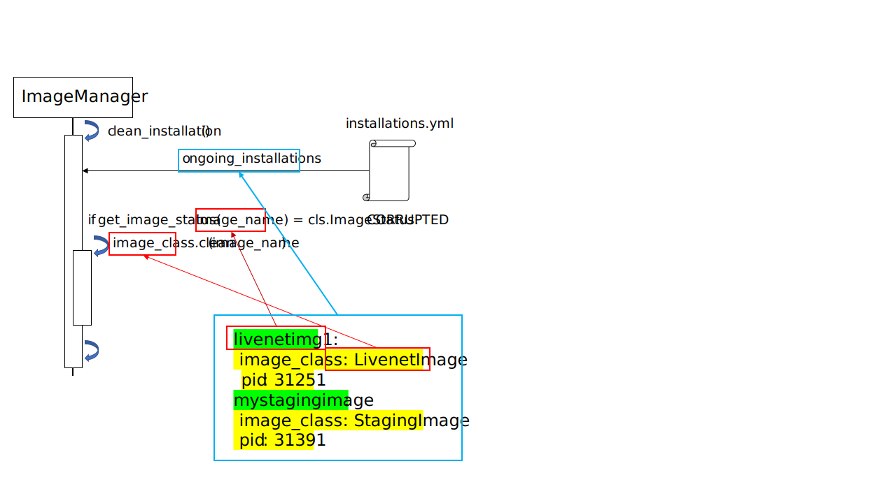

Cleaning process
======================

The cleaning process is an important process to keep diskless tool file system clean. This process aim to clean all files of an image when the installation process of the image has crashed.

Image creation process
----------------------

The mechanism of cleaning images use a file called installation.yml file. We add informations about images installation inside this file during the image installation.

Bellow, a properly image creation process:

.. figure::  ./images/proper_installation.png
   :align:   center

   A proper installation process

We can see that at the start of the installation the image is registered inside the installations.yml file, and at the end of the installation the image is unregistered from this file.

Bellow, a bad image installation process:

.. figure::  ./images/bad_installation.png
   :align:   center

   An image installation that crash 
   
We can see that the image is nether unregistered from the installation.yml file because the process has crashed.

Image status
----------------------

An image can has three status:

+----------------------------------------+------------+------------+-----------+
| Image status                           | CREATED    | IN_CREATION| CORRUPTED |
+========================================+============+============+===========+
| Inside installations.yml file          |            |     x      |     x     |
+----------------------------------------+------------+------------+-----------+
| Installation process is running        |            |     x      |           |
+----------------------------------------+------------+------------+-----------+

As you can see the image status depend on two elements. If the image is registered or not inside the installation.yml file, and if the process that install the image is currently running.

The content of the installatins.yml file is the following:

.. figure::  ./images/installation_file.png
   :align:   center

   Content of installations.yml file during two simultaneous images installations.

We can see that the name and the class of the image are registered. The pid of the installation process is also registered.

Cleaning process
----------------------

The cleaning process is called once after the user has selected an action in the main menu in gui.

Bellow the cleaning process:

   
   Image cleaning process
   
We can see that an image is cleaning when it's status is CORRUPTED. Bellow the process to get image status:

.. figure::  ./images/get_image_status.SVG
   :align:   center
   
   Getting image status process
   
This process returns the image status in compliance with the previous image status table.

