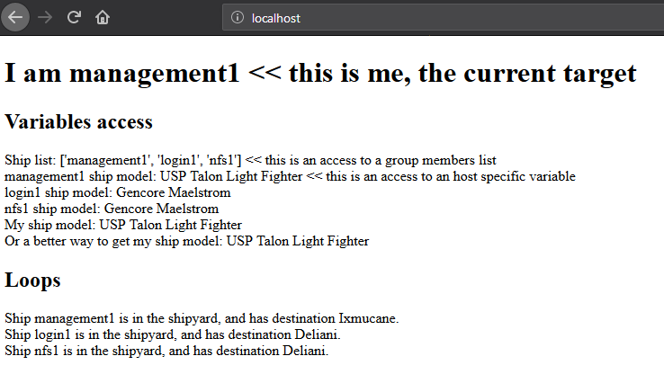

=============
Learn Ansible
=============

To understand how **BlueBanquise** works, it is essential to learn basis of Ansible.

This section tries to provide key knowledge to at least be able to manipulate and edit the stack to your needs.

It is assumed here that your system is already installed, and that Ansible has also been installed. It is also assumed that **BlueBanquise** stack has not been installed yet, and so Ansible is freshly installed without modifications.

All work will be done on the current host.

Minimal inventory
=================

Edit /etc/hosts file, and add "management1" on localhost line:

.. code-block:: text

  127.0.0.1   localhost localhost.localdomain localhost4 localhost4.localdomain4 management1
  ::1         localhost localhost.localdomain localhost6 localhost6.localdomain6

Then, create some needed directories and files:

.. code-block:: bash

  mkdir /etc/ansible/inventory
  mkdir /etc/ansible/inventory/group_vars
  mkdir /etc/ansible/inventory/group_vars/all
  mkdir /etc/ansible/roles
  mkdir /etc/ansible/playbooks

And edit /etc/ansible/ansible.cfg line to fix /etc/ansible/inventory as default inventory folder:

.. code-block:: text

  [defaults]
  inventory      = /etc/ansible/inventory

Also set, in this same file /etc/ansible/ansible.cfg, the roles_path value to /etc/ansible/roles:

.. code-block:: text

  roles_path    = /etc/ansible/roles

And also change hash_behaviour to merge, as this is the most interesting algorithm:

.. code-block:: text

  hash_behaviour = merge

Finally, add management1 host into the inventory. Create a file called /etc/ansible/inventory/myhost.yml with the following content:

.. code-block:: yaml

  management1

Our very basic Ansibe configuration is done. But one thing remains: we need to ensure our host (management1) can ssh to itself without password, as Ansible relies fully on the ssh to connect to remote hosts.

Let's generate a ssh key (press enter multiple time):

.. code-block:: bash

  ssh-keygen -N ""

Ensure you can ssh on management1 using a password:

.. code-block:: bash

  [root@management1 ]# ssh management1
  The authenticity of host 'management1 (10.10.0.1)' can't be established.
  ECDSA key fingerprint is SHA256:XXXXXXXXXXXXXXXXXXXXXXXXXXXXXXXXXXXXXXXX
  ECDSA key fingerprint is MD5:XXXXXXXXXXXXXXXXXXXXXXXXXXXXXXXXXXXXXXX.
  Are you sure you want to continue connecting (yes/no)? yes
  Warning: Permanently added 'management1,10.10.0.1' (ECDSA) to the list of known hosts.
  root@management1's password:
  [root@management1 ~]#

If ok, then deploy ssh public key to allow password less authentication, and ensure you can now ssh with the key:

.. code-block:: text

  [root@management1 ~]# ssh-copy-id management1
  /usr/bin/ssh-copy-id: INFO: Source of key(s) to be installed: "/root/.ssh/id_rsa.pub"
  root@management1's password:
  Number of key(s) added: 1
  [root@management1 ~]# ssh management1
  [root@management1 ~]#

Finally, check Ansible can connect to management1, and report hosts is up:

.. code-block:: bash

  [root@management1 ~]# ansible all -m ping
  management1 | SUCCESS => {
      "changed": false,
      "ping": "pong"
  }
  [root@management1 ~]#

Let's see the available and useful commands now.

Ansible commands
================

ansible
-------

The **ansible** command provides few interesting features.

Version
^^^^^^^

First command is to check current Ansible version. It should be >= 2.8.2:

.. code-block:: bash

  ansible --version

Ping an host or all hosts
^^^^^^^^^^^^^^^^^^^^^^^^^

Use the following command to check if Ansible can contact a specific registered host:

.. code-block:: bash

  ansible management1 -m ping

Or all hosts:

.. code-block:: bash

  ansible all -m ping

Also, it is possible to gather **facts**. Facts are dynamic variables, accessible only when Ansible is running on the target. Facts provides live information about the target: it's running kernel, it's linux distribution, network or cpu information, etc.

.. code-block:: bash

  ansible -m setup --tree /dev/shm/ management1

Then, open file /dev/shm/management1 to check its content and the result of facts gathering.

ansible-inventory
-----------------

Ansible inventory command is extremely useful and will be massively used on this documentation.

This command allows to gather information from your inventory and check the expected output.

Groups and hosts
^^^^^^^^^^^^^^^^

The command:

.. code-block:: bash

  ansible-inventory --graph

Provide information about groups and hosts inside each group:

.. code-block:: bash

  @all:
    |--@ungrouped:
    |  |--management1

It is possible to see here that management1 is member of group @ungrouped, which is part of group @all.
More will be seen later in this documentation.

Host variables
^^^^^^^^^^^^^^

To output variables for a specific host, and check for example your variable precedence mechanism provided what is expected, use:

.. code-block:: bash

  ansible-inventory --yaml --host management1

For now, there are no available variables in the inventories, so output will be {}.

ansible-playbook
----------------

This command is used to launch playbooks, and ask Ansible to execute tasks on desired host(s). This is the most used command when using **BlueBanquise**.

Important parameters are:

* -e or --extra-vars, which allows to provide additional variables for execution (keep in mind that variables set here win the whole precedence)
* -t or --tags, which allows to execute only specific tasks or part of tasks (seen later)
* -s or --skip-tags, which allows to not execute some specific tasks or part of tasks (seen later)

Debug
-----

All of these commands accept verbose flags with -v, -vv, -vvv, etc. The more v, the more verbose.

Also, it is possible to execute all of them with the variable ANSIBLE_DEBUG=1 set, which will dramatically increase output information (but unfortunately not always relevant to our needs...).

For example, a very verbose execution would be:

.. code-block:: bash

  ANSIBLE_DEBUG=1 ansible -m ping management1 -vvv

Variables and groups
====================

Now that all important commands have been seen, it is time to add some variables inside the inventory, and play with groups.

Adding variables
----------------

We are going to add few variables, at different positions in the inventories.

Create file /etc/ansible/inventory/group_vars/all/my_ship.yml with the following content:

.. code-block:: yaml

  my_ship:
    model: USP Talon Light Fighter
    price: 6000 # in cr
    equipment:
      generator: Advanced MicroFusion
      shield: Structural Integrity Field
      front_gun: Pulse-Cannon
      sidekicks:
        - Plasma Storm
        - Zica SuperCharger
    destination: Deliani

Now, ensure management1 can see these variables:

.. code-block:: bash

  [root@ ~]# ansible-inventory --yaml --host management1
  my_ship:
    destination: Deliani
    equipment:
      front_gun: Pulse-Cannon
      generator: Advanced MicroFusion
      shield: Structural Integrity Field
      sidekicks:
      - Plasma Storm
      - Zica SuperCharger
    model: USP Talon Light Fighter
    price: 6000
  [root@ ~]#

Nice, we can now use these variables for management1 when working on it.

Let's add 2 other hosts: login1 and nfs1.

Edit file /etc/ansible/inventory/myhost.yml to obtain:

.. code-block:: text

  management1
  login1
  nfs1

And now let's check login1 (when will exist) can also access these variables:

.. code-block:: bash

  [root@ ~]# ansible-inventory --yaml --host login1
  my_ship:
    destination: Deliani
    equipment:
      front_gun: Pulse-Cannon
      generator: Advanced MicroFusion
      shield: Structural Integrity Field
      sidekicks:
      - Plasma Storm
      - Zica SuperCharger
    model: USP Talon Light Fighter
    price: 6000
  [root@ ~]#

Perfect. It is time to play with groups, before coming back to variables to work on variables precedence.

Configuring groups
------------------

Lets check current groups:

.. code-block:: bash

  [root@ ~]# ansible-inventory --graph
  @all:
    |--@ungrouped:
    |  |--login1
    |  |--management1
    |  |--nfs1
  [root@ ~]#

All our hosts belong to the ungrouped group and to the all group. But we want to be able to assign specific variables to each kind of equipment. We need to create groups.

There are two ways to create groups. In YAML, directly in the hosts files, or using specific Ansible syntax in separate files. Both are useful, and we will combine them.

In YAML
^^^^^^^

Edit again the /etc/ansible/inventory/myhost.yml file, and this time let's use real YAML:

.. code-block:: yaml

  master:
    hosts:
      management1:
  slaves:
    hosts:
      login1:
      nfs1:

Now, let's check again groups:

.. code-block:: bash

  [root@ ~]# ansible-inventory --graph
  @all:
    |--@master:
    |  |--management1
    |--@slaves:
    |  |--login1
    |  |--nfs1
    |--@ungrouped:
  [root@ ~]#

We can see that management1 is now member of group master, and that login1 and nfs1 are member of group slaves.

The special string **hosts** in this file define that the string above is a group, and that strings bellow are hosts member of this group.

It is also possible to set groups in a group in this same file. Edit it again:

.. code-block:: yaml

  my_nodes:
    children:
      master:
        hosts:
          management1:
      slaves:
        hosts:
          login1:
          nfs1:

And result:

.. code-block:: bash

  [root@ ~]# ansible-inventory --graph
  @all:
    |--@my_nodes:
    |  |--@master:
    |  |  |--management1
    |  |--@slaves:
    |  |  |--login1
    |  |  |--nfs1
    |--@ungrouped:
  [root@ ~]#

The **children** string define that string above is a group that contains bellow group(s).

In Ansible syntax
^^^^^^^^^^^^^^^^^

The second way to create groups is to use the Ansible native syntax, which can be simpler in some cases.

Create a file /etc/ansible/inventory/mygroups and set the following content:

.. code-block:: text

  [colors:children]
  blue
  red

  [blue]
  management1
  login1

  [red]
  nfs1

And check the result:

.. code-block:: bash

  [root@ ~]# ansible-inventory --graph
  @all:
    |--@colors:
    |  |--@blue:
    |  |  |--login1
    |  |  |--management1
    |  |--@red:
    |  |  |--nfs1
    |--@my_nodes:
    |  |--@master:
    |  |  |--management1
    |  |--@slaves:
    |  |  |--login1
    |  |  |--nfs1
    |--@ungrouped:
  [root@ ~]#

Same concept applies here, with different syntax.

Note that an host can be part of multiple groups.

You can find more information and examples `here on intro_inventory <https://docs.ansible.com/ansible/latest/user_guide/intro_inventory.html>`_ .

Variables precedence
--------------------

Time to use all these groups and make full usage of the inventory structure.

If you remember precedence system in Vocabulary section (more `here on Ansible dedicated page <https://docs.ansible.com/ansible/latest/user_guide/playbooks_variables.html#variable-precedence-where-should-i-put-a-variable>`_ ) group_vars/all is in position 4 in the precedence. This is where we set our spaceship variables.

Let's say now we wish to change our ship destination for management1 node only.

Check current destination for all hosts:

.. code-block:: bash

  [root@ ~]# ansible-inventory --yaml --host management1 | grep destination
    destination: Deliani
  [root@ ~]# ansible-inventory --yaml --host login1 | grep destination
    destination: Deliani
  [root@ ~]# ansible-inventory --yaml --host nfs1 | grep destination
    destination: Deliani
  [root@ ~]#

We can redefine the variable in group_vars/all (that apply to all hosts in the @all group, so everyone), but we only want to impact management1 node.

In the precedence list, you can see that inventory host_vars are in position 9, so they will win against position 4 of group_vars/all. Let’s use this.

Edit file /etc/ansible/inventory/myhost.yml and add a destination variable under management1:

.. code-block:: yaml

  my_nodes:
    children:
      master:
        hosts:
          management1:
            destination: Ixmucane
      slaves:
        hosts:
          login1:
          nfs1:

And check destinations again:

.. code-block:: bash

  [root@ ~]#  ansible-inventory --yaml --host management1 | grep destination
  destination: Ixmucane
    destination: Deliani
  [root@ ~]#

**OOPS ! We made a mistake**. Indeed, if you check again content of file /etc/ansible/inventory/group_vars/all/my_ship.yml, you can see destination is not at the top, but under *my_ship*.

Edit again /etc/ansible/inventory/myhost.yml and fix it:

.. code-block:: yaml

  my_nodes:
    children:
      master:
        hosts:
          management1:
            my_ship:
              destination: Ixmucane
      slaves:
        hosts:
          login1:
          nfs1:

And check destinations again:

.. code-block:: bash

  [root@ ~]# ansible-inventory --yaml --host management1 | grep destination
    destination: Ixmucane
  [root@ ~]# ansible-inventory --yaml --host login1 | grep destination
    destination: Deliani
  [root@ ~]# ansible-inventory --yaml --host nfs1 | grep destination
    destination: Deliani
  [root@ ~]#

Perfect. Setting a variable in the host definition file is equivalent to using host_vars folder. But host_vars folder is difficult to use when having a very large number of hosts, which is why in **BlueBanquise** we are using directly the host file.

Let's say now we want to change the model of spaceship of all the slave nodes. So not a single host, but all slave members hosts.

We are going to use level 6 in variables precedence: group_vars/. Create a directory called *slave* (same name than the group we want to work with) in group_vars:

.. code-block:: bash

  mkdir /etc/ansible/inventory/group_vars/slaves

Then, create file /etc/ansible/inventory/group_vars/slave/myship.yml with the following content:

.. code-block:: yaml

  my_ship:
    model: Gencore Maelstrom

And check variables of hosts:

.. code-block:: bash

  [root@ ~]# ansible-inventory --yaml --host management1 | grep model
    model: USP Talon Light Fighter
  [root@ ~]# ansible-inventory --yaml --host login1 | grep model
    model: Gencore Maelstrom
  [root@ ~]# ansible-inventory --yaml --host nfs1 | grep model
    model: Gencore Maelstrom
  [root@ ~]#

Prefect. Remember the pizza in Vocabulary section. Ansible just flatten the whole inventory, using precedence, and you obtain variables.

Last point for this part, remember that in variable’s precedence, extra_vars is level 22 and always win, so adding extra vars when executing Ansible later will allow us to force variables at execution time for testing purposes or just because we need it.

Roles and playbooks
===================

Time to apply some configuration on our target host.

We are going to create a role that install a web server package, create a very basic web page with our ship’s information, and start the web server service.

Role
----

Create a role called "shipyard", with needed folders:

.. code-block:: bash

  mkdir /etc/ansible/roles/shipyard
  mkdir /etc/ansible/roles/shipyard/tasks
  mkdir /etc/ansible/roles/shipyard/templates

Tasks folder contains tasks to perform, and main.yml file inside will be the starting point for Ansible. Templates folder will contain our templates (configuration files) in Jinja2 language.

Task
^^^^

Create file /etc/ansible/roles/shipyard/tasks/main.yml with the following content:

.. code-block:: yaml

  ---

  - name: Package
    package:
      name: httpd
      state: present

  - name: Template >> /var/www/html/index.html
    template:
      src: index.html.j2
      dest: /var/www/html/index.html
      owner: root
      group: root
      mode: 0644
    tags:
      - templates

  - name: Start services
    service:
      name: httpd
      state: started
      enabled: yes

Content is pretty simple:

* Ansible installs httpd package (or do nothing if present)
* Then Ansible render the template index.html.j2 and write the result in /var/www/html/index.html
* Then Ansible ensure httpd service is started and enabled at boot

You can find all Ansible modules here in the `official documentation <https://docs.ansible.com/ansible/latest/modules/modules_by_category.html>`_ .

Template
^^^^^^^^

Templates are probably the key feature of Ansible and all automation tools.

The idea is simple: you provide Ansible with a copy of your desired configuration file, with variables to be dynamnicaly replaced in order to fill on the fly some parts of the file.

Let's do this with a simple html page, and first with a static page.

Create the template /etc/ansible/roles/shipyard/templates/index.html.j2 with the following static content:

.. code-block:: html

  <html>
  <header>
    <title>This is title</title>
  </header>
  <body>
    Hello world
  </body>
  </html>

The current template is static, we will make it dynamic later.

Playbook
--------

Lets create our playbook, which will contains a list of roles to apply on management1 host.

Create file /etc/ansible/playbooks/myplaybook.yml with the following content:

.. code-block:: yaml

  ---
  - name: myplaybook
    hosts: "management1"
    roles:
      - role: shipyard
        tags: shipyard

Simply put, target of the playbook is host management1, and role to apply is shipyard.

Skip the tags for now.

Note that hosts can be a list of hosts (comma separated: management1,login1,nfs1), or a group of hosts (all, slaves, color, etc.).

Now, execute the playbook, and let Ansible do its job:

.. code-block:: bash

  ansible-playbook myplaybook.yml

If all goes well, you should now have the file /var/www/html/index.html generated on management1, and using a web browser you can check the result.

.. image:: images/capture_index_1.png

But this is not very interesting, let's add some dynamic part into our template.

Jinja2
------

Edit file /etc/ansible/roles/shipyard/templates/index.html.j2 to make it this way:

.. code-block:: html

  <html>
  <header>
    <title>Shipyard</title>
  </header>
  <body>
    <h1>I am {{inventory_hostname}} << this is me, the current target</h1>
    <h2>Variables access</h2>
    Ship list: {{groups['all']}} << this is an access to a group members list  
    management1 ship model: {{hostvars['management1']['my_ship']['model']}} << this is an access to an host specific variable  
    login1 ship model: {{hostvars['login1']['my_ship']['model']}}  
    nfs1 ship model: {{hostvars['nfs1']['my_ship']['model']}}  
    My ship model: {{hostvars[inventory_hostname]['my_ship']['model']}}  
    Or a better way to get my ship model: {{my_ship.model}}  
    <h2>Loops</h2>
    
    Ship {{ship}} is in the shipyard, and has destination {{hostvars[ship]['my_ship']['destination']}}.  
    
  </body>
  </html>

And let's re-execute the playbook. But we have already installed the package and started the service, so let's ask Ansible to only work on the tags 'templates' to fasten the execution (this tag was defined in the tasks/mail.yml file previsouly seen):

.. code-block:: bash

  ansible-playbook myplaybook.yml -t templates

And check again our web page.

You can see multiple things:

* We executed the task on management1, so inventory_hostname variable content is 'management1'. This is an Ansible reserved variable that contains the target hostname.
* groups['mygroup'] allows to get a list with all the hosts member of the group.
* hostvars['myhost'] allows to access variables of this host, using the variable precedence mechanism.
* hostvars[inventory_hostname] is equivalent to a direct variables access has we are accessing our current target variables.

Now regarding to Jinja2:

* {{ }} allows to insert a variable in the destination file.
*  are Jinja2 instructions (for, if, etc.).
* {# #} are Jinja2 commentaries.
* The remaining is put in the destination file "as is".

You can experiment with this template to understand the whole mechanism. The whole Jinja2 documentation can be found here: `Jinja2 template designer <https://jinja.palletsprojects.com/en/2.10.x/templates/>`_

You should now understand the very basis of Ansible.
If you feel something is missing in this quick Ansible training, please do not hesitate to ask us to add elements.

