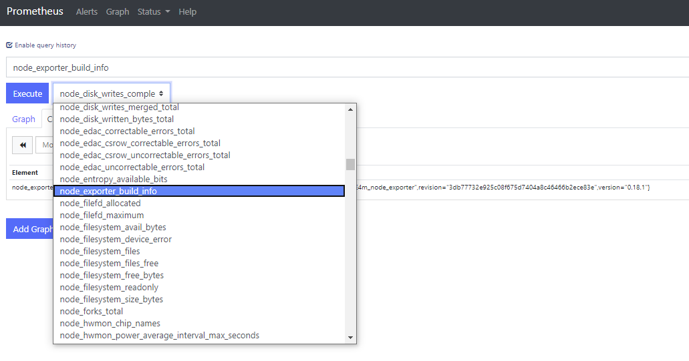
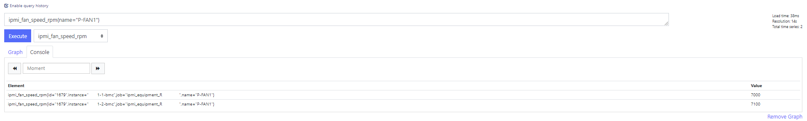
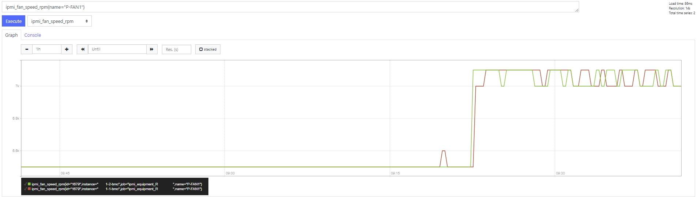
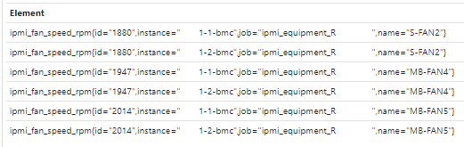
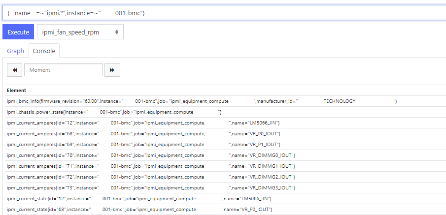
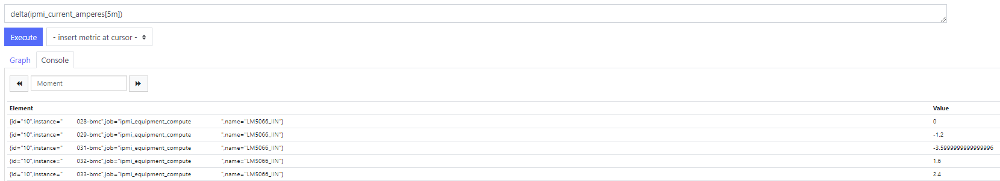
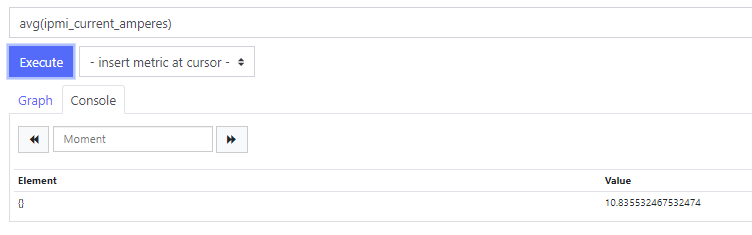
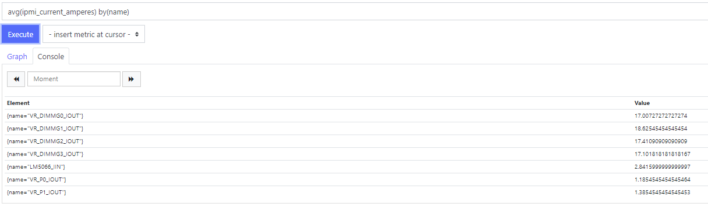
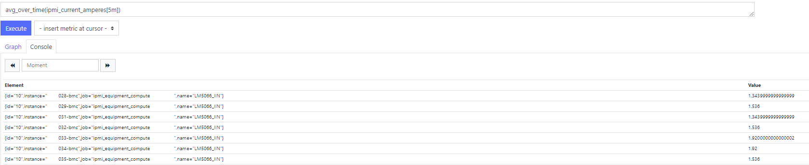

**********
Prometheus
**********

In this topic, we will see how to install both grafana_server and grafana_client, using ansible.

Prerequisites
-------------

* have ansible installed.
* know how to use playbooks

Also, make sure those packages are present on your system (They should be in the custom repository):

* prometheus
* alertmanager
* grafana

Installation
------------

Prometheus Server
^^^^^^^^^^^^^^^^^

First make sure you have /etc/ansible/inventory/group_vars/all/addons/prometheus.yml it should look like this::

  prometheus:
  # More info: https://www.robustperception.io/whats-the-difference-between-group_interval-group_wait-and-repeat_interval
  scrape_interval: 1m
  evaluation_interval: 2m
  alertmanager:
    group_wait: 1m
    group_interval: 10m
    repeat_interval: 3h

Simply add to the playbook of your choice (which is for the prometheus server) ::

 roles:
     - role: prometheus_server
       tags: prometheus_server

run ::

    ansible-playbook /etc/ansible/playbooks/<your playbook> --tags prometheus_server

now ansible_server should be installed.

The configuration file for prometheus is located under /etc/prometheus/prometheus.yml. It contains all the exporters to scrape, and more.

Prometheus Client
^^^^^^^^^^^^^^^^^

Add the desired exporters in your monitoring.yml file (generally found under /etc/ansible/inventory/group_vars/equipment_XX/monitoring.yml)

and don't forget to add the name of the package you want to install and the service name

for example::

  monitoring:

  exporters:
    node_exporter:
      package: node_exporter
      service: node_exporter
      port: 9100
    ha_cluster_exporter:
      package: ha_cluster_exporter
      service: ha_cluster_exporter
      scrape_interval: 10m
      scrape_timeout: 4m
      port: 9664

.. note:: as you can see, you can also add the scrape_interval (which is how often the metrics get scraped), and the scrape_timeout (which represents how long until a scrape request times out)

.. note:: if you want to add exporters, make sure your package contains the binary and the .service file, put preferably under /usr/local/bin and /etc/systemd/system.

simply add to the playbook of your choice (which is for the prometheus clients) your tweaks (hosts, and if you want to start or enable services) ::

  hosts: isma1-1
  vars:
    start_services: false
    enable_services: false

and add the role ::

 roles:
     - role: prometheus_client
       tags: prometheus_client

run ::

    ansible-playbook /etc/ansible/playbooks/<your playbook> --tags prometheus_client

now prometheus_client should be installed.

Variables
---------

There are 4 types of variable in prometheus

1. Counters
2. Gauges
3. Histograms
4. Summaries

Counters
^^^^^^^^

Counters are used for metrics that can only increase.
It's an incremental counter, that is used in order to know how rapidly something grows for example.

.. note::

    for example, it is used for the number of packets that is transmitted by a switch interface.
    using the irate function of prometheus, we can then tell how many packets were transmitted in a given interval.

it can also be used for error counts, tasks completed, and so on

Gauges
^^^^^^

Gauges are used for metrics that can go up, but can also decrease.
It gives a specific value for the time set.

.. note::

    for example, it is used for the temperature of the bmcs.
    This way, you have the temperature for any given time.

it can also be used for memory usage, number of requests, and so on
it can be used with function like min,max,average, and so on to get the wanted result.

Histograms & Summaries
^^^^^^^^^^^^^^^^^^^^^^

Histograms and summaries are more complex variable types, and are used less often, so that's why we won't go too much in the details.
Histograms and summaries are both used for getting the request durations, or the response sizes.
Their main goal is to watch for data that fall in a certain category.

you can get more info here: https://prometheus.io/docs/practices/histograms/

Queries
-------

In order to query a **metric** with prometheus, you have to go to the prometheus web page.
By default, it is located at 172.16.0.2:9090.

To query a metric, simple type in the metrics name. You also have a dropdown list with all the available metrics to query.

if you want specific metrics (with one or more specific labels) ::

  query_name{instance="instance"}

for example:

.. note::

    for example, ipmi_fan_speed_rpm{name="P-FAN1"} will only return the fan_speed of the fan name "P-FAN-1"

in the graph tab, you can also see the variation of the value over time. You can also choose from when to when.

Regex
^^^^^

You can also use the same queries, but with regex.

the global syntax for using this is ::

  query{attribute=~"regex_value"}

if you want the attribute to follow the given regex, or ::

  query{attribute!~"regex_value"}

if you dont want the attribute to follow the regex.
the **tilda** here is very important.

using this syntaxe, you can:

* get the metrics which attribute corresponds to a list

*for example*:
  **ipmi_fan_speed_rpm{name=~"MB-FAN5|MB-FAN4|S-FAN2"}**

will return

* follow a pattern

*for example* :
  **ipmi_fan_speed_rpm{name=~".*.FAN.*"}**

will return all the ipmi_fan_speed_rpm metrics with the name FAN in its name label

another example:
  **{__name__=~"ipmi.*",instance=~"001-bmc"}**

will return all the metrics which name starts with ipmi, and which instance is 001-bmc

Boolean operators
^^^^^^^^^^^^^^^^^

You can also combine different metrics, using boolean operators. There are several operators in prometheus.
Some of them are the following:

* == (equal)
* != (not-equal)
* > (greater-than)
* < (less-than)
* >= (greater-or-equal)
* <= (less-or-equal)

these are used in order to get the results that correspond to the condition.
for example::

  ipmi_up==1

will only return the instances of the query that are equal to one.

* and (intersection)
* or (union)
* unless (complement)

vector1 and vector2 results in a vector consisting of the elements of vector1 for which there are elements in vector2 with exactly matching label sets. Other elements are dropped. The metric name and values are carried over from the left-hand side vector.

for example:
  **node_exporter_build_info and ignoring(revision, version,goversion,branch,package) node_cpu_package_throttles_total**

will return::

  node_exporter_build_info{branch="HEAD",goversion="go1.12.5",instance="isma1-2:9100",job="equipment_R423_E4m_node_exporter",revision="3db77732e925c08f675d7404a8c46466b2ece83e",version="0.18.1"}

because it has the same instance name and job name as a node_cpu_package_throttles_total

vector1 or vector2 results in a vector that contains all original elements (label sets + values) of vector1 and additionally all elements of vector2 which do not have matching label sets in vector1.

for example:
  **node_exporter_build_info or node_cpu_package_throttles_total**

will return::

  node_exporter_build_info{branch="HEAD",goversion="go1.12.5",instance="isma1-2:9100",job="equipment_R423_E4m_node_exporter",revision="3db77732e925c08f675d7404a8c46466b2ece83e",version="0.18.1"}
  node_cpu_package_throttles_total{instance="isma1-2:9100",job="equipment_R423_E4m_node_exporter",package="0"}
  node_cpu_package_throttles_total{instance="isma1-2:9100",job="equipment_R423_E4m_node_exporter",package="1"}

vector1 unless vector2 results in a vector consisting of the elements of vector1 for which there are no elements in vector2 with exactly matching label sets. All matching elements in both vectors are dropped.

There are also other types of boolean operators, like group_left or group_right, you can find more about it here:

.. seealso:: https://prometheus.io/docs/prometheus/latest/querying/operators/

Functions & aggregations
^^^^^^^^^^^^^^^^^^^^^^^^

Prometheus comes with a variety of querying functions. We will go through some of the major ones:

* delta
* irate
* avg
* sum
* min, max

delta
"""""

Delta calculates the difference of value between the value from X minutes ago and the current value

ex ::

  delta(ipmi_current_amperes[5m])

rate & irate
""""""""""""

Rate() gives you the per second average rate of change over your range interval.
irate() is the per second rate of change at the end of your range interval

the difference between rate and delta, is that rate automatically adjusts for resets. It means that it only works with "counter" vaariables, i.e a variable that can only increase.
For example, if a metric value changes like this:

* 0
* 4
* 6
* 10

and resets:

* 2

rate will capture the change, and will give take the value of 2 as if it were 12 to get the rate.

avg
"""

returns the average value of **all** query results.
by default, it returns the avg value by job::
     avg(ipmi_current_amperes)

but you can also average by any other attribute, using avg(query) by(attribute)

avg_over_time
"""""""""""""

Average is self explanatory, it gives you the average value of a metric during the given interval, **for each instance**.

for example if ipmi_current_amperes had the values: 2,4,6 in the last 5m::

     avgi_over_time(ipmi_current_amperes[5m])

would return 4.

output example:

sum,min,max
"""""""""""

Self explanatory.
Works the same way as *avg*, and can be used with _over_time too.

more
""""

for more info, check:

.. seealso:: https://prometheus.io/docs/prometheus/latest/querying/functions/

Alerts
------

Alerts are located in the /etc/prometheus/alerts directory

example of alert::

  groups:
  - name: Alerts for nodes
    rules:
    - alert: high_RAM_ Usage
      expr: (1 - (node_memory_MemAvailable_bytes{job=~".*.R423.*"} / (node_memory_MemTotal_bytes{job=~".*.R423.*"})))* 100 > 90
      for: 1m
      labels:
        severity: warning
      annotations:
        summary: " (instance {{ $labels.instance }})"
        description: "memory usage greater than 90%  \n  VALUE = {{ $value }}\n  LABELS: {{ $labels }}"

this alert will be seen as *pending* by prometheus when the condition in **expr:** is verified, in this case, when the percentage of used RAM is greater than 90%.
It will seen as *firing* when the condition is met for X minutes,hours,or days, X being in the **for** field.
It will be fired with an extra label called severity, which is set to *warning* in this case.
The annotations section is here to set a summary and description of the alert. you can acces the variables of the metric by using de global variables {{ $value }} or {{ $labels }}.

Alertmanager
^^^^^^^^^^^^

Alertmanager is a plugin for prometheus, used to manage alerts. by default, it's located under under the isma's ip adress, port 9093.
you can customize alertmanager under /etc/alertmanager/alertmanager.yml.
by default it looks like this::

  global:
    smtp_smarthost: 'localhost:25'
    smtp_from: 'alertmanager@your_domain'
    smtp_require_tls: false

  route:
    group_by: ['alertname', 'job']
    group_wait: 1m
    group_interval: 10m
    repeat_interval: 3h
    receiver: sys-admin-team

  receivers:
    - name: 'sys-admin-team'
      email_configs:
        - to: 'sys-admin-team@site.com'

  inhibit_rules:
  - source_match:
      severity: 'critical'
    target_match:
      severity: 'warning'
    equal: ['alertname', 'cluster', 'service']

you can find more about it here:

.. seealso:: https://prometheus.io/docs/alerting/latest/configuration/

here are examples of some alerts:

.. seealso:: https://awesome-prometheus-alerts.grep.to/rules.html

Prometheus.yml
--------------

This is where all the exporters and the scrape related variables are stored. By default, it looks something like this::

  global:
    scrape_interval: 1m
    evaluation_interval: 2m

  rule_files:
    - 'alerts/*.yml'

  alerting:
    alertmanagers:
    - static_configs:
      - targets:
        - localhost:9093 # Alertmanager is considered on the same host for now

  scrape_configs:

    # I watch myself
    - job_name: 'prometheus_master'
      scrape_interval: 30s
      static_configs:
        - targets: ['localhost:9090']

  # GENERIC EXPORTER
  # All equipment profiles and their exporters
    - job_name: 'equipment_R423_E4m_node_exporter'
      scrape_interval:
      scrape_timeout:
      static_configs:
        - targets: ['isma1-1:9100']
        - targets: ['isma1-2:9100']

rule_files is where the alert related stuff is located

alerting is where you put alertmanager related stuff

scrape_configs is where you put all the exporters that you want to listen to, with the targets, and so on

.. seealso:: https://prometheus.io/docs/prometheus/latest/configuration/configuration/
