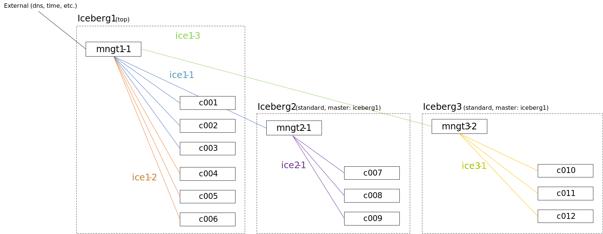

========================
Manage multiple icebergs
========================

Now that the simple configuration has been tested and done, it is possible,
to extend the cluster, to activate the multiple icebergs mechanism.

Icebergs mechanism allows to split cluster into parts, in order to:

* Distribute load over multiple managements nodes.
* Isolate part of the cluster from the others.

It is important to understand what is an iceberg in BlueBanquise.

Iceberg elements
================

Each iceberg is composed of:

* A set of dedicated management nodes (can be bare metal servers, VMs, containers, etc.).
* Some hosts part of this iceberg, and managed by the iceberg management nodes.
* Iceberg isolated management networks, called **iceX-Y** by default, with X the iceberg number (starting from 1).
* An Ansible group, with all management nodes and hosts part of the iceberg.

Icebergs are connected together using a simple hierarchical pattern:
an iceberg can be a **top**, meaning it is the top in the hierarchy,
or be a **standard** iceberg, meaning it will refer to a master iceberg
(the **top** iceberg in 2 levels hierarchy, or another **standard** iceberg if more levels).

The following schema resume the notion:

Few notes about this schema:

* Icebergs can be connected to any administration networks.
* Managements of a standard iceberg are expected to be connected to both administration network,
  i.e. on one of their internal iceberg administration network, but also on one of the administration network of their master iceberg.
* Services will work as a chain. For example, time will come from the top iceberg (or an external source) and each time server will take as source the time server of its master iceberg.

Note that this architecture is flexible, and can be adapted to create isolated icebergs (i.e. having multiple fully isolated clusters in the same BlueBanquise configuration).

Note also that using iceberg related groups, it is possible to define variables dedicated to each iceberg (for example, define a different time zone, a different domain name, etc.). However, and this is **important**, variables defined at *group_vars/equipment_X* level should never be used in icebergs groups, i.e. *group_vars/icebergX*, as it is impossible to determine the "winner" between both values.

Configuring top iceberg
=======================

Understanding mechanism
-----------------------

By default, iceberg mechanism is deactivated, and so all hosts are considered member of iceberg1.

Sorry, as a physician, I start counting at 1 when speaking of physical things, and so icebergs are numbered at 1 by default. However, nothing prevent using 0 as a start point when activating icebergs mechanism.

This automation is achieved by j2 variable j2_current_iceberg:

.. code-block:: text

  j2_current_iceberg: "{{ iceberg_naming+'1' }}{{ group_names | select('match','^'+iceberg_naming+'[0-9]+') | list | unique | sort | first | join }}"

If icebergs_system is set to false, then iceberg is iceberg_naming+'1' = iceberg1.
If set to true, then j2_current_iceberg will look check groups the current hosts is member of, and look for a group with pattern iceberg_naming+'[0-9]+', and use it to determine current iceberg.

Then, other values will be deduced from this:

.. code-block:: text

  j2_current_iceberg_number: "{{ j2_current_iceberg | replace(iceberg_naming,' ') | trim }}"
  j2_current_iceberg_network: "{{ management_networks_naming + (j2_current_iceberg_number|string) }}"

* j2_current_iceberg_number is simply the j2_current_iceberg without the "iceberg" string, so the iceberg number, here "1".
* j2_current_iceberg_network is the addition of the default network naming and the iceberg number, so here "ice1".

Note also that 2 variables are here to simplify developments of templates:

* j2_icebergs_groups_list: "{{ groups | select('match','^'+iceberg_naming+'[0-9]+') | list }}"
* j2_number_of_icebergs: "{{ groups | select('match','^'+iceberg_naming+'[0-9]+') | list | length }}"

Refer to file icebergs.yml in j2_variables in group_vars/all (do not edit them if you do not master the stack).

Enabling iceberg mechanism
--------------------------

Note: do not play any role from now, until hosts are in their iceberg group.

To activate icebergs mechanism, open file group_vars/all/general_settings/general.yml, set **icebergs_system** to *true*.

Create iceberg 1
----------------

We now need to create the iceberg1 group, define its variables, and add hosts into it.

Create dedicated folder in inventory/cluster/:

.. code-block:: bash

  mkdir /etc/bluebanquise/inventory/cluster/icebergs/

Then create file /etc/bluebanquise/inventory/cluster/icebergs/iceberg1, and add the following content:

.. code-block:: text

  [iceberg1:vars]
  iceberg_master = top
  iceberg_level = 1

  [iceberg1]

This will create an Ansible group called iceberg1, with 2 associated variables.

* iceberg_master defines if the iceberg is a top, or a standard iceberg linked to a master.
* iceberg_level defines the level of this iceberg in the services chain. This is for example used to calculate stratum value of time servers, etc.

Note: iceberg_level could be automatically calculated. However, having it has a variable allows the system administrator to tune it to desired ways.

Let's check current groups status:

.. code-block:: text

  [root@mngt1-1 ~]# ansible-inventory --graph
  @all:
  ...
    |--@iceberg1:
    |--@ungrouped:
  [root@mngt1-1 ~]#

iceberg1 group has been created, and is empty. Now add management(s) and nodes of the current iceberg into it.

To do so, edit again file /etc/bluebanquise/inventory/cluster/icebergs/iceberg1 and under [iceberg1] simply add hosts:

.. code-block:: text

  [iceberg1:vars]
  iceberg_master = top
  iceberg_level = 1

  [iceberg1]
  management1
  login1
  c[001:004]

Note: it is possible to add ranges of nodes, like in this example c[001:004]. This is a different syntax than clustershell.

Check again groups:

.. code-block:: text

  [root@mngt1-1 ~]# ansible-inventory --graph
  @all:
  ...
    |--@iceberg1:
    |  |--management1
    |  |--login1
    |  |--c001
    |  |--c002
    |  |--c003
    |  |--c004
    |--@ungrouped:
  [root@mngt1-1 ~]#

And push again configuration using the default playbook for each host. It is possible to see what is going to be modified using --diff --check at ansible-playbook invocation.

There should not be major modifications in configuration.

Create iceberg 2
----------------

Create now a second iceberg, with iceberg1 as master.

Create file /etc/bluebanquise/inventory/cluster/icebergs/iceberg2, with the following content:

.. code-block:: text

  [iceberg2:vars]
  iceberg_master = iceberg1
  iceberg_level = 2

  [iceberg2]

This new iceberg is not a top iceberg, and so refer to its master, here iceberg1.

Configure a new management, called management2, that will be in charge of iceberg2.
According to icebergs definition, management2 must be connected to both ice1-1 network and ice2-1 network.

For convenience, create a dedicated folder in cluster directory to store all nodes related to each iceberg, and move current nodes into iceberg1 directory.

.. code-block:: text

  mkdir -p /etc/bluebanquise/inventory/cluster/nodes/iceberg1/
  mkdir /etc/bluebanquise/inventory/cluster/nodes/iceberg2/
  mv /etc/bluebanquise/inventory/cluster/*.yml /etc/bluebanquise/inventory/cluster/nodes/iceberg1/

A warning may be displayed during playbook execution for now, because nodes/iceberg2/ is still empty.

Now create management2 file /etc/bluebanquise/inventory/cluster/nodes/iceberg2/management.yml:

.. code-block:: yaml

  mg_managements:
    children:
      equipment_typeM:
        hosts:
          management2:
            bmc:
              name: bmanagement2
              ip4: 10.10.100.2
              mac: 08:00:27:0d:41:97
              network: ice1-1
            network_interfaces:
              enp0s3:
                ip4: 10.10.0.2
                mac: 08:00:27:de:41:21
                network: ice1-1
              enp0s8:
                ip4: 10.12.0.1
                mac: 08:00:27:de:42:23
                network: ice2-1

This host is connected to both icebergs, and will be pushed from ice1-1 and act as a pusher (management) on ice2-1.

And add management2 to iceberg2, by editing /etc/bluebanquise/inventory/cluster/icebergs/iceberg2 and adding management2 under [iceberg2]:

.. code-block:: text

  [iceberg2:vars]
  iceberg_master = iceberg1
  iceberg_level = 2

  [iceberg2]
  management2

Play again playbooks on management1, so management2 is added into dhcp, pxe, dns, hosts, etc. configuration files.

Once done, use standard pxe boot procedure to deploy OS on management2.

Now, few steps has to be followed in a specific order in order to deploy configuration on it.

Deploy management configuration
-------------------------------

First, it is needed that management2 mount over nfs the repositories and the BlueBanquise configuration from management1.

Ensure management2 is part of a group that will mount the repositories and ansible, in nfs.yml. If no, you can create a custom group for that, that would regroup all non top iceberg management.

Copy current management1 playbook:

.. code-block:: text

  cp /etc/bluebanquise/playbooks/management1.yml /etc/bluebanquise/playbooks/management2.yml

and change target host inside to match management2.

Once done, deploy repositories_client role, by forcing management2 to be temporary part of iceberg1:

.. code-block:: text

  ansible-playbook /etc/bluebanquise/playbooks/management2.yml -t repositories_client --extra-vars j2_current_iceberg=iceberg1

Then deploy repositories_server role, and nfs_client role, so that management2 can get repositories localy and distribute them for iceberg2:

.. code-block:: text

  ansible-playbook /etc/bluebanquise/playbooks/management2.yml -t repositories_server,nfs_client --extra-vars j2_current_iceberg=iceberg1

Now, management2 can be autonomous. Deploy the whole configuration on it:

.. code-block:: text

  ansible-playbook /etc/bluebanquise/playbooks/management2.yml

And proceed as usual to add more hosts into iceberg2 and deploy them, this time from management2.
