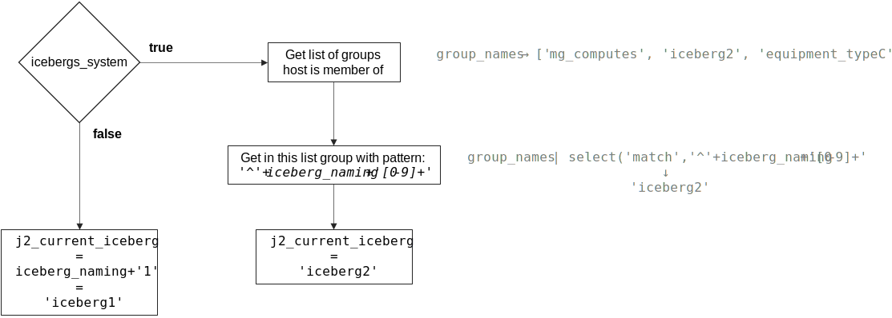
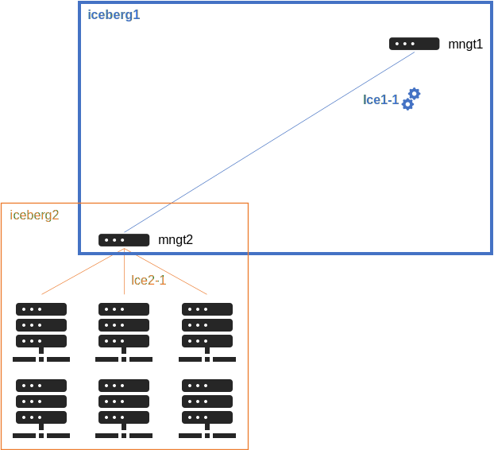
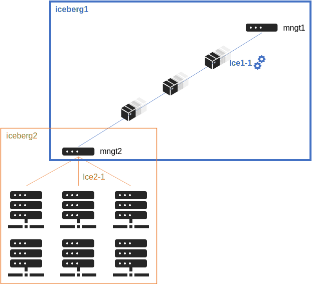

========================
Manage multiple icebergs
========================

Now that the simple configuration has been tested and done, it is possible,
to extend the cluster, to activate the multiple icebergs mechanism.

Icebergs mechanism allows to split cluster into parts, in order to:

* Distribute load over multiple managements nodes.
* Isolate part of the cluster from the others, while keeping if needed an unified interconnect network.

It is important to understand what is an iceberg in BlueBanquise.

.. note::
  An iceberg is also often called an *island* in High Performance Computing
  domain.

Iceberg elements
================

Each iceberg is composed of:

* A set of dedicated management nodes (can be bare metal servers, VMs, containers, etc.).
* Some hosts part of this iceberg, and managed by the iceberg management nodes.
* Iceberg isolated management networks, called **iceX-Y** by default, with X the iceberg number (starting from 1).
* An Ansible group, with all management nodes and hosts part of the iceberg.

Icebergs are connected together using a simple hierarchical pattern:
an iceberg can be a **top**, meaning it is the top in the hierarchy,
or be a **standard** iceberg, meaning it will refer to a master iceberg
(which can be a **top** iceberg, or another **standard** iceberg if more than 2
levels).

The following schema summarize an example target architecture:

Few notes about this schema:

* Icebergs managements can be connected to any administration networks.
* Managements of a *standard iceberg* are expected to be connected **to both administration network**,
  i.e. on one of their internal iceberg administration network, but also on one of the administration network of their master iceberg
  (so here, one above, and one bellow).
* Services will work as a chain. For example, time will come from the top iceberg (or an external source) and each time server will take as source the time server of its master iceberg.

Note that this architecture is flexible, and can be adapted to create isolated
icebergs (i.e. having multiple fully isolated clusters in the same BlueBanquise
configuration).

.. warning::
  Note also that using iceberg related groups, it is possible to define variables
  dedicated to each iceberg (for example, define a different time zone, a
  different domain name, etc.).
  However, and this is **important**, variables defined in *group_vars/equipment_X*
  (prefixed by **ep_** and **authentication_**) should never be used in icebergs
  groups, i.e. *group_vars/icebergX*, as this is incompatible with the stack
  logic: some roles expect all the members of equipment_profile groups to have
  the same values for each **ep_** and **authentication_** parameters.

.. note::
  As a physician, I start counting at 1 when speaking of physical things, and so
  icebergs are numbered at 1 by default. However, nothing prevents using 0 as a
  start point when activating icebergs mechanism.

We are going to split this target cluster into different icebergs:

Iceberg1 will be the top iceberg, and icebergs 2, 3 and 4 will be standard
icebergs, with iceberg1 as master iceberg.

Configuring top iceberg
=======================

Understanding mechanism
-----------------------

By default, iceberg mechanism is deactivated, and so all hosts are considered
member of iceberg1.

This automation is achieved by j2 variable j2_current_iceberg, in file
internal/group_vars/all/j2_variables/icebergs.yml:

.. code-block:: text

  j2_current_iceberg: "{{ iceberg_naming+'1' }}{{ group_names | select('match','^'+iceberg_naming+'[0-9]+') | list | unique | sort | first | join }}"

So to resume this code, assuming we are working on host *c001* which is part of *iceberg2* group:

* **If** *icebergs_system* is set to *false*
   * -> **Then** iceberg is *iceberg_naming+'1' = iceberg1*.
* **If** *icebergs_system* is set to *true*
   * -> **Then** j2_current_iceberg will check groups the current hosts is member of (*group_names*), and look for a group with pattern *iceberg_naming+'[0-9]+'*, and use it to determine current iceberg.

Then, other values will be deduced from this:

.. code-block:: text

  j2_current_iceberg_number: "{{ j2_current_iceberg | replace(iceberg_naming,' ') | trim }}"
  j2_current_iceberg_network: "{{ management_networks_naming + (j2_current_iceberg_number|string) }}"

* j2_current_iceberg_number is simply the j2_current_iceberg without the "iceberg" string, so the iceberg number, here "2".
* j2_current_iceberg_network is the addition of the default network naming and the iceberg number, so here "ice2".

Note also that 2 variables are here to simplify developments of templates:

* j2_icebergs_groups_list: "{{ groups | select('match','^'+iceberg_naming+'[0-9]+') | list }}"
* j2_number_of_icebergs: "{{ groups | select('match','^'+iceberg_naming+'[0-9]+') | list | length }}"

Variables names are self explaining these variables.

Enabling iceberg mechanism
--------------------------

.. warning::
  Do not play any role from now, until hosts are in their iceberg group.

To activate icebergs mechanism, open file
*group_vars/all/general_settings/general.yml*, and set *icebergs_system* to
**true**.

Create iceberg 1
----------------

We now need to create the iceberg1 group, define its variables, and add hosts
into it.

Create dedicated folder if absent:

.. code-block:: bash

  mkdir /etc/bluebanquise/inventory/cluster/icebergs/

Then create file *inventory/cluster/icebergs/iceberg1*,
and add the following content:

.. code-block:: text

  [iceberg1:vars]
  iceberg_master = top
  iceberg_level = 1

  [iceberg1]

This will create an Ansible group called iceberg1, with 2 associated variables.

* **iceberg_master** defines if the iceberg is a **top**, or a **standard** iceberg linked to a master.
* **iceberg_level** defines the level of this iceberg in the services chain. This is for example used to calculate stratum value of time servers, etc.

.. note::
  iceberg_level could be automatically calculated. However, having it as a
  variable allows the system administrator to tune it to desired ways.

Let's check current groups status:

.. code-block:: text

  [root@mngt1 ~]# ansible-inventory --graph
  @all:
  ...
    |--@iceberg1:
    |--@ungrouped:
  [root@mngt1 ~]#

iceberg1 group has been created, and is empty. Now add management(s) and nodes
of the current iceberg into it.

To do so, edit again file *inventory/cluster/icebergs/iceberg1* and under
*[iceberg1]* simply add hosts:

.. code-block:: text

  [iceberg1:vars]
  iceberg_master = top
  iceberg_level = 1

  [iceberg1]
  management1
  login[1:2]
  storage[1:6]

.. note::
  As you can see, it is possible to add ranges of nodes, like in this example
  with login[1:2]. This is a different syntax than ClusterShell's nodeset or
  SchedMD's Slurm.

Check groups again:

.. code-block:: text

  [root@mngt1 ~]# ansible-inventory --graph
  @all:
  ...
    |--@iceberg1:
    |  |--management1
    |  |--login1
    |  |--login2
    |  |--storage1
    |  |--storage2
    |  |--storage3
    |  |--storage4
    |  |--storage5
    |  |--storage6
    |--@ungrouped:
  [root@mngt1 ~]#

And push this new configuration using your dedicated playbook for each already
deployed hosts.
It is possible to see what is going to be modified using *--diff --check* at
ansible-playbook invocation.

There should not be major modifications in configuration for hosts of iceberg1.

Create iceberg 2
----------------

Create now a second iceberg, with iceberg1 as master.

Create file *inventory/cluster/icebergs/iceberg2*, with the following content:

.. code-block:: text

  [iceberg2:vars]
  iceberg_master = iceberg1
  iceberg_level = 2

  [iceberg2]

This new iceberg is not a top iceberg, and so refer to its master, here
iceberg1.

Configure a new management, called mngt2, that will be in charge of iceberg2.
According to icebergs definition, mngt2 must be connected to both ice1-1 network
and ice2-1 network.

For convenience, we create a dedicated folder in cluster directory to store all
nodes related to each iceberg. We also move all current nodes into iceberg1
directory.

.. code-block:: text

  mkdir -p /etc/bluebanquise/inventory/cluster/nodes/iceberg1/
  mkdir -p /etc/bluebanquise/inventory/cluster/nodes/iceberg2/
  mv /etc/bluebanquise/inventory/cluster/*.yml /etc/bluebanquise/inventory/cluster/nodes/iceberg1/

A warning may be displayed during playbook execution for now, because
*nodes/iceberg2/* is still empty.

Now create mngt2 file dedicated file
*inventory/cluster/nodes/iceberg2/management.yml* with the following content:

.. code-block:: yaml

  mg_managements:
    children:
      equipment_typeM:
        hosts:
          mngt2:
            bmc:
              name: bmngt2
              ip4: 10.10.100.2
              mac: 08:00:27:0d:41:97
              network: ice1-1
            network_interfaces:
              - interface: enp0s8
                ip4: 10.12.0.1
                mac: 08:00:27:de:42:23
                network: ice2-1
              - interface: enp0s3
                ip4: 10.10.0.2
                mac: 08:00:27:de:41:21
                network: ice1-1

This host is connected to both icebergs, and will be pushed from ice1-1 and act
as a pusher (management) on ice2-1.

.. warning::
  Two important things, related to network.
  First, BMC is connected to ice1-1, as mngt1 is in charge of deploying mngt2.
  Secondly, here, network_interface connected to network ice2-1 **MUST BE THE
  FIRST** in the list. This is key, as you need nodes to reach mngt2 to its main
  iceberg interface. Only mngt1 should need access to ice1-1 interface of mngt2,
  and the *ssh_master* role will ensure that Ansible from mngt1 use this one.

Add mngt2 to iceberg2, by editing *inventory/cluster/icebergs/iceberg2* and
adding mngt2 under [iceberg2]:

.. code-block:: text

  [iceberg2:vars]
  iceberg_master = iceberg1
  iceberg_level = 2

  [iceberg2]
  mngt2

Play again playbooks on mngt1, so mngt2 is added into dhcp, pxe, dns, hosts,
etc. configuration files.

.. note::
  Even if mngt2 is not part of iceberg1, it has been added to configuration
  files on mngt1, like any other nodes of iceberg1. All nodes part of a sub
  iceberg and also part of *mg_managements* group are automatically added, as
  they also need to be deployed from this iceberg, like any other nodes.

Once done, use standard procedure to deploy OS on mngt2 from mngt1 (*bootset*,
etc).

Now, few steps has to be followed in a specific order in order to deploy
configuration on mngt2.

Deploy sub management configuration
-----------------------------------

First, using default strategy (you can use another one), it is needed that mngt2
mount over nfs the repositories and the BlueBanquise configuration from mngt1.
This to be able to install packages, but also act as a repository server for
its iceberg, and be able to deploy the configuration on its iceberg nodes.

We need to ensure mngt2 is part of a group that will mount the repositories and
bluebanquise, in nfs.yml. By default, this group is called
*secondary_managements*.

Create file *inventory/cluster/groups/secondary_managements* with the following
content:

.. code-block:: text

  [secondary_managements]
  mngt2

Then ensure in file *inventory/group_vars/all/general_settings/nfs.yml* you have
at least these two exports:

.. code-block:: yaml

  nfs:

    ...

    bluebanquise:
      mount: /etc/bluebanquise
      export: /etc/bluebanquise
      server: mngt1
      clients_groups:
        - secondary_managements
      take_over_network: ice1-1
      export_arguments: ro,no_root_squash,sync
      mount_arguments: ro,intr,nfsvers=4.2,bg

    repositories:
      mount: /var/www/html/repositories
      export: /var/www/html/repositories
      server: mngt1
      clients_groups:
        - secondary_managements
      take_over_network: ice1-1
      export_arguments: ro,no_root_squash,sync
      mount_arguments: ro,intr,rsize=32768,wsize=32768,nfsvers=4.2,bg

So mngt1 will export both folders, and members of secondary_managements (so
mngt2) will mount it.

.. note::
  All is set to read only here (ro). It is up to you to switch to read write if
  needed.

If you just added these new nfs exports, play the role nfs_server on mngt1 and
check that mngt1 now export these foldes, using *showmount -e mngt1* command.

Next, we will need a playbook for mngt2. Copy current mngt1 dedicated playbook:

..note ::
  We assume here mngt1.yml playbook exist. You may have used another name for it:
  managements.yml, management1.yml, etc. Please adapte these instructions to 
  your own environment.

.. code-block:: text

  cp /etc/bluebanquise/playbooks/mngt1.yml /etc/bluebanquise/playbooks/mngt2.yml

And change target host inside to match mngt2.

From now, few steps need to be done in a very strict order. We are going to
force mngt2 to be part of iceberg1 for few commands, in order to be able to
bootstrap it. To do so, we will execute the mngt2.yml playbook, with an extra
variable, that will force *j2_current_iceberg* to be **iceberg1**.

We need first mngt2 to be able to install packages, and so to use mngt1 as
repositories server.

Deploy repositories_client role, by forcing mngt2 to be temporary part of
iceberg1:

.. code-block:: text

  mngt1# ansible-playbook /etc/bluebanquise/playbooks/mngt2.yml -t repositories_client --extra-vars j2_current_iceberg=iceberg1

Packages can now be downloaded from mngt1 to mngt2 and installed on mngt2.

Then deploy nfs_client role, and repositories_server role, so that mngt2 can get
repositories locally and distribute them on iceberg2:

.. code-block:: text

  mngt1# ansible-playbook /etc/bluebanquise/playbooks/mngt2.yml -t nfs_client,repositories_server --extra-vars j2_current_iceberg=iceberg1

*/var/www/html/repositories* and */etc/bluebanquise* from mngt1 are now mounted
on mngt2, and httpd server is running on mngt2.

Now, mngt2 can be autonomous and do not need to be part of iceberg1.
Deploy the whole configuration on it:

.. code-block:: text

  mngt1# ansible-playbook /etc/bluebanquise/playbooks/mngt2.yml

And now mngt2 act as iceberg2 management, and can provide packages to its nodes.

And proceed as usual to add more hosts into iceberg2 and deploy them,
this time from mngt2.

Redo this same process for each additional island.

Interconnect and job scheduler (HPC only)
-----------------------------------------

Now that your icebergs are up and running comes the question of the interconnect
(if exist) and the job scheduler (by default Slurm). Same question can be made
for the storage: you may need all nodes to reach a network FS (Lustre, BeeGFS,
etc.).

For storage, it should be straightforward: once the storage is online and
reachable over the interconnect, all nodes can mount it.

The Slurm setup is a little bit more complex. You will need a unified network to
allow your nodes to be able to reach the same Slurm controller, mostly running
on the mngt1 server.

But you will also need to ensure direct hostnames resolution of all computes
nodes is done on the interconnect, and not on the internet. Why ? Simply because
when parallel computations take places, Slurm will provide to the instance nodes
hostnames as target, and so if nodes need to reach each other through ethernet,
nodes from one iceberg will not be able to reach nodes from other icebergs, and
so parallel computations will not initialize.

Example: user job is asking for 100 nodes, the whole cluster is free, and each
iceberg contains 80 nodes. Slurm will allocate 80 nodes from iceberg1, lets say
c[001-080] and 20 nodes from iceberg2, c[081-100]. The final mpirun command
will receive as hosts target c[001-100]. c001 will be able to communicate with
c002, but not with c081, as iceberg ethernet networks are isolated. But if c081
resolves to c081 over the interconnect network, then since this network is
unified, c001 will be able to reach c081 and initialize MPI run.

.. note::
  It is possible to set routing between icebergs over ethernet, but this is not
  in the scope of this documentation.

To achieve direct computes hosts resolution over interconnect, ensure the
interconnect network interface is first in the network_interface list of each
compute node, which is the preferred network.

For example:

.. code-block:: text

  hosts:
    c001:
      bmc:
        name: bc001
        ip4: 10.2.103.1
        mac: 08:00:27:0d:f8:a5
        network: ice2-1
      network_interfaces:
        - interface: enp0s3
          ip4: 10.2.3.1
          mac: 08:00:27:0d:f8:a6
          network: ice2-1
        - interface: ib0
          ip4: 10.20.3.1
          network: interconnect-1

Becomes:

.. code-block:: text

  hosts:
    c001:
      bmc:
        name: bc001
        ip4: 10.2.103.1
        mac: 08:00:27:0d:f8:a5
        network: ice2-1
      network_interfaces:
        - interface: ib0
          ip4: 10.20.3.1
          network: interconnect-1
        - interface: enp0s3
          ip4: 10.2.3.1
          mac: 08:00:27:0d:f8:a6
          network: ice2-1

Using this, all nodes will now be able to communicate directly over the
interconnect.

.. note::
  Having interconnect here as direct resolution is not an issue to deploy
  configuration with Ansible. By default, the ss_master role force the ssh from
  a management to targets to be done on the first management network in the
  target network_interfaces list. In this example, a ping c001 will ping the
  ib0 interface connected to the ib0 network, so 10.20.3.1, but an ssh c001 will
  connect to c001 through interface enp0s3 connected to the ice2-1 network, so
  10.2.3.1.
