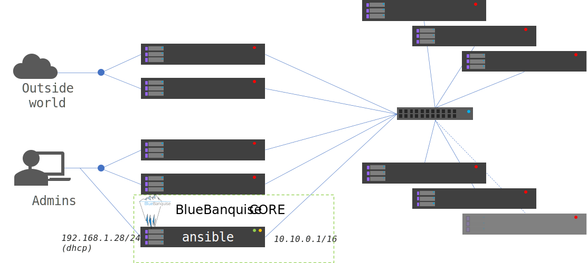
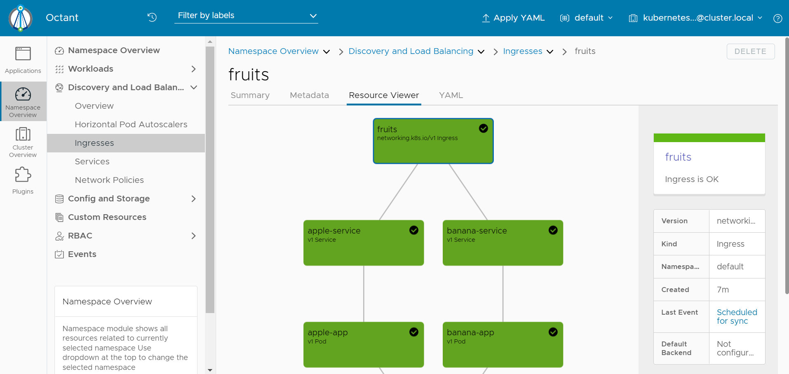

==============================
[Scenario] - Deploy Kubernetes
==============================

BlueBanquise and Kubernetes works pretty well together.

While BlueBanquise is in charge of provisioning bare metal / on premise infrastructure, 
Kubespray can deploy a production ready Kubernetes cluster over this infrastructure.

This result in 2 layers on the hardware, both autonomous but working together.

.. image:: images/scenario_kubernetes/K8S_o_BB_o_BM.svg

Deploy BlueBanquise CORE cluster
================================

We are going to deploy the following infrastructure, considering that the number of workers 
can be more than the 2 in this example.
Master nodes **must** be an odd number (n*2+1). Here we will use 3 masters, which is standard for small and medium clusters.

We will also rely on 5 additional nodes:

* **ansible** host, which will be the BlueBanquise management node. This server will host BlueBanquise configuration, CORE services (dhcp, dns, repositories, pxe stack, monitoring, etc.).
* **hap1** and **hap2** which will be haproxy used to expose the Kubernetes cluster to the world.
* **hap3** and **hap4** which will be haproxy used to reach Kubernetes administration API for system administrators.

Both hap[1-2] and hap[3-4] will expose a virtual ip, based on keepalived, to ensure high availability and easy system security upgrades.

.. image:: images/scenario_kubernetes/cluster_main_schema.svg

Install management node
-----------------------

First step is to have an operating system available, with a sudo able user.
This system will be the **ansible** node.

Install this node manually, using an ISO from Ubuntu-server main site.
Create user ``bluebanquise`` as base admin user. Also ask for ssh server to be install.

Once system is setup and rebooted, ssh on it, update it and install needed software:

.. code-block:: text

  sudo apt-get update && sudo apt-get upgrade
  sudo apt-get install git python3 python3-pip
  pip3 install ansible ansible-base cryptography jinja2 netaddr pbr jmespath ruamel.yaml ruamel.yaml.clib MarkupSafe

We will assume our cluster will use this ansible management node as a gateway to reach the web and so download packages and more.

To allow that, edit file /etc/sysctl.conf and add the following content in it:

.. code-block:: text

  net.ipv4.ip_forward = 1

Then update iptables and save them to be persistent. In the following command, enp0s3 is the NIC on ansible node that is connected to the web.
10.10.0.0/16 is the network of the BlueBanquise (and future K8S) cluster, where requests will come to reach the web.

.. code-block:: text

  sudo iptables -t nat -A POSTROUTING -s 10.10.0.0/16 -o enp0s3 -j MASQUERADE
  sudo apt install iptables-persistent
  sudo bash -c 'iptables-save > /etc/iptables/rules.v4'

Also generate an ssh key for later usage:

.. code-block:: text

  ssh-keygen -t ed25519 -q -N "" -f $HOME/.ssh/id_ed25519

Reboot system to ensure latest kernel is running, and ipv4 forward enabled.
System is now ready to host BlueBanquise.

.. image:: images/scenario_kubernetes/cluster_bootstrap_ansible.svg

Last step is to grab ubuntu-server iso, and configure local minimal repository to allow later PXE deployments:

.. code-block:: text

  wget https://releases.ubuntu.com/20.04.4/ubuntu-20.04.4-live-server-amd64.iso
  mkdir -p /var/www/html/repositories/ubuntu/20.04/x86_64/os/
  mv ubuntu-20.04.4-live-server-amd64.iso /var/www/html/repositories/ubuntu/20.04/x86_64/ubuntu-20.04-live-server-amd64.iso
  mount /var/www/html/repositories/ubuntu/20.04/x86_64/ubuntu-20.04-live-server-amd64.iso /mnt
  cp -a /mnt/* /var/www/html/repositories/ubuntu/20.04/x86_64/os/
  umount /mnt

Grab BlueBanquise
-----------------

We will need to grab both CORE and COMMUNITY repositories, as monitoring is contained in this second one.

Create needed folders, and clone repositories:

.. code-block:: text

  mkdir $HOME/bluebanquise/core
  mkdir $HOME/bluebanquise/community
  cd $HOME/bluebanquise/core
  git clone https://github.com/bluebanquise/bluebanquise.git .
  cd ../community
  git clone https://github.com/bluebanquise/community.git .

Configure inventory
-------------------

Copy k8s sample inventory and playbooks as a work base:

.. code-block:: text

  cd $HOME/bluebanquise/core/
  cp -a resources/examples/k8s/inventory .
  cp -a resources/examples/k8s/playbooks .

Tune nodes definitions
^^^^^^^^^^^^^^^^^^^^^^

You will need to tune the following files, according to your hardware 
infrastructure MAC address and NIC names (mine are enp0s3 or enp0s8):

* inventory/cluster/nodes/managements.yml contains ansible node definition
* inventory/cluster/nodes/haproxys.yml contains hap[1-4] nodes definition
* inventory/cluster/nodes/masters.yml contains m[1-3] nodes definition
* inventory/cluster/nodes/workers.yml contains w[1-2]+ nodes definition

Set authentication
^^^^^^^^^^^^^^^^^^

Generate sha512 hash from a strong password for the bluebanquise user on all nodes to be deployed, using:

.. code-block:: text

  python3 -c 'import crypt,getpass; print(crypt.crypt(getpass.getpass(), crypt.mksalt(crypt.METHOD_SHA512)))'

Keep value somewhere.

Also grab ssh public key:

.. code-block:: text

  cat $HOME/.ssh/id_ed25519.pub

Keep value somewhere.

Now edit file inventory/group_vars/all/equipment_all/authentication.yml and update content according to 
values obtained just before:

.. code-block:: yaml

  ---
  # Root password to be used on deployed hosts
  authentication_root_password_sha512: $6$M3crarMVoUV3rALd$ZTre2CIyss7zOb4lkLoG23As9OAkYPw2BM88Y1F43n8CCyV5XWwAYEwBOrS8bcCBIMjIPdJG.ndOfzWyAVR4j0  # This password is 'root', change it!
  
  # SSH public keys to be added as authorized keys on deployed/managed hosts
  authentication_ssh_keys:
    - ssh-ed25519 AAAAC3NzaC1lZDI1NTE5AAAAIBAmInyLG4oavgn54xIY9/8GfUBwCz328LxM4s/E8Ti+ root@ubuntu0

.. note::
  Value authentication_root_password_sha512 is used to populate admin account, even if admin account 
  is sudo based and so not called root.

Set equipment profiles
^^^^^^^^^^^^^^^^^^^^^^

If your hardware is not generic (VMs or similar), you will probably need to tune equipment profiles 
parameters of each equipment groups (SOL consoles, BMC authentication, kernel parameters, iPXE advanced settings, etc.).
Refer to main BlueBanquise documentation on possible settings and how to achieve this tuning.

This scenario assumes you are using a generic hardware.

Adjust backbone network
^^^^^^^^^^^^^^^^^^^^^^^

Backbone network settings in inventory/group_vars/all/general_settings/networks.yml may not be the 
one reflecting your backbone. Update this network according to your needs.

Do not forget to update ips in inventory/cluster/nodes/haproxys.yml if needed.

Deploy management
-----------------

Now that inventory is ready, next step is to deploy BlueBanquise on ansible host.

.. code-block:: text

  cd $HOME/bluebanquise/core/playbooks/
  ansible-playbook managements.yml -b --diff

If all goes well, you should see the 10.10.0.1 ip set on main cluster NIC, and 
all services running (isc-dhcp-server, apache2, etc.)

Deploy infrastructure
---------------------

It is time to deploy other nodes.

Request a fresh OS deployment at next boot using bluebanquise-bootset command:

.. code-block:: text

  bluebanquise-bootset -n hap[1-4],m[1-3],w[1-2] -b osdeploy

Have now the other nodes boot over PXE the way you desire.

.. note::
   BlueBanquise also provides tools to manipulate remote nodes power, refer to main documentation).

You should see the operating system deploying on other nodes. Once OS has been deployed, nodes will reboot and 
boot over disk automatically.

Ensure now you can reach all nodes using bluebanquise user:

.. code-block:: text

  clush -bw hap[1-4],m[1-3],w[1-2] echo "hello world!"

If all goes well, deploy nodes configuration using their dedicated playbooks:

.. code-block:: text

  cd $HOME/bluebanquise/core/playbooks/
  ansible-playbook hap.yml -b --diff
  ansible-playbook m.yml -b --diff
  ansible-playbook w.yml -b --diff

.. image:: images/scenario_kubernetes/cluster_deploy_bb.svg

Once configuration has been pushed, you need to check if nodes can reach the web and resolve external domains.

.. code-block:: text

  ssh m1
  ping 8.8.8.8
  ping google.com

If both ping respond, your cluster is ready to host Kubernetes. Only missing element is hap3 and hap4 configuration 
to be able to relay Kubernets admin API to administrators.

Deploy Kubernetes cluster
=========================

Grab Kubespray
--------------

Kubespray is available on github. Get latest version from 
https://github.com/kubernetes-sigs/kubespray/releases and download it:

.. code-block:: text

  wget https://github.com/kubernetes-sigs/kubespray/archive/refs/tags/v2.18.0.tar.gz
  tar xvzf v2.18.0.tar.gz
  cd kubespray-2.18.0

Configure kubespray
-------------------

Lets create needed inventory and variables tunings. First, we need to clone the 
sample inventory:

cd inventory
cp -a sample mycluster

Then, edit file mycluster/inventory.ini and add the cluster nodes deployed 
using BlueBanquise:

.. code-block:: text

  [all]
  m1 ansible_host=10.10.2.1 ip=10.10.2.1 etcd_member_name=etcd1
  m2 ansible_host=10.10.2.2 ip=10.10.2.2 etcd_member_name=etcd2
  m3 ansible_host=10.10.2.3 ip=10.10.2.3 etcd_member_name=etcd3
  w1 ansible_host=10.10.3.1 ip=10.10.3.1
  w2 ansible_host=10.10.3.2 ip=10.10.3.2

  [kube_control_plane]
  m1
  m2
  m3

  [etcd]
  m1
  m2
  m3

  [kube_node]
  w1
  w2

  [calico_rr]

  [k8s_cluster:children]
  kube_control_plane
  kube_node
  calico_rr

Now that nodes are declared, edit file mycluster/group_vars/all/all.yml 
and set our haproxy as way to reach the cluster admin API 
(we set 10.10.0.3 as virtual ip and 6443 as port).

.. code-block:: yaml

  ## External LB example config
  ## apiserver_loadbalancer_domain_name: "elb.some.domain"
  # loadbalancer_apiserver:
  #   address: 1.2.3.4
  #   port: 1234
  apiserver_loadbalancer_domain_name: "elb.kub"
  loadbalancer_apiserver:
    address: 10.10.0.3
    port: 6443

Then edit mycluster/group_vars/k8s_cluster/k8s-cluster.yml and set to true 
kube_proxy_strict_arp variable:

.. code-block:: yaml

  # configure arp_ignore and arp_announce to avoid answering ARP queries from kube-ipvs0 interface
  # must be set to true for MetalLB to work
  kube_proxy_strict_arp: true

Configure now MetalLB and ingress-nginx to be deployed on the cluster.
Edit file mycluster/group_vars/k8s_cluster/addons.yml and set the following parameters:

.. code-block:: yaml

  # Nginx ingress controller deployment
  ingress_nginx_enabled: true
  ingress_nginx_host_network: true
  ingress_publish_status_address: ""

  # MetalLB deployment
  metallb_enabled: true
  metallb_speaker_enabled: true
  metallb_ip_range:
    - "10.10.7.7-10.10.7.20"

Except if you need something else specific, we are done with Kubespray configuration.

Deploy K8S
----------

It is time to deploy the Kubernetes cluster over the BlueBanquise cluster.

To do so, cd into kubespray-2.18.0 folder, and execute the cluster.yml playbook the following way:

.. code-block:: text

  ansible-playbook cluster.yml -b -i inventory/mycluster/inventory.ini

This step may take some time, depending of the size of your cluster.
On my small cluster, it took around 15 min to complete.

Tasks are idempotent. If you encounter errors (mainly related to downloads), fix and 
replay this playbook again.

.. image:: images/scenario_kubernetes/cluster_main_schema.svg

Check cluster works
-------------------

Now that cluster is deployed, we need to dialog with it.
For that, we are going to install kubectl:

.. code-block:: text

  sudo apt-get update && sudo apt-get install -y apt-transport-https
  curl -s https://packages.cloud.google.com/apt/doc/apt-key.gpg | sudo apt-key add -
  echo "deb https://apt.kubernetes.io/ kubernetes-xenial main" | sudo tee -a /etc/apt/sources.list.d/kubernetes.list
  sudo apt-get update
  sudo apt-get install -y kubectl

Then, ssh on a K8S master and grab the content of credentials file:

.. code-block:: text

  ssh m1 cat /etc/kubernetes/admin.conf

And copy this content on ~/.kube/config:

.. code-block:: text

  mkdir -p ~/.kube
  vim ~/.kube/config

And check the cluster is running as expected:

.. code-block:: text

  bluebanquise@ansible:~$ kubectl cluster-info
  Kubernetes control plane is running at https://elb.kub:6443
  
  To further debug and diagnose cluster problems, use 'kubectl cluster-info dump'.
  bluebanquise@ansible:~$ kubectl version
  Client Version: version.Info{Major:"1", Minor:"23", GitVersion:"v1.23.4", GitCommit:"e6c093d87ea4cbb530a7b2ae91e54c0842d8308a", GitTreeState:"clean", BuildDate:"2022-02-16T12:38:05Z", GoVersion:"go1.17.7", Compiler:"gc", Platform:"linux/amd64"}
  Server Version: version.Info{Major:"1", Minor:"22", GitVersion:"v1.22.5", GitCommit:"5c99e2ac2ff9a3c549d9ca665e7bc05a3e18f07e", GitTreeState:"clean", BuildDate:"2021-12-16T08:32:32Z", GoVersion:"go1.16.12", Compiler:"gc", Platform:"linux/amd64"}
  bluebanquise@ansible:~$ kubectl get nodes
  NAME   STATUS   ROLES                  AGE     VERSION
  m1     Ready    control-plane,master   6m24s   v1.22.5
  m2     Ready    control-plane,master   6m4s    v1.22.5
  m3     Ready    control-plane,master   5m52s   v1.22.5
  w1     Ready    <none>                 4m49s   v1.22.5
  w2     Ready    <none>                 4m48s   v1.22.5
  bluebanquise@ansible:~$

Install Octant
==============

In order to easily visualize what is running inside the cluster, 
a K8S dedicated UI is a plus. There are multiple possibilities: 
native K8S UI, Lens, etc.

In this scenario, we are going to use Octant (https://octant.dev/), which is perfect to 
manage our cluster with a minimal amount of efforts. Also, the dependencies 
graphs add a lot to understanding resources interactions.

Grab latest tar.gz Octant version from https://github.com/vmware-tanzu/octant/releases.

.. code-block:: text

  wget https://github.com/vmware-tanzu/octant/releases/download/v0.25.1/octant_0.25.1_Linux-64bit.tar.gz
  tar xvzf octant_0.25.1_Linux-64bit.tar.gz
  octant_0.25.1_Linux-64bit/octant

Let this shell open to let Octant run. Since Octant uses the local kube config, 
we have nothing else to do.
Octant now runs and listen on http://localhost:7777 . Use an ssh tunnel to reach it or any other way.

Configure Kubernetes cluster
============================

Now that the K8S cluster is running, we need to adjust few parameters to be 
able to use it on a bare metal hardware.

Configure nginx-ingress together with MetalLB
---------------------------------------------

We want our ingress resources to be reachable over a virtual ip, spawned by MetalLB, and 
connected to our proxy servers.

>>>>>>>>>>>>>>>>>> scehma

Create file nginx-ingress-metallb.yml with the following content:

.. code-block:: yaml

    # Source: https://github.com/kubernetes/ingress-nginx/blob/main/charts/ingress-nginx/templates/controller-service-webhook.yaml
    apiVersion: v1
    kind: Service
    metadata:
    labels:
        app.kubernetes.io/name: ingress-nginx
        app.kubernetes.io/instance: ingress-nginx
        app.kubernetes.io/component: controller
    name: ingress-nginx-controller-admission
    namespace: ingress-nginx
    spec:
    type: ClusterIP
    ports:
        - name: https-webhook
        port: 443
        targetPort: webhook
    selector:
        app.kubernetes.io/name: ingress-nginx
        app.kubernetes.io/part-of: ingress-nginx
    ---
    # Source: https://github.com/kubernetes/ingress-nginx/blob/main/charts/ingress-nginx/templates/controller-service.yaml
    apiVersion: v1
    kind: Service
    metadata:
    labels:
        app.kubernetes.io/name: ingress-nginx
        app.kubernetes.io/instance: ingress-nginx
        app.kubernetes.io/component: controller
    name: ingress-nginx-controller
    namespace: ingress-nginx
    spec:
    type: LoadBalancer
    externalTrafficPolicy: Cluster
    ports:
        - name: http
        port: 80
        protocol: TCP
        targetPort: http
        - name: https
        port: 443
        protocol: TCP
        targetPort: https
    selector:
        app.kubernetes.io/name: ingress-nginx
        app.kubernetes.io/part-of: ingress-nginx

And apply it:

.. code-block:: text

  kubectl apply -f nginx-ingress-metallb.yml

You should now be able to see the address given by MetalLB to reach ingress resources:

.. code-block:: text

    bluebanquise@ansible:~$ kubectl get services -n ingress-nginx
    NAME                                 TYPE           CLUSTER-IP      EXTERNAL-IP   PORT(S)                      AGE
    ingress-nginx-controller             LoadBalancer   10.233.6.175    10.10.7.7     80:32694/TCP,443:32099/TCP   16h
    ingress-nginx-controller-admission   ClusterIP      10.233.45.203   <none>        443/TCP                      16h
    bluebanquise@ansible:~$

Here: 10.10.7.7

Create test resources
---------------------

Lets create 2 http server basic resources, and 
connect them to dedicated services, and then to an ingress.

>>>>>>>>>>>>>>>>>>

Create file banana.yml with the following content:

.. code-block:: yaml

    kind: Pod
    apiVersion: v1
    metadata:
    name: banana-app
    labels:
        app: banana
    spec:
    containers:
        - name: banana-app
        image: hashicorp/http-echo
        args:
            - "-text=banana"

    ---

    kind: Service
    apiVersion: v1
    metadata:
    name: banana-service
    spec:
    selector:
        app: banana
    ports:
        - port: 5678 # Default port for image

Then create apple.yml with the following content:

.. code-block:: yaml

    kind: Pod
    apiVersion: v1
    metadata:
    name: apple-app
    labels:
        app: apple
    spec:
    containers:
        - name: apple-app
        image: hashicorp/http-echo
        args:
            - "-text=apple"

    ---

    kind: Service
    apiVersion: v1
    metadata:
    name: apple-service
    spec:
    selector:
        app: apple
    ports:
        - port: 5678 # Default port for image

Both will create a small test http server, that will answer 'banana' 
or 'apple' depending on the one reached.

Apply these 2 files:

.. code-block:: text

  kubectl apply -f banana.yml
  kubectl apply -f apple.yml

And check pods and services were created:

.. code-block:: text

  bluebanquise@ansible:~$ kubectl get pods
  NAME         READY   STATUS    RESTARTS   AGE
  apple-app    1/1     Running   0          20h
  banana-app   1/1     Running   0          20h
  bluebanquise@ansible:~$ kubectl get services
  NAME             TYPE        CLUSTER-IP      EXTERNAL-IP   PORT(S)    AGE
  apple-service    ClusterIP   10.233.12.216   <none>        5678/TCP   20h
  banana-service   ClusterIP   10.233.9.162    <none>        5678/TCP   20h
  kubernetes       ClusterIP   10.233.0.1      <none>        443/TCP    20h
  bluebanquise@ansible:~$

We can check that http server works. Ssh on a master, and try to curl these ip 
(these are internal ip, only reachable from inside the cluster).

.. code-block:: text

  bluebanquise@ansible:~$ ssh m1
  bluebanquise@m1:~$ curl http://10.233.12.216:5678
  apple
  bluebanquise@m1:~$ curl http://10.233.9.162:5678
  banana
  bluebanquise@m1:~$

Lets now create an ingress, so these 2 web servers can be reached from the MetalLB ip.

Create file fruits.yml with the following content:

.. code-block:: yaml

    apiVersion: networking.k8s.io/v1
    kind: Ingress
    metadata:
    name: fruits
    annotations:
        ingress.kubernetes.io/rewrite-target: /
    spec:
    rules:
    - http:
        paths:
            - path: /apple
            pathType: Prefix
            backend:
                service:
                name: apple-service
                port:
                    number: 5678
            - path: /banana
            pathType: Prefix
            backend:
                service:
                name: banana-service
                port:
                    number: 5678

Basicaly, this ingress will bind to both apple and banana services.
If a request reach /apple url path, it will be redirected to apple 
service and so pod, and same for banana.

Apply this ingress to the K8S cluster:

.. code-block:: text

  kubectl apply -f fruits.yml

Check ingress has been created:

.. code-block:: text

  bluebanquise@ansible:~$ kubectl get ingress
  NAME     CLASS    HOSTS   ADDRESS   PORTS   AGE
  fruits   <none>   *                 80      3s
  bluebanquise@ansible:~$

And try to reach pods on the MetalLB ip:

.. code-block:: text

  bluebanquise@ansible:~$ curl http://10.10.7.7/banana
  banana
  bluebanquise@ansible:~$ curl http://10.10.7.7/apple
  apple
  bluebanquise@ansible:~$

It is also interesting to check resources graph into Octant:

Lets ensure now outside world can reach our http servers.
To do so, we will edit our haproxys servers configuration.

Link MetalLB to world
---------------------

Ssh on hap1, and edit haproxy configuration file /etc/haproxy/haproxy.cfg.
Add the following content at end of the file:

.. code-block:: text

  listen kubernetes-http
    bind *:80
    mode tcp
    option log-health-checks
    timeout client 3h
    timeout server 3h
    server metallb 10.10.7.7:80 check verify none inter 10000

Then restart haproxy service:

.. code-block:: text

  systemctl restart haproxy

Do the same on the second haproxy server hap2.

Logout, and try to reach fruits web servers from the outside world, i.e. on 
the keepalived virtualip:

.. code-block:: text

  curl http://10.10.0.3/banana

If you get 'banana' as an answer, you won!

K8S cluster is now ready to accept your resources.

Deploy Monitoring (optional)
============================

