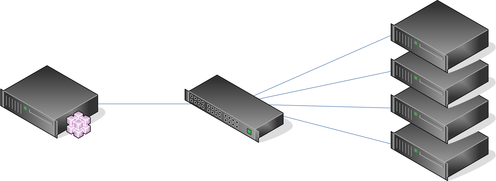
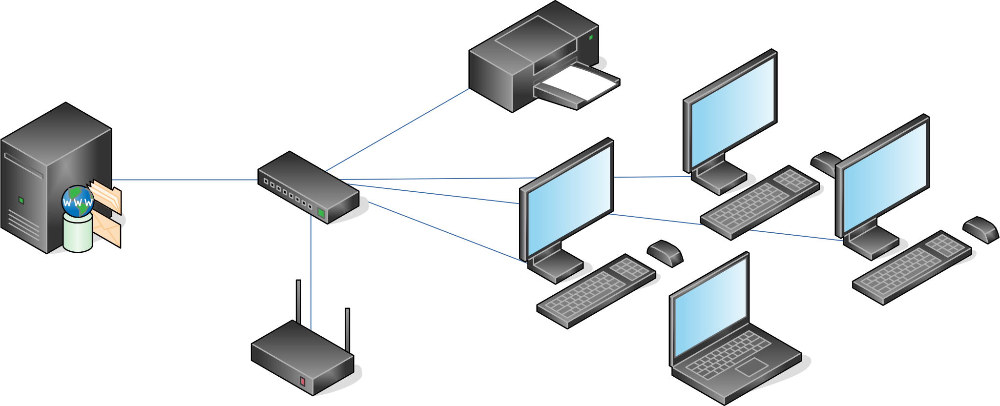

==========
Vocabulary
==========

Lets establish few common terms between us before going deeper in technical details.

Some words are important in **BlueBanquise**. Most of them are described here.

Ansible vocabulary
==================

Host
----

An Ansible **host** (also often refered as a **node**) is a remote host managed by Ansible. An **host** can be a physical server, but also a VM or something else.

Hosts are defined in */etc/bluebanquise/inventory/cluster/nodes*.

Please do a difference between an Ansible managed host, and a host. All equipment that can have an ip on the network are considered "host", but only those with an ssh + python capability and on which we will use Ansible to deploy a configuration are considered "Ansible managed host". They are declared the same way in the stack inventory.

Group
-----

An Ansible **group** is a logical aggregation of hosts. For example, system administrator can define a group "database_servers" that would contain hosts "database1" and "database2".

**Groups** allow Ansible to provide dedicated **variables** to member hosts or execute tasks on a set of hosts.

Note: a host can be part of multiple groups.

Variables
---------

Variables in Ansible follow the YAML structure.

A variable is like in any programming language: a variable name, and a data related.

Multiple kind of variables exist in Ansible:

Simple
^^^^^^

A simple variable is defined this way:

.. code-block:: yaml

  my_variable_1: hello!
  my_variable_2: 7777

In Jinja2, variable will be accessible directly this way:

.. code-block:: text

  {{my_variable_1}}

Output will be:

.. code-block:: text

  hello!

List
^^^^

A list is like an array, and can be iterated over:

.. code-block:: yaml

  my_names_list:
    - bob
    - alice
    - henry

In Jinja2, variable can be iterated over, or a specific value of the list can be used (like an array):

.. code-block:: text

  
  {{i}}
  
  {{my_names_list[0]}}

Note that index start at 0.

Output will be:

.. code-block:: text

  bob
  alice
  henry
  bob

Note also that to check if a list is empty, it is possible to check the list itself:

.. code-block:: text

  
  the list is not empty
  
  the list is empty %}
  

Dictionary
^^^^^^^^^^^

A dictionary is simply a pack of other variables, defined under it (some kind of variables tree):

.. code-block:: yaml

  my_dictionarry_1:
    my_variable_1: hello!
    my_variable_2: 7777
    my_names_list:
      - bob
      - alice
      - henry

In Jinja2, dictionary can be access two ways:

.. code-block:: text

  
  {{i}}
  
  
  {{i}}
  

  {{my_dictionarry_1.my_names_list[0]}}
  {{my_dictionarry_1['my_names_list'][0]}}

Output will be:

.. code-block:: text

  bob
  alice
  henry
  bob
  alice
  henry

  bob
  bob

Jinja2 will be discussed later, do not worry about this point for now.

j2 Variables
^^^^^^^^^^^^

These are **BlueBanquise** specific variables. All variables with name starting by **j2_** are j2 variables.

These variables are all stored in group_vars/all/j2_variables directory, and are used for the internal purpose of the stack.

These variables are here to simplify tasks and templates writing, by removing ugly and redundant things from them, and providing a direct access to values.
You can consider these variables as "functions" that takes as argument the current running host (or the host provided in hostvars if loaded using hostvars call).

To clarify your mind, you can consider that these variables contains a simple value. In reality, they contain Jinja2 code as a string, that will be interpreted by Ansible during tasks/templates execution, which is why these are more functions/API than pure variables.

Remmeber that in any case, if these variables are not providing the expected value, you can use Ansible variables precedence mechanism to force your values.

Last point, for developers, these j2 variables should be considered as a way to keep compatibility with roles, while upgrading the logic of the stack.

Inventory, roles, and playbooks
-------------------------------

Inventory
^^^^^^^^^

The Ansible inventory is the directory that contains Ansible variables and hosts definitions. In **BlueBanquise**, default path is /etc/bluebanquise/inventory.

Inventory is the **DATA**.

Roles
^^^^^

An Ansible role is a list of tasks to do to achieve a purpose. For example, there will be a role called dhcp_server, that contains task to install, configure and start the dhcp server.

In **BlueBanquise**, default path is /etc/bluebanquise/roles.

Note that /etc/bluebanquise/roles is splitted in multiple directories, but ansible.cfg file is configured to use roles in all of them.

Roles are the **AUTOMATION LOGIC**.

Playbooks
^^^^^^^^^

An Ansible playbook is simply a list of roles to apply, on a specific host or group of hosts. It is a yaml file.

In **BlueBanquise**, default path is /etc/bluebanquise/playbooks.

Playbooks are your **LIST OF ROLES TO APPLY on your hosts/targets**.

Variables precedence
--------------------

We are reaching the very important part of the stack.

Ansible has an internal mechanism called **Variables precedence**. Simply put: you can define the same variables (same name) multiple times, and using this mechanism, some definitions will have priority above others, depending of the situation.

When a variable is defined in a yml file, the position of the file in the ansible inventory is key.

For example, a variable defined in /etc/bluebanquise/inventory/group_vars/all/ will have the less precedence, and a variable defined in /etc/bluebanquise/inventory/cluster will have a higher precedence, and so win if loaded.

The full list of available variables precedence is provided in Ansible documentation: `variable precedence list <https://docs.ansible.com/ansible/latest/user_guide/playbooks_variables.html#variable-precedence-where-should-i-put-a-variable>`_

This feature is key to the stack and key for system administrator to manipulate the **BlueBanquise** stack the way he/she/(it ?) wants, and *force* automatic values if desired.

For example, values can be set by default, and then redefined for some groups of hosts without changing the default for all others. Or it can be used to simply fix a dynamic j2 variable to the desired value in hosts definitions if dynamic value is not the one expected. Etc.

Inventory can be seen as a giant pizza, in 3D then flatten.

* *Paste* is the variable in /etc/bluebanquise/inventory/group_vars/all
* Then *large ingredients* comes from /etc/bluebanquise/inventory/group_vars/equipment_myequipment
* Then *small ingredients* above are the /etc/bluebanquise/inventory/cluster/nodes/
* And *pepper and tomatoes* (last layer) is the extra-vars at call.

.. image:: images/pizza_example.svg

I like pizza...

Merge
-----

Ansible default hash_behaviour is *replace*. **BlueBanquise** is using *merge*.

If using *replace*, when a dictionary is impacted by the variable’s precedence mechanism, Ansible overwrite the full dictionary if a variable has a higher precedence somewhere.

If using *merge*, Ansible will only update the related variable, and keep the original dictionary and values for all other variables in this dictionary.

Jinja2
------

Jinja2 is the templating language used by Ansible to render templates in roles. It is heavily used in the stack, and learning Jinja2 will often be needed to create custom roles. (But Jinja2 is simple if you are use to code or especially script with bash).

Full documentation is available in a "single page": `Jinja2 template designer <https://jinja.palletsprojects.com/en/2.10.x/templates/>`_

Stack vocabulary
================

Icebergs
--------

Icebergs are logical (and often physical) isolation of ethernet management networks. Most of the time, icebergs are used to:

* Spread load over multiple managements servers (for very large clusters). Icebergs are also often called "islands" in these cases.
* Secure cluster by dividing specific usages, to prevent compromised system to access all the network.

One Iceberg is composed of one or multiple managements servers, **in charge of the same pool of nodes**.

**BlueBanquise** support many kinds of configurations, but most common are:

One iceberg configuration
^^^^^^^^^^^^^^^^^^^^^^^^^

.. image:: images/one_iceberg.svg

For simple systems (small/medium HPC cluster, small enterprise network, university IT practical session room, etc.), one iceberg scenario is the standard. One or multiple management will reach the same ethernet administration networks, and federate the same pool of nodes.

Multiple icebergs configuration
^^^^^^^^^^^^^^^^^^^^^^^^^^^^^^^

.. image:: images/multiple_icebergs.svg

For advanced systems, (large HPC clusters needing load spreading with unified network, enterprise network, etc.), multiple icebergs scenario can be required. **BlueBanquise** allows multiple levels of icebergs, for complex needs. Also, a global_network can be defined so all nodes from all icebergs can communicate through this unified network (most of the time an Interconnect network).

.. image:: images/multiple_icebergs_example_1.svg

Equipment profiles
------------------

In **BlueBanquise**, nodes are nearly always part of a group starting with prefix **equipment_**. These groups are called *equipment profiles*.

They are used to provide hosts of this group the **equipment_profile** dictionary (this dictionary defines hosts operating system parameters, kernel parameters, partitioning, etc.), and other variables if needed like dedicated authentication parameters.

These are key groups of the stack.

**It is important** to note that equipment_profiles dictionary **must not** be used at an upper level than group_vars in variables precedence. **It can, but you must NOT**.
