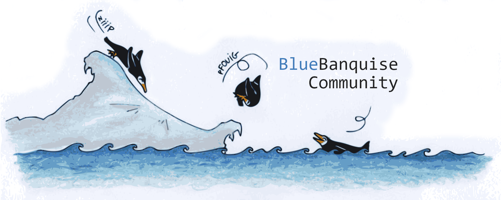

# Community

This repository hosts all [internal community driven roles or tools](#internal-community-roles-and-tools) around [**BlueBanquise**](https://github.com/bluebanquise/bluebanquise). These additional roles/tools can be new, or simply forks from the [core stack](https://github.com/bluebanquise/bluebanquise/tree/master/roles).

We also maintain here a [list of external roles and tools](#external-roles-and-tools) known to be working well with BlueBanquise.

## Internal Community roles and tools

### Concept

Each role/tool is owned by a developer, in charge of it.

Each owner can ask a new release of the repository, as this repository was made to provide fast releases cycle to core external roles/tools.

While the core stack aims to be multiple Linux distributions ready, each Community role owner is in charge of providing compatibility with Linux distributions (or not) for the additional role.

### List of available roles/tools

| Role/tool name        | Description                                              | Owner           | Link                                |
| --------------------- | -------------------------------------------------------- | --------------- | ----------------------------------- |
| automate              | Automate recurrent sys admin tasks                       | @oxedions       | [link](roles/automate/)             |
| clone                 | Clone to image and restore HDD                           | @johnnykeats    | [link](roles/clone/)                |
| display_tuning        | Provides screenrc configuration and iceberg shell colors | @oxedions       | [link](roles/display_tuning/)       |
| drbd                  | Setup drbd disk replication on multiple nodes            | @oxedions       | [link](roles/drbd/)                 |
| flexlm                | Configure flexlm                                         | @strus38        | [link](roles/flexlm/)               |
| generic_psf           | Generic packages, services, folders and files            | @johnnykeats    | [link](roles/generic_psf/)          |
| grafana               | Install Grafana                                          | @strus38        | [link](roles/grafana/)              |
| haproxy               | Install and configure a basic http haproxy               | @oxedions       | [link](roles/haproxy/)              |
| high_availability     | Setup a corosync-pacemaker based HA cluster              | @oxedions       | [link](roles/high_availability/)    |
| lmod                  | Install and configure Lmod                               | @oxedions       | [link](roles/lmod/)                 |
| loki                  | Install and configure Loki                               | @neilmunday     | [link](roles/loki/)                 |
| nhc                   | Install and configure LBNL Node Health Check             | @oxedions       | [link](roles/nhc/)                  |
| nvidia                | Install Nvidia driver and Cuda                           | @oxedions       | [link](roles/nvidia/)               |
| ofed                  | Install OFED OpenFabrics                                 | @oxedions       | [link](roles/ofed/)                 |
| openldap              | Install and configure OpenLDAP and SSSD (beta)           | @oxedions       | [link](roles/openldap/)             |
| prometheus            | Install and configure Prometheus monitoring and alerting | @oxedions       | [link](roles/prometheus/)           |
| podman                | Install and configure Podman container framework         | @strus38        | [link](roles/podman/)               |
| rasdaemon             | Check system for hardware errors                         | @oxedions       | [link](roles/rasdaemon/)            |
| report                | Check inventory and gather helpful data                  | @oxedions       | [link](roles/report/)               |
| singularity           | Install and configure Singularity or SingularityPRO      | @strus38        | [link](roles/singularity/)          |
| slurm                 | Install and configure Slurm Workload Manager             | @oxedions       | [link](roles/slurm/)                |
| update_reboot         | Update all packages and reboot system                    | @oxedions       | [link](roles/update_reboot/)        |
| users_basic           | Set / remove users                                       | @oxedions       | [link](roles/users_basic/)          |

## External roles and tools

These roles were reported compatible by BlueBanquise community users. Please do not hesitate to submit more.

| Role/tool name        | Description                                              | Owner           | Link                                         |
| --------------------- | -------------------------------------------------------- | --------------- | -------------------------------------------- |
| 389ds-server          | Installs the 389DS server (LDAP server)                  | lvps            | [link](https://github.com/lvps/389ds-server) |
