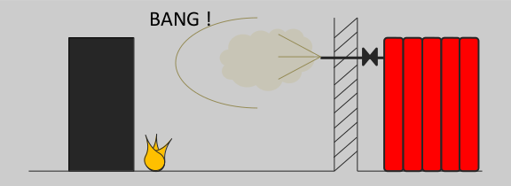

# Datacenters Safety

Datacenter infrastructure and computer rooms can be harmful; it is advised to always be vigilant and respect common sense / obvious precautions.
In any cases, never panic, other dangers than first one (holes for example) are often present in computer rooms.

I personally broke my shoulder by falling into a 3m hole inside an IT room. Now I am always extra careful.

## General safety

When operating in a datacenter, it is strongly recommended to obtain all safety related information from datacenter team, and especially:

* Urgent numbers (internal and external) and phones position
* Urgent kit position
* Evacuation circuit
* Fire detection and extinguishing system
* Position of mains electricity breaker
* Presence of any unexpected danger (fall, chemical, etc.).

When possible, avoid working alone in a room, and enquire about your colleagues regularly.

## Fire

It is advised to enquire about fire detection and extinguishing politic of a datacenter before working on site.

### Maine types of fires

Note:

* US Class B applies on liquid and gas. US Class C is for electrical equipment. C geometric symbol refer to electrical fire (US).
* Powder extinguishers are extremely destructive for IT equipment. When equipment tension is under 1000 V, water extinguishers with additives can be used to prevent too much damage.

Some countries use other types of symbolic (colors for example, most of the time same color than geometrical symbol). It is advised to get information on extinguishers types when working in a datacenter.
In case of liquid or gas fire, try to cut liquid/gas arrival before attacking fire, using the main site breaker or a local breaker.

### Main types of extinguishers

#### Portable extinguishers

Extinguishing agents can be water, foam, powder, gas (carbon dioxide, halocarbon, etc.).

When using such extinguisher, always attack fire at its base.

#### Mobile extinguishers

Bigger than portable extinguishers, extinguishing agents are the same.

#### Static or gas extinguishers

These extinguishers are common in datacenter or in electrical rooms. They are efficient and prevent damage on equipment. Equipment can continue to operate during extinction, which is why gas extinction is widely used in datacenters with high availability requirements. These extinguishers reduce O2 concentration and inhibit fire chemical reaction by injecting neutral gas in IT room.

When fire is detected, a visual and/or sound signal is emitted for a short period, then room is isolated and extinguishers detonate to liberate gas. **This detonation of neutral gas injecting into the room can be harmful** and fresh air might be rare in IT room. When such extinguishing system is used, it is strongly recommended to install desks or working area as far as possible of it, ensure a walkable path to exit, and get information on signal emitted before something happens.

#### Water smog

Water smog extinction systems are commonly seen in data center. Standard equipment can continue to operate during extinction, if fire is quickly detected and stopped (commonly less than 10 minutes). However, it is recommended to check equipment afterwards.

Size of droplets is important, as huge droplets may damage IT equipment. Water should be injected as smog.

####  Water hose

Water hoses are not commonly seen in datacenter as they are incompatible with IT equipment.

## Electricity

### Human body and intensity

The body resistance is related to skin and presence of water around or on the skin, and to tension applied.

When using ohm’s law, and knowing that body electrical resistance, it is possible to determine the intensity in a human body knowing the tension. For example, for a dry skin and 250V alternating current, resistance would be 5kΩ, and using ohm’s law, intensity would be 250/5000=0.05A=50mA.

Limits are not the same for alternating and continuous current.

In our example, 50 mA will be harmful.

Note: these values explain why standard differential circuit breaker in familly homes is 30 mA in some countries.

### Distance from equipment

A minimal distance should be taken from all electrical distribution equipment:

* All high tension equipment: 3 m to 4 m.
* All low tension equipment: 30 cm to 50 cm.
* IP2X low tension equipment: can be manipulated if accredited.

### Breakers reset

**Resetting an electrical circuit breaker or turning on a breaker can be harmful is someone is working on the circuit.** Check first if no one has put near the circuit breaker a note telling to not reset it, or if something is preventing it (adhesive tape for example).

**Only try to reset once**, if the circuit breaker refuse to move or break again, do not reset it: there could be someone exposed to danger somewhere on the line (causing circuit to break), or it could cause fire.

When resetting an electrical circuit breaker, keep a distance and if possible wear a face shield and protection gloves or do not watch it directly (or keep your face behind the door if this door is equipped with transparent glass). Electrical equipment like this one may, in rare time, burn and cause injuries (especially when old or bad quality).

In general, let professional eletricians handle these equipments. Just be aware of the danger.

## Safety symbols

There are multiple classifications.

### GHS for Globally Harmonized System of Classification and Labelling of Chemicals.

This is international classification. Many countries have now switched to it.

| Meaning      | GHS international Symbol                          |
| ----------- | ------------------------------------ |
| Explosive       |   |
| Flammable      |  |
| Oxidizing    |  |
| Compressed Gas    |  |
| Corrosive    |  |
| Toxic    |  |
| Toxic, Irritant, Narcotic, etc.    |  |
| Mutagenic, Carcinogenic, repro-toxic, etc.    |  |
| Dangerous for the environment    |  |

And if you need details:

* Physical hazards
    * H200: Unstable explosive
    * H201: Explosive; mass explosion hazard
    * H202: Explosive; severe projection hazard
    * H203: Explosive; fire, blast or projection hazard
    * H204: Fire or projection hazard
    * H205: May mass explode in fire
    * H220: Extremely flammable gas
    * H221: Flammable gas
    * H222: Extremely flammable aerosol
    * H223: Flammable aerosol
    * H224: Extremely flammable liquid and vapor
    * H225: Highly flammable liquid and vapor
    * H226: Flammable liquid and vapor
    * H227: Combustible liquid
    * H228: Flammable solid
    * H229: Pressurized container: may burst if heated
    * H230: May react explosively even in the absence of air
    * H231: May react explosively even in the absence of air at elevated pressure and/or temperature
    * H240: Heating may cause an explosion
    * H241: Heating may cause a fire or explosion
    * H242: Heating may cause a fire
    * H250: Catches fire spontaneously if exposed to air
    * H251: Self-heating; may catch fire
    * H252: Self-heating in large quantities; may catch fire
    * H260: In contact with water releases flammable gases which may ignite spontaneously
    * H261: In contact with water releases flammable gas
    * H270: May cause or intensify fire; oxidizer
    * H271: May cause fire or explosion; strong oxidizer
    * H272: May intensify fire; oxidizer
    * H280: Contains gas under pressure; may explode if heated
    * H281: Contains refrigerated gas; may cause cryogenic burns or injury
    * H290: May be corrosive to metals

* Health hazards
    * H300: Fatal if swallowed
    * H301: Toxic if swallowed
    * H302: Harmful if swallowed
    * H303: May be harmful if swallowed
    * H304: May be fatal if swallowed and enters airways
    * H305: May be harmful if swallowed and enters airways
    * H310: Fatal in contact with skin
    * H311: Toxic in contact with skin
    * H312: Harmful in contact with skin
    * H313: May be harmful in contact with skin
    * H314: Causes severe skin burns and eye damage
    * H315: Causes skin irritation
    * H316: Causes mild skin irritation
    * H317: May cause an allergic skin reaction
    * H318: Causes serious eye damage
    * H319: Causes serious eye irritation
    * H320: Causes eye irritation
    * H330: Fatal if inhaled
    * H331: Toxic if inhaled
    * H332: Harmful if inhaled
    * H333: May be harmful if inhaled
    * H334: May cause allergy or asthma symptoms or breathing difficulties if inhaled
    * H335: May cause respiratory irritation
    * H336: May cause drowsiness or dizziness
    * H340: May cause genetic defects
    * H341: Suspected of causing genetic defects
    * H350: May cause cancer
    * H351: Suspected of causing cancer
    * H360: May damage fertility or the unborn child
    * H361: Suspected of damaging fertility or the unborn child
    * H361d: Suspected of damaging the unborn child
    * H362: May cause harm to breast-fed children
    * H370: Causes damage to organs
    * H371: May cause damage to organs
    * H372: Causes damage to organs through prolonged or repeated exposure
    * H373: May cause damage to organs through prolonged or repeated exposure

* Environmental hazards
    * H400: Very toxic to aquatic life
    * H401: Toxic to aquatic life
    * H402: Harmful to aquatic life
    * H410: Very toxic to aquatic life with long-lasting effects
    * H411: Toxic to aquatic life with long-lasting effects
    * H412: Harmful to aquatic life with long-lasting effects
    * H413: May cause long-lasting harmful effects to aquatic life
    * H420: Harms public health and the environment by destroying ozone in the upper atmosphere

* Physical properties
    EUH001: Explosive when dry
    EUH006: Explosive with or without contact with air
    EUH014: Reacts violently with water
    EUH018: In use may form flammable/explosive vapor-air mixture
    EUH019: May form explosive peroxides
    EUH044: Risk of explosion if heated under confinement

* Health properties
    EUH029: Contact with water liberates toxic gas
    EUH031: Contact with acids liberates toxic gas
    EUH032: Contact with acids liberates very toxic gas
    EUH066: Repeated exposure may cause skin dryness or cracking
    EUH070: Toxic by eye contact
    EUH071: Corrosive to the respiratory tract

* Environmental properties
    EUH059: Hazardous to the ozone layer, superseded by GHS Class 5.1 in the second adaptation to technical progress of CLP.

* Other
    EUH201: Contains lead. Should not be used on surfaces liable to be chewed or sucked by children.
    EUH201A: Warning! Contains lead.
    EUH202: Cyanoacrylate. Danger. Bonds skin and eyes in seconds. Keep out of the reach of children.
    EUH203: Contains chromium(VI). May produce an allergic reaction.
    EUH204: Contains isocyanates. May produce an allergic reaction.
    EUH205: Contains epoxy constituents. May produce an allergic reaction.
    EUH206: Warning! Do not use together with other products. May release dangerous gases (chlorine).
    EUH207: Warning! Contains cadmium. Dangerous fumes are formed during use. See information supplied by the manufacturer. Comply with the safety instructions.
    EUH208: Contains <name of sensitizing substance>. May produce an allergic reaction.
    EUH209: Can become highly flammable in use.
    EUH209A: Can become flammable in use.
    EUH210: Safety data sheet available on request.
    EUH401: To avoid risks to human health and the environment, comply with the instructions for use.

### NFPA for Standard System for the Identification of the Hazards of Materials for Emergency Response

Tables from Wikipedia : https://en.wikipedia.org/wiki/NFPA_704

Mainly USA, but can be found in other countries. Each number in each color has a specific meaning. See tables for details. The higher the number, the more dangerous.

#### Flammability (red)

| Number      | Meaning                       |
| ----------- | ------------------------------------ |
| 0       | Materials that will not burn under typical fire conditions (e.g. Carbon tetrachloride), including intrinsically noncombustible materials such as concrete, stone and sand (Materials that will not burn in air when exposed to a temperature of [820 °C (1,500 °F)] for a period of 5 minutes)  |
| 1 | Materials that require considerable preheating, under all ambient temperature conditions, before ignition and combustion can occur (e.g. mineral oil). Includes some finely divided suspended solids that do not require heating before ignition can occur. Flash point at or above 93 °C (200 °F). |
| 2 | Must be moderately heated or exposed to relatively high ambient temperature before ignition can occur (e.g. diesel fuel) and multiple finely divided suspended solids that do not require heating before ignition can occur. Flash point between 38 and 93 °C (100 and 200 °F). |
| 3 | Liquids and solids (including finely divided suspended solids) that can be ignited under almost all ambient temperature conditions (e.g. gasoline, acetone). Liquids having a flash point below 23 °C (73 °F) and having a boiling point at or above 38 °C (100 °F) or having a flash point between 23 and 38 °C (73 and 100 °F). |
| 4 | Will rapidly or completely vaporize at normal atmospheric pressure and temperature, or is readily dispersed in air and will burn readily (e.g. acetylene, diethylzinc, liquid hydrogen). Includes pyrophoric substances. Flash point below 23 °C (73 °F). |

#### Health (blue)

| Number      | Meaning                       |
| ----------- | ------------------------------------ |
| 0 | Poses no health hazard, no precautions necessary and would offer no hazard beyond that of ordinary combustible materials (e.g. wood) |
| 1 | Exposure would cause irritation with only minor residual injury (e.g. acetone, sodium bromate) |
| 2 | Intense or continued but not chronic exposure could cause temporary incapacitation or possible residual injury (e.g. diethyl ether) |
| 3 | Short exposure could cause serious temporary or moderate residual injury (e.g. chlorine, liquid hydrogen, carbon monoxide) |
| 4 | Very short exposure could cause death or major residual injury (e.g. hydrogen cyanide, phosphine, sarin, hydrofluoric acid) |

#### Instability/reactivity (yellow)

| Number      | Meaning                       |
| ----------- | ------------------------------------ |
| 0 | Normally stable, even under fire exposure conditions, and is not reactive with water (e.g. helium) |
| 1 | Normally stable, but can become unstable at elevated temperatures and pressures (e.g. propene) |
| 2 | Undergoes violent chemical change at elevated temperatures and pressures, reacts violently with water, or may form explosive mixtures with water (e.g. white phosphorus, potassium, sodium) |
| 3 | Capable of detonation or explosive decomposition but requires a strong initiating source, must be heated under confinement before initiation, reacts explosively with water, or will detonate if severely shocked (e.g. ammonium nitrate, chlorine trifluoride) |
| 4 | Readily capable of detonation or explosive decomposition at normal temperatures and pressures (e.g. nitroglycerin, chlorine azide, chlorine dioxide) |

#### Special notice (white)

| Character      | Meaning                       |
| ----------- | ------------------------------------ |
| OX | Oxidizer, allows chemicals to burn without an air supply (e.g. potassium perchlorate, ammonium nitrate, hydrogen peroxide). |
| W | Reacts with water in an unusual or dangerous manner (e.g. cesium, sodium, sulfuric acid). |
| SA | Simple asphyxiant gas. Specifically limited to the following gases: nitrogen, helium, neon, argon, krypton and xenon.|
