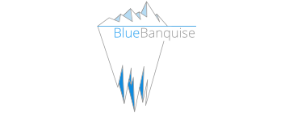

# BlueBanquise tutorials

<!-- 

    

        
    

    

        
Welcome on BlueBanquise tutorials!

    

 -->

Welcome on BlueBanquise tutorials!

Documents provided here are generic, and not directly related to the BlueBanquise Ansible collections or BlueBanquise stack.

Current available tutorials are:

* System administration:
    * [Basic introduction](sysadmin_introduction.md)
    * [Servers farm deployment and system administration](sysadmin_servers_farm_deployment.md)
    * [Learn Ansible basics to automate deployments](sysadmin_ansible.md)
    * [Basic monitoring with Prometheus](sysadmin_monitoring.md)
* High Performance Computing (HPC):
    * [Deploying Slurm scheduler over a servers farm](hpc_slurm.md)
    * [Configure users environment](hpc_users_environment.md)
    * [Introduction to parallel computing](hpc_parallel_computing.md)
<!--* Kubernetes:
    * [Deploy a Kubernetes cluster using Kubespray](kubernetes_deploy.md)
    * [Deploy basic resources inside a K8S cluster](kubernetes_basics.md) -->
