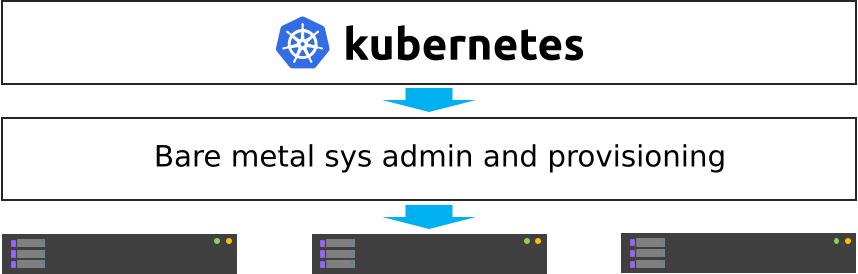
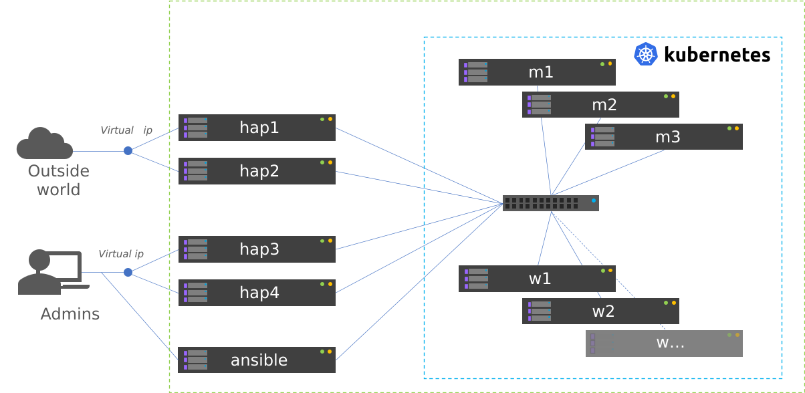

# Deploy a local Kubernetes cluster

You can rely on the [servers farm deployment tutorial](sysadmin_servers_farm_deployment.md) seen before to deploy the low lever layer of nodes cluster.
And on the [Ansible](sysadmin_ansible.md) tutorial to learn how to use and configure Ansible.

While the first tutorial was is in charge of provisioning bare metal / on premise infrastructure, we will use Kubespray here to deploy a production ready Kubernetes cluster over this infrastructure.

This result in 2 layers on the hardware, both autonomous but working together.

<div class="comment-tile">
    <div class="comment-tile-image">
        
    </div>
    <div class="comment-tile-text">
        <p>Small tip: when possible, try to isolate your layers: bare metal is managed by bare metal, kubernetes is managed by kubernetes. Mixing layers always end up in an unmaintanable cluster.</p>
    </div>
</div>



## Deploy CORE cluster

We are going to deploy the following infrastructure, considering that the number of workers 
can be more than the 2 in this example.
Master nodes **must** be an odd number (n*2+1). Here we will use 3 masters, which is standard for small and medium clusters.

We will also rely on 5 additional nodes:

* **ansible** host, which will be the management node. This server will host configuration, CORE services (dhcp, dns, repositories, pxe stack, monitoring, etc.).
* **hap1** and **hap2** which will be haproxy used to expose the Kubernetes cluster to the world.
* **hap3** and **hap4** which will be haproxy used to reach Kubernetes administration API for system administrators.

Note: you can merge hap1/hap2 with hap3/hap4 to only have 2 nodes in/out (or even 1 node for a POC).



### Install management node

We will assume here that you already used the [servers farm deployment tutorial](sysadmin_servers_farm_deployment.md) to deploy all needed hosts and that the cluster is ready.
We assume here that the cluster is based on Ubuntu 20.04. See end of [servers farm deployment tutorial](sysadmin_servers_farm_deployment.md) page on how to deploy Ubuntu if needed.

First step is to have Ansible installed to be able to use Kubespray, and also ensure all nodes have access to the web. We will configure our Ansible node as a gateway, but this could be another node. Please adapt to your infrastructure.

```
apt update && apt upgrade -y
apt install -y python3 python3-pip
pip3 install ansible ansible-base cryptography jinja2 netaddr pbr jmespath ruamel.yaml ruamel.yaml.clib MarkupSafe
```

We will assume our cluster will use this Ansible management node as a gateway to reach the web and so download packages and more.

To allow that, on the **ansible** node, edit file /etc/sysctl.conf and add the following content in it:

```
net.ipv4.ip_forward = 1
```

Then update iptables and save them to be persistent. In the following command, enp0s3 is the NIC on ansible node that is connected to the web.
10.10.0.0/16 is the network of the bare metal (and future K8S) cluster, where requests will come to reach the web.

```
sudo iptables -t nat -A POSTROUTING -s 10.10.0.0/16 -o enp0s3 -j MASQUERADE
sudo apt install iptables-persistent
sudo bash -c 'iptables-save > /etc/iptables/rules.v4'
```

Also generate an ssh key for later usage:

```
ssh-keygen -t ed25519 -q -N "" -f $HOME/.ssh/id_ed25519
```

Reboot system to ensure latest kernel is running, and ipv4 forward enabled.


Haproxy and keepalived
----------------------

Ssh on hap3 and install both tools:

```
apt-get install haproxy keepalived
```

Now tune haproxy to make this host redirect all incoming tcp traffic on port 6443 to kubernetes masters.
Edit file /etc/haproxy/haproxy.cfg and add at the end:

```
listen kubernetes-apiserver-https
  bind *:6443
  mode tcp
  option log-health-checks
  timeout client 3h
  timeout server 3h
  server m1 10.10.2.1:6443 check check-ssl verify none inter 10000
  server m2 10.10.2.2:6443 check check-ssl verify none inter 10000
  server m3 10.10.2.3:6443 check check-ssl verify none inter 10000
  balance roundrobin
```

And start/restart service:

```
systemctl restart haproxy
```

Now create the keepalived virtual ip. Edit/create /etc/keepalived/keepalived.conf and add the following content:

```
vrrp_script reload_haproxy {
    script "/usr/bin/killall -0 haproxy"
    interval 1
}

vrrp_instance VI_1 {
  virtual_router_id 100
  state MASTER
  priority 100

  # interval de check
  advert_int 1

  # interface de synchro entre les LB
  lvs_sync_daemon_interface enp0s3
  interface enp0s3

  # authentification entre les 2 machines LB
  authentication {
    auth_type PASS
    auth_pass secret
  }

  # vip
  virtual_ipaddress {
    10.10.0.3/16 brd 10.10.255.255 scope global
  }

  track_script {
    reload_haproxy
  }

}
```

And start service:

```
systemctl restart keepalived
```

You should see the virtual ip created on your external NIC, as keepalived entered MASTER state on this node.

Do the exact same procedure on hap4. You should not see the virtual ip spawning as keepalived will detect ip already 
exist on hap3 and so will enter BACKUP state.

Also prepare hap1 and hap2 systems by installing haproxy and keepalived on them. Configure keepalived, but let haproxy down and unconfigured for now.

## Deploy Kubernetes cluster

### Grab Kubespray

Kubespray is available on github. Get latest version from 
https://github.com/kubernetes-sigs/kubespray/releases and download it:

```
wget https://github.com/kubernetes-sigs/kubespray/archive/refs/tags/v2.18.0.tar.gz
tar xvzf v2.18.0.tar.gz
cd kubespray-2.18.0
```

### Configure kubespray

Lets create needed inventory and variables tunings. First, we need to clone the 
sample inventory:

```
cd inventory
cp -a sample mycluster
```

Then, edit file mycluster/inventory.ini and add the cluster nodes deployed earlier:

```INI
[all]
m1 ansible_host=10.10.2.1 ip=10.10.2.1 etcd_member_name=etcd1
m2 ansible_host=10.10.2.2 ip=10.10.2.2 etcd_member_name=etcd2
m3 ansible_host=10.10.2.3 ip=10.10.2.3 etcd_member_name=etcd3
w1 ansible_host=10.10.3.1 ip=10.10.3.1
w2 ansible_host=10.10.3.2 ip=10.10.3.2

[kube_control_plane]
m1
m2
m3

[etcd]
m1
m2
m3

[kube_node]
w1
w2

[calico_rr]

[k8s_cluster:children]
kube_control_plane
kube_node
calico_rr
```

Now that nodes are declared, edit file mycluster/group_vars/all/all.yml 
and set our haproxy as way to reach the cluster admin API 
(we set 10.10.0.3 as virtual ip and 6443 as port).

```yaml
## External LB example config
## apiserver_loadbalancer_domain_name: "elb.some.domain"
# loadbalancer_apiserver:
#   address: 1.2.3.4
#   port: 1234
apiserver_loadbalancer_domain_name: "elb.kub"
loadbalancer_apiserver:
  address: 10.10.0.3
  port: 6443
```
Then edit mycluster/group_vars/k8s_cluster/k8s-cluster.yml and set to true 
kube_proxy_strict_arp variable:

```yaml
# configure arp_ignore and arp_announce to avoid answering ARP queries from kube-ipvs0 interface
# must be set to true for MetalLB to work
kube_proxy_strict_arp: true
```

Configure now MetalLB and ingress-nginx to be deployed on the cluster.
Edit file mycluster/group_vars/k8s_cluster/addons.yml and set the following parameters:

```yaml
# Nginx ingress controller deployment
ingress_nginx_enabled: true
ingress_nginx_host_network: true
ingress_publish_status_address: ""

# MetalLB deployment
metallb_enabled: true
metallb_speaker_enabled: true
metallb_ip_range:
  - "10.10.7.7-10.10.7.20"
```

Except if you need something else specific, we are done with Kubespray configuration.

### Deploy K8S

It is time to deploy the Kubernetes cluster over the BlueBanquise cluster.

To do so, cd into kubespray-2.18.0 folder, and execute the cluster.yml playbook the following way:

```
ansible-playbook cluster.yml -b -i inventory/mycluster/inventory.ini
```

This step may take some time, depending of the size of your cluster.
On my small cluster, it took around 15 min to complete.

Tasks are idempotent. If you encounter errors (mainly related to downloads), fix and 
replay this playbook again.


### Check cluster works

Now that cluster is deployed, we need to dialog with it.
For that, we are going to install kubectl:

```
sudo apt-get update && sudo apt-get install -y apt-transport-https
curl -s https://packages.cloud.google.com/apt/doc/apt-key.gpg | sudo apt-key add -
echo "deb https://apt.kubernetes.io/ kubernetes-xenial main" | sudo tee -a /etc/apt/sources.list.d/kubernetes.list
sudo apt-get update
sudo apt-get install -y kubectl
```

Then, ssh on a K8S master and grab the content of credentials file:

```
ssh m1 cat /etc/kubernetes/admin.conf
```

And copy this content on ~/.kube/config on ansible system where we installed kubectl:

```
mkdir -p ~/.kube
vim ~/.kube/config
```

And check the cluster is running as expected:

```
bluebanquise@ansible:~$ kubectl cluster-info
Kubernetes control plane is running at https://elb.kub:6443

To further debug and diagnose cluster problems, use 'kubectl cluster-info dump'.
bluebanquise@ansible:~$ kubectl version
Client Version: version.Info{Major:"1", Minor:"23", GitVersion:"v1.23.4", GitCommit:"e6c093d87ea4cbb530a7b2ae91e54c0842d8308a", GitTreeState:"clean", BuildDate:"2022-02-16T12:38:05Z", GoVersion:"go1.17.7", Compiler:"gc", Platform:"linux/amd64"}
Server Version: version.Info{Major:"1", Minor:"22", GitVersion:"v1.22.5", GitCommit:"5c99e2ac2ff9a3c549d9ca665e7bc05a3e18f07e", GitTreeState:"clean", BuildDate:"2021-12-16T08:32:32Z", GoVersion:"go1.16.12", Compiler:"gc", Platform:"linux/amd64"}
bluebanquise@ansible:~$ kubectl get nodes
NAME   STATUS   ROLES                  AGE     VERSION
m1     Ready    control-plane,master   6m24s   v1.22.5
m2     Ready    control-plane,master   6m4s    v1.22.5
m3     Ready    control-plane,master   5m52s   v1.22.5
w1     Ready    <none>                 4m49s   v1.22.5
w2     Ready    <none>                 4m48s   v1.22.5
bluebanquise@ansible:~$
```

You can see that we access the cluster through our haproxy server, port 6443.


### Install Octant

In order to easily visualize what is running inside the cluster, 
a K8S dedicated UI is a plus. There are multiple possibilities: 
native K8S UI, Lens, etc.

In this scenario, we are going to use Octant (https://octant.dev/), which is perfect to 
manage our cluster with a minimal amount of efforts. Also, the dependencies 
graphs add a lot to understanding resources interactions.

Grab latest tar.gz Octant version from https://github.com/vmware-tanzu/octant/releases.

```
wget https://github.com/vmware-tanzu/octant/releases/download/v0.25.1/octant_0.25.1_Linux-64bit.tar.gz
tar xvzf octant_0.25.1_Linux-64bit.tar.gz
octant_0.25.1_Linux-64bit/octant
```

Let this shell open to let Octant run. Since Octant uses the local kube config, 
we have nothing else to do.
Octant now runs and listen on http://localhost:7777 . Use an ssh tunnel to reach it or any other way.

## Configure Kubernetes cluster

Now that the K8S cluster is running, we need to adjust few parameters to be 
able to use it on a bare metal hardware.

### Configure nginx-ingress together with MetalLB

We want our ingress resources to be reachable over a virtual ip, spawned by MetalLB, and 
connected to our proxy servers.

Create file nginx-ingress-metallb.yml with the following content:

```yaml

# Source: https://github.com/kubernetes/ingress-nginx/blob/main/charts/ingress-nginx/templates/controller-service-webhook.yaml
apiVersion: v1
kind: Service
metadata:
  labels:
      app.kubernetes.io/name: ingress-nginx
      app.kubernetes.io/instance: ingress-nginx
      app.kubernetes.io/component: controller
  name: ingress-nginx-controller-admission
  namespace: ingress-nginx
spec:
  type: ClusterIP
  ports:
      - name: https-webhook
      port: 443
      targetPort: webhook
  selector:
      app.kubernetes.io/name: ingress-nginx
      app.kubernetes.io/part-of: ingress-nginx
---
# Source: https://github.com/kubernetes/ingress-nginx/blob/main/charts/ingress-nginx/templates/controller-service.yaml
apiVersion: v1
kind: Service
metadata:
  labels:
      app.kubernetes.io/name: ingress-nginx
      app.kubernetes.io/instance: ingress-nginx
      app.kubernetes.io/component: controller
  name: ingress-nginx-controller
  namespace: ingress-nginx
spec:
  type: LoadBalancer
  externalTrafficPolicy: Cluster
  ports:
      - name: http
      port: 80
      protocol: TCP
      targetPort: http
      - name: https
      port: 443
      protocol: TCP
      targetPort: https
  selector:
      app.kubernetes.io/name: ingress-nginx
      app.kubernetes.io/part-of: ingress-nginx
```

And apply it:

```
kubectl apply -f nginx-ingress-metallb.yml
```

You should now be able to see the address given by MetalLB to reach ingress resources:

```
bluebanquise@ansible:~$ kubectl get services -n ingress-nginx
NAME                                 TYPE           CLUSTER-IP      EXTERNAL-IP   PORT(S)                      AGE
ingress-nginx-controller             LoadBalancer   10.233.6.175    10.10.7.7     80:32694/TCP,443:32099/TCP   16h
ingress-nginx-controller-admission   ClusterIP      10.233.45.203   <none>        443/TCP                      16h
bluebanquise@ansible:~$
```

Here: 10.10.7.7


Lets ensure now outside world can reach our http servers.
To do so, we will edit our haproxys servers configuration.

### Link MetalLB to world

Ssh on hap1, and edit haproxy configuration file /etc/haproxy/haproxy.cfg.
Add the following content at end of the file:

```
listen kubernetes-http
  bind *:80
  mode tcp
  option log-health-checks
  timeout client 3h
  timeout server 3h
  server metallb 10.10.7.7:80 check verify none inter 10000
```

Then restart haproxy service:

```
systemctl restart haproxy
```

Do the same on the second haproxy server hap2.

Your cluster should be ready. You can try now to deploy basic resources to test it: [Deploy basic resources inside K8S](kubernetes_basics.md).