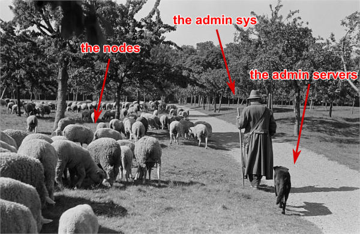

# Servers farm deployment

This tutorial tries to teach how to install manually a basic **servers farm**, also called a **cluster**.

This tutorial will focus on simplicity, lightness and good practices.
All software used are very common and when facing an error, a quick look on the
web will most of the time solves the issue.

If you face any issues with this tutorial, do not hesitate to contact me at:
`contact@bluebanquise.com`

<div class="comment-tile">
    <div class="comment-tile-image">
        
    </div>
    <div class="comment-tile-text">
        <p>This tutorial is based on EL 9 OS (RHEL 9, RockyLinux 9, AlmaLinux 9, etc).
Most of the configurations provided here are portable on other distributions (Ubuntu, Debian, Open Suse).
In annexes, I will detail how to port this to other distributions.</p>
    </div>
</div>


## 1. Hardware requirements

The following hardware is needed to perform this training:

**Minimal configuration to do the training:**
Laptop/workstation with 8Go RAM and 40Go disk. VT-x instructions MUST be activated in the BIOS. VMs will be used.
Note that with this configuration, you will need to tweak ram allocated to each VM after each PXE, but this is feasible.

**Recommended configuration to do the training:**
Laptop/workstation with 16go or more, and 100Go disk. VT-x instructions MUST be activated in the BIOS. VMs will be used.

**Best configuration to do the training:**
A real cluster, with real physical servers.

## 2. Useful commands

General commands:

* Load a kernel module : `modprobe mymodule -v`
* Unload a kernel module : `modprobe -r mymodule`
* List loaded kernel modules : `lsmod`
* Check listening processes and port used : `netstat -aut`
* Get hardware information (use –help for more details) : `inxi` or `dmidecode`
* Check network configuration : `ip add`
* Open a screen : `screen -S sphen`
* List screens : `screen -ls`
* Join a screen : `screen -x sphen`
* Detach a screen : use `Ctrl+a+d` on keyboard
* Change keyboard language in current terminal : `loadkeys fr` (azerty), `loadkeys us` (qwerty)
* Remount / when in read only (often in recovery mode) : `mount -o remount,rw /`
* Apply a patch on a file : `patch myfile.txt < mypatch.txt`
* Do a patch from original and modified file : `diff -Naur original.txt modified.txt`

IPMI commands for remote control :

* Boot choice, very useful for very slow to boot systems (`bios` can be replaced with `pxe` or `cdrom` or `disk`) : `ipmitool -I lanplus -H bmc5 -U user -P password chassis bootdev bios`
* Make boot persistent : `ipmitool -I lanplus -H bmc5 -U user -P password chassis bootdev disk options=persistent`. Note: remember that UEFI systems can dynamically change boot order.
* Control power (`reset` can be replaced with `soft` or `cycle` or `off` or `on` or `status`) : `ipmitool -I lanplus -H bmc5 -U user -P password chassis power reset`
* Activate remote console (use `Enter`, then `&` then `.` to exit) : `ipmitool -H bmc5 -U user -P password -I lanplus -e \& sol activate`

More: [IPMI tool how to](https://support.pivotal.io/hc/en-us/articles/206396927-How-to-work-on-IPMI-and-IPMITOOL)

Note: when using sol activate, if keyboard does not work, try using the same command into a screen, this may solve the issue (strangely...).

Clush usage (if clustershell has been installed on system):

* To do a command on all nodes : `clush -bw node1,node[4-5] "hostname"`
* To copy a file on all nodes : `clush -w node1,node[4-5] --copy /root/slurm.conf --dest=/etc/slurm/slurm.conf`
* To replace a string in a file of all nodes : `clush -bw compute1[34-67] 'sed -i "s/10.0.0.1/nfsserver/g" /etc/fstab'`

## 3. Vocabulary

### 3.1. Basic concepts

Few words on vocabulary used:

* To avoid confusion around "server" word, which can be used for software or hardware, we will keep this convention in this tutorial:
   * a **node** or an **host** refers to a physical or virtual machine with an operating system on it.
   * a **server** refer to a software daemon listening on the network (most of the time via a services mechanism like systemd).
* A **NIC** is a network interface controller (the thing you plug the Ethernet cable in ツ).
   * Note that on some systems, a NIC can be shared between server mother board and server BMC. See that as a bridge, which involve some specific things. Tip: when debugging PXE, try to avoid this kind of configuration, and use a BMC dedicated link if available. When using a shared NIC, link often goes down during PXE process, which means losing remote console during the important part of the PXE process.
* The **system administrator**, or sysadmin, will be you, the person in charge of managing the cluster. It is often refered as the "root" or the "sudo" user.
* Pets and Cattles
  * A pet node is a key node, that you MUST keep healthy and that is considered difficult to reinstall.
  * A cattle node, is a "trashable" node, that you consider non vital to production and that is considered easy to reinstall.



(Original black and white image from Roger Rössing, otothek_df_roe-neg_0006125_016_Sch%C3%A4fer_vor_seiner_Schafherde_auf_einer_Wiese_im_Harz.jpg)

An cluster can be seen like a sheep flock. The admin sys (shepherd), the management node (shepherd dog), and the worker nodes (sheep). This leads to two types of nodes, like cloud computing: pets (shepherd dog) and cattle (sheep). While the safety of your pets must be absolute for good production, losing cattle is common and considered normal. In HPC (High Performance Computing) for example, most of the time, management node, file system (io) nodes, etc, are considered as pets. On the other hand, compute nodes and login nodes are considered cattle. Same philosophy apply for file systems: some must be safe, others can be faster but “losable”, and users have to understand it and take precautions (backup data).

### 3.2. Basic words

An cluster is an aggregate of physical compute nodes dedicated to perform tasks, hosts resources, or execute intensive calculations.
On some clusters, like HPC clusters, users will be able to login through ssh on dedicated nodes (called login nodes),
upload their code and data, then compile their code, and launch jobs (calculations) on the cluster.

To maintain the cluster synchronized and to provide features, multiple **services** are running on management node.

Most of the time, a cluster is composed of:

* An **administration node** or **management node** (pet), whose purpose is to host all core resources of the cluster.
* **IO nodes** (pet), whose purpose is to provide storage for users. Basic storage is based on NFS, and advanced storage (optional) on parallel file systems (POSIX or object based).
* **Login nodes** (cattle), whose purpose is to be the place where users or admin can interact with the cluster. On an HPC cluster, this is where users login via ssh and interact with the job scheduler, and manage their code and data.
* **Compute nodes** or **worker nodes** (cattle), whose purpose is to provide CPU/GPU resources.

A node is the name given to a server inside a cluster. Nodes are most of the time equipped with a **BMC**
for Baseboard Management Controller, which is kind of a small server connected on the server motherboard and allow manipulating the server remotely (power on, power off, boot order, status, console, etc.). Legacy BMCs are using IPMI protocal to communicate with, while new generation BMC are using http REST API (RedFish API). Unfortunately, many BMC are also using proprietary APIs. Note that standard BMCs also embed a small webserver, to be able to interact with via a web browser.

Sometime, servers are **racked** into a **chassis** that can embed an **CMC** for Chassis Management Controller. Servers and chassis can be
**racked** into a rack that can embed an **RMC** for Rack Management Controller.

On the **operating system** (OS), a **service** is a software daemon managed by **systemd**. For example, the DHCP server service is in charge of attributing nodes IP addresses on the network depending of their MAC address (each network interface has its own MAC). Another example, the job scheduler, is also used as a service. Etc.

Management node, called here `odin`, is the node hosting most of vital services of the cluster.

On some expensive clusters, **Interconnect** network, often based on the **InfiniBand** technology (IB), is used in parallel of the Ethernet network (Eth). Interconnect is mainly used for calculations (transfer data between process of running codes) and is used to export the fast file systems, exported by the IO nodes. InfiniBand has much lower latency and much higher bandwidth than legacy Ethernet network.

### 3.3. Understanding services

As said above, management node host multiple basic services needed to run the cluster:
* The **repository** server: based on http protocol, it provides packages (rpm) to all nodes of the cluster. Service is `httpd` (Apache).
* The **tftp** server: based on tftp protocol, it provides PXE very basic files to initialize boot sequence on the remote servers. Service is `fbtftp` (Facebook Tftp), but could also be `atftp` or any other tftp server. Note that recent servers do not need a tftp server and can directly boot over http (we keep tftp here for compatibility).
* The **dhcp** server: provides ip for all nodes and BMC on the network. Ip are attributed using MAC addresses of network interfaces. Service is `dhcpd` (ISC DHCP).
* The **dns** server: provides link between ip and hostname, and the opposite. Service is `named` (bind9).
* The **time** server: provides a single and synchronized clock for all equipment of the cluster. More important than it seems. Service is `chronyd` (Chrony).
* The **pxe stack**: represent the aggregate of the repository server, the tftp server, the dhcp server, the dns server and the time server. Used to deploy OS on nodes on the cluster using the network.
* The **nfs** server: export simple storage spaces and allows nodes to mount these exported spaces locally (/home, /opt, etc. ). Service is `nfs-server`.
* The **LDAP** server: provides centralized users authentication for all nodes. This is optional for some clusters. Service is `slapd` (OpenLDAP).
* The **job scheduler** server (if specializing cluster to HPC): manage computational resources, and spread jobs from users on the cluster. Service is `slurmctld` (Slurm).
* The **monitoring** server: monitor the cluster to provide metrics, and raise alerts in case of issues. Service is `prometheus` (Prometheus).

<div class="comment-tile">
    <div class="comment-tile-image">
        
    </div>
    <div class="comment-tile-text">
        <p>Small tip: never neglect monitoring, especially during cluster deployment. An healty cluster makes an happy admin, able to play strategy games while the cluster is purring...</p>
    </div>
</div>

## 4. Cluster description

### 4.1. Architecture

The cluster structure for this training will be as follows:


On the hardware side:

* One master node called `odin`.
* One storage node called `thor`, based one NFS, will be deployed, for /home and /software.
* One external/internal node called `heimdall` for users to login or/and to act as a gateway.
* Multiple compute nodes, called `valkyries` will then be deployed on the fly via PXE.

This architecture is similar to HPC clusters, but is very generic. A web farm would replace the login node by a gateway or a load balancer, a Blender rendering farm would just skip the login node, etc.

### 4.2. Network

Network information:

The whole cluster will use a single subnet `10.10.0.0/16`.
IP used will be (nic name to be set depending of your hardware, use `ip a` command to obtain your nic names, which can be ethX, enoX, enX, enpX, enp0sX, etc.):

* odin: 10.10.0.1 (nic: enp0s3)
* thor : 10.10.1.1 (nic: enp0s3)
* heimdall: 10.10.2.1 (nic: enp0s3), 192.168.1.77 (nic: enp0s8) for users access
* valkyrieX: 10.10.3.X (nic: enp0s3)

Domain name will be `cluster.local`.

Note: if you plan to test this tutorial in Virtualbox, 10.10.X.X range may
already been taken by Virtualbox NAT. In this case, use another subnet like 10.77.X.X.

### 4.3. Final notes before we start

All nodes will be installed with a minimal install AlmaLinux 9. Needed other packages (rpms)
will be created on the fly from sources.

* To simplify this tutorial, firewall will be deactivated. You can reactivate it later.
* We will keep SELinux enforced. When facing permission denied, try setting SELinux into permissive mode to check if that's the reason, or check selinux logs. I know SELinux can be difficult to deal with, but keeping it enforced also forces you to avoid unexpected dangerous things.
* If you get `Pane is dead` error during pxe install, most of the time increase RAM to minimum 1200 Mo or more and it should be ok.
* You can edit files using `vim` which is a powerful tool, but if you feel more comfortable with, use `nano` (`nano myfile.txt`, then edit file, then use `Ctrl+O` to save, and `Ctrl+X` to exit). There is a very nice tutorial online for Vim, investing in it worth it on the long term.
* Keep cool, and take fresh air when its not working as expected.

## 5. Management node installation

This part describes how to manually install `odin` management node basic services, needed to deploy and install the other servers.

Install first system with AlmaLinux DVD image (using an USB stick), and choose minimal install as package selection (Or server with GUI if you prefer. However, more packages installed means less security and less performance).

Partition schema should be the following, without LVM but standard partitions:

*	/boot 2Go ext4
*	swap 4Go
*	/ remaining space ext4

Note: you can learn how to use LVMs later.

Be extremely careful with time zone choice. This parameter is more important than it seems as time zone will be set in the kickstart file later, and MUST be the same than the one chosen here when installing `odin`. If you don’t know which one to use, choose Europe/Brussels, the same one chose in the kickstart example of this document.
After install and reboot, disable firewalld using:

```
systemctl disable firewalld
systemctl stop firewalld
```

Change hostname to `odin` (need to login again to see changes):

```
hostnamectl set-hostname odin.cluster.local
```

To start most services, we need the main NIC to be up and ready with an ip.
We will use **NetworkManager** to handle network. `nmcli` is the command to interact with NetworkManager.

<div class="comment-tile">
    <div class="comment-tile-image">
        
    </div>
    <div class="comment-tile-text">
        <p>Note about NetworkManager: some say its bad, some say its good. It depends of admin tastes. Use it if you feel confortable with it, or use systemd-networkd if you prefer. Best idea to me is to use what is default on the system: NetworkManager on RHEL like distributions and Suse, systemd-networkd on Ubuntu and Debian.</p>
    </div>
</div>

Assuming main NIC name is `enp0s8`, to set `10.10.0.1/16` IP and subnet on it, use the following commands:

```
nmcli con mod enp0s8 ipv4.addresses 10.10.0.1/16
nmcli con mod enp0s8 ipv4.method manual
nmcli con up enp0s8
```

Then ensure interface is up with correct ip using:

```
ip a
```

You should see your NICs with `enp0s8` having ip `10.10.0.1` with `/16` prefix.

Time to setup basic repositories.

### 5.1. Setup basic repositories

#### 5.1.1. Main OS

Backup and clean first default AlmaLinux repositories:

```
cp -a /etc/yum.repos.d/ /root/
rm -f /etc/yum.repos.d/*
```

The local repository allows the main server and other servers to install automatically rpm with correct dependencies without having to access web repository. All needed rpm are available in the AlmaLinux DVD.

Next step depends if you are using a Virtual Machine or a real server.

3 ways to do:

1. If you are using a real server, upload the AlmaLinux DVD in /root folder and mount it in /mnt (or mount it directly from CDROM):

```
mount /root/AlmaLinux-9-x86_64-Everything.iso /mnt
```

Copy full iso (will be needed later for PXE), and use the database already on the DVD:

```
mkdir -p /var/www/html/repositories/AlmaLinux/9/x86_64/os/
cp -a /mnt/* /var/www/html/repositories/AlmaLinux/9/x86_64/os/
restorecon -r /var/www/html/
```

2. Or you can also simply mount the iso directly in the good folder:

```
mkdir -p /var/www/html/repositories/AlmaLinux/9/x86_64/os/
mount /root/AlmaLinux-9-x86_64-Everything.iso /var/www/html/repositories/AlmaLinux/9/x86_64/os/
restorecon -r /var/www/html/
```

3. If you are using a Virtual Machine, simply create the folder and mount the ISO that you should have added into the virtual CDROM drive:

```
mkdir -p /var/www/html/repositories/AlmaLinux/9/x86_64/os/
mount /dev/cdrom /var/www/html/repositories/AlmaLinux/9/x86_64/os/
restorecon -r /var/www/html/
```

Now, indicate the server the repository position (here local disk). To do so, edit the file `/etc/yum.repos.d/os.repo` and add:

```
[BaseOS]
name=BaseOS
baseurl=file:///var/www/html/repositories/AlmaLinux/9/x86_64/os/BaseOS
gpgcheck=0
enabled=1

[AppStream]
name=AppStream
baseurl=file:///var/www/html/repositories/AlmaLinux/9/x86_64/os/AppStream
gpgcheck=0
enabled=1
```

Note: BaseOS provides basic rpms and tools, while AppStream provides different versions of very specific softwares (you can ask for a specific version of Apache http server for example).

OS repositories are split between BaseOS and AppStream. Using this file, we will reach both.

Finally, install and start the `httpd` service, to allow other servers using this repository through `http`.

```
dnf install httpd -y
systemctl enable httpd
systemctl start httpd
```

The repository server is up, and listening. We can now use it to reach repositories, as any other servers on the cluster network will.

Edit `/etc/yum.repos.d/os.repo` and update to:

```
[BaseOS]
name=BaseOS
baseurl=http://10.10.0.1/repositories/AlmaLinux/9/x86_64/os/BaseOS
gpgcheck=0
enabled=1

[AppStream]
name=AppStream
baseurl=http://10.10.0.1/repositories/AlmaLinux/9/x86_64/os/AppStream
gpgcheck=0
enabled=1
```

Ensure it works, by installing for example `wget`:

```
dnf clean all
dnf repolist
dnf install wget
```

#### 5.1.2. Other repositories

We will need to add extra packages as not all is contained in the AlmaLinux 9 DVD.
Create extra repository folder:

```
mkdir -p /var/www/html/repositories/AlmaLinux/9/x86_64/extra/
restorecon -r /var/www/html/
```

We now need to create a new repository here using the dedicated command. This will be for now an empty repository.
We must install this command first:

```
dnf install -y createrepo
createrepo /var/www/html/repositories/AlmaLinux/9/x86_64/extra/
restorecon -r /var/www/html/
```

Then create dedicated repository file `/etc/yum.repos.d/extra.repo` with the following content:

```
[Extra]
name=Extra
baseurl=http://10.10.0.1/repositories/AlmaLinux/9/x86_64/extra
gpgcheck=0
enabled=1
```

To close this repositories part, we may install few useful packages.

If a local web browser is needed, install the following packages:

```
dnf install xorg-x11-utils xauth firefox
```

Then login on node using `ssh -X -C` to be able to launch `firefox`. Note however that this can be extremely slow.
A better way is to use ssh port forwarding features (`-L`), this part is covered later in this training.

Also, install ipmitool if using an IPMI compatible cluster, these will be used for computes nodes deployment and PXE tools.

```
dnf install ipmitool
```

### 5.2. DHCP server

The DHCP server is used to assign ip addresses and hostnames to other nodes. It is the first server seen by a new node booting in PXE for installation. In this configuration, it is assumed MAC addresses of nodes are known.

Install the dhcp server package:

```
dnf install dhcp-server
```

Do not start it now, configure it first.
The configuration file is `/etc/dhcp/dhcpd.conf`.
It should be like the following, replacing MAC address here by the ones of the current cluster. It is possible to tune global values.
Unknown nodes/BMC will be given a temporary ip on the 10.0.254.x range if dhcp server do not know their MAC address.

```
 authoritative;

 option client-arch code 93 = unsigned integer 16;
 if exists client-arch {
   if option client-arch = 00:00 {
     filename "undionly.kpxe";
   } elsif option client-arch = 00:07 {
     filename "ipxe.efi";
   } elsif option client-arch = 00:08 {
     filename "ipxe.efi";
   } elsif option client-arch = 00:09 {
     filename "ipxe.efi";
   }
 }

 subnet 10.10.0.0 netmask 255.255.0.0 {
 # range 10.10.254.0 10.10.254.254; # range where unknown servers will be
 option domain-name "cluster.local";
 option domain-name-servers 10.10.0.1; # dns server ip
 option broadcast-address 10.10.255.255;
 default-lease-time 600;
 max-lease-time 7200;

 next-server 10.10.0.1; #  pxe server ip

# List of nodes

host thor {
 hardware ethernet 08:00:27:18:68:BC;
 fixed-address 10.10.1.1;
 option host-name "thor";
}

host heimdall {
 hardware ethernet 08:00:27:18:58:BC;
 fixed-address 10.10.2.1;
 option host-name "heimdall";
}

host valkyrie01 {
 hardware ethernet 08:00:27:18:67:BC;
 fixed-address 10.10.3.1;
 option host-name "valkyrie01";
}

host valkyrie02 {
 hardware ethernet 08:00:27:18:68:BC;
 fixed-address 10.10.3.2;
 option host-name "valkyrie02";
}

}
```

Note: also add your server's BMC if any.

Finally, start and enable the dhcp service:

<div class="comment-tile">
    <div class="comment-tile-image">
        
    </div>
    <div class="comment-tile-text">
        <p>&#x26A0; WARNING &#x26A0;: only enable the DHCP service if you are on an isolated network, as in opposite to the other services, it may disturb the network if another DHCP is on this network.</p>
    </div>
</div>

```
systemctl enable dhcpd
systemctl start dhcpd
```

Note: if needed, you can search for nodes in `10.10.254.0-10.10.254.254` range using the following `nmap` command (install it using `dnf install nmap`):

```
nmap 10.10.254.0-254
```

This is useful to check after a cluster installation that no equipment connected on the network was forgotten in the process, since registered nodes in the DHCP should not be in this range.

### 5.3. DNS server

DNS server provides on the network ip/hostname relation to all hosts:

* ip for corresponding hostname
* hostname for corresponding ip

Install dns server package:

```
dnf install bind
```

Configuration includes 3 files: main configuration file, forward file, and reverse file. (You can separate files into more if you wish, not needed here).

Main configuration file is `/etc/named.conf`, and should be as follow (we are creating an isolated cluster, if not, configure recursion and forwarders, refer to Bind9 documentation):

```
options {
	listen-on port 53 { 127.0.0.1; 10.10.0.1;};
	listen-on-v6 port 53 { ::1; };
	directory 	"/var/named";
	dump-file 	"/var/named/data/cache_dump.db";
	statistics-file "/var/named/data/named_stats.txt";
	memstatistics-file "/var/named/data/named_mem_stats.txt";
	allow-query     { localhost; 10.10.0.0/16;};

	recursion no;

	dnssec-enable no;
	dnssec-validation no;
	dnssec-lookaside auto;

	/* Path to ISC DLV key */
	bindkeys-file "/etc/named.iscdlv.key";

	managed-keys-directory "/var/named/dynamic";

	pid-file "/run/named/named.pid";
	session-keyfile "/run/named/session.key";
};

logging {
        channel default_debug {
                file "data/named.run";
                severity dynamic;
        };
};

zone "." IN {
	type hint;
	file "named.ca";
};

zone"cluster.local" IN {
type master;
file "forward";
allow-update { none; };
};
zone"10.10.in-addr.arpa" IN {
type master;
file "reverse";
allow-update { none; };
};

include "/etc/named.rfc1912.zones";
include "/etc/named.root.key";
```

Note that the `10.10.in-addr.arpa` is related to first part of our range of ip. If cluster was using for example `172.16.x.x` ip range, then it would have been `16.172.in-addr.arpa`.

Recursion is disabled because no other network access is supposed available.

What contains our names and ip are the two last zone parts. They refer to two files: `forward` and `reverse`. These files are located in `/var/named/`.

First one is `/var/named/forward` with the following content:

```
$TTL 86400
@   IN  SOA     odin.cluster.local. root.cluster.local. (
        2011071001  ;Serial
        3600        ;Refresh
        1800        ;Retry
        604800      ;Expire
        86400       ;Minimum TTL
)
@       IN  NS          odin.cluster.local.
@       IN  A           10.10.0.1

odin               IN  A   10.10.0.1
thor               IN  A   10.10.1.1
heimdall           IN  A   10.10.2.1

valkyrie01         IN  A   10.10.3.1
valkyrie02         IN  A   10.10.3.2
```

Second one is `/var/named/reverse`:

```
$TTL 86400
@   IN  SOA     odin.cluster.local. root.cluster.local. (
        2011071001  ;Serial
        3600        ;Refresh
        1800        ;Retry
        604800      ;Expire
        86400       ;Minimum TTL
)
@       IN  NS          odin.cluster.local.
@       IN  PTR         cluster.local.

odin      IN  A   10.10.0.1

1.0        IN  PTR         odin.cluster.local.
1.1        IN  PTR         thor.cluster.local.
1.2        IN  PTR         heimdall.cluster.local.

1.3        IN  PTR         valkyrie01.cluster.local.
2.3        IN  PTR         valkyrie02.cluster.local.
```

Set rights on files:

```
chgrp named -R /var/named
chown -v root:named /etc/named.conf
restorecon -rv /var/named
restorecon -v /etc/named.conf
```

And start service:

```
systemctl enable named
systemctl start named
```

The server is up and running. We need to setup client part, even on our `odin`
management node.

The old way was to edit the `/etc/resolv.conf`. However, when using NetworkManager or systemd-netword, this is bad idea and we should update DNS directly in these tools.

WWWWWWWWWWWWWWWWWWWWWWWWWWWWWWWWWW
WWWWWWWWWWWWWWWWW

To do so, edit `/etc/resolv.conf` and add the following (but keep your primary dns after the one of the cluster to be able to resolv other hosts over the web):

```
search cluster.local
nameserver 10.10.0.1
```

So for example, my final file at home is:

```
nameserver 10.10.0.1
search home cluster.local
nameserver 192.168.1.1
nameserver 2a01:cb08:8acc:b600:a63e:51ff:fe14:f413
nameserver fe80::a63e:51ff:fe14:f413%enp0s3
```

Which allows me to resolv `thor` or `google.com`.

Note: you may wish to prevent other scripts (dhclient for example) to edit the file.
If using an ext4 filesystem, it is possible to lock the file using:

```
chattr +i /etc/resolv.conf
```

Use `-i` to unlock it later.

DNS is now ready. You can try to ping `odin` and see if it works.
Stop DNS service and try again to see it does not resolve ip anymore.

### 5.4. Hosts file

An alternative or in complement to DNS, most system administrators setup an hosts file.

The hosts file allows to resolve locally which ip belongs to which hostname if written inside. For small clusters, it can fully replace the DNS.
On large cluster, most system administrators write inside at least key or critical hostnames and ip and uses a DNS.

Lets create our hosts file. Edit `/etc/hosts` file and have it match the following:

```
127.0.0.1   localhost localhost.localdomain localhost4 localhost4.localdomain4
::1         localhost localhost.localdomain localhost6 localhost6.localdomain6

10.10.0.1   odin
10.10.1.1   thor
10.10.2.1   heimdall
10.10.3.1   valkyrie01
10.10.3.2   valkyrie02
```

You can now try to stop DNS server and check that now, even with the DNS stopped, we can resolve and ping `odin`.

### 5.5. Time server

The time server provides date and time to ensure all nodes/servers are synchronized. This is VERY important, as many authentication tools (munge, ldap, etc.) will not work if cluster is not clock synchronized. If something fail to authenticate, one of the first debug move is to check clock are synchronized.

Install needed packages:

```
dnf install chrony
```

Configuration file is `/etc/chrony.conf`, for both client or/and server configuration, as chrony can act as both client and server at the same time (see time synchronisation as a chain).

We will configure it to allow the local network to query time from this server.
Also, because this is a poor clock source, we use a stratum 12 (the bigger, the badder time source is). This is purely virtual here, but idea is: if a client can reach multiple time servers, then it will sync with the higest stratum one available.

The file content should be as bellow:

```
# Define local clock as a bad clock
local stratum 12

# Allow queries from the main network
allow 10.10.0.0/16

# Record the rate at which the system clock gains/losses time.
driftfile /var/lib/chrony/drift

# Allow the system clock to be stepped in the first three updates
# if its offset is larger than 1 second.
makestep 1.0 3

# Enable kernel synchronization of the real-time clock (RTC).
rtcsync

# Specify directory for log files.
logdir /var/log/chrony
```

Then start and enable service:

```
systemctl restart chronyd
systemctl enable chronyd
```

### 5.6. PXE stack

PXE, for Preboot Execution Environment, is a mechanism that allows remote hosts to boot from the network and deploy operating system using configuration and packages from the management node.

It is now time to setup the PXE stack, which is composed of the dhcp server, the http server, the tftp server, the dns server, and the time server.

The http server will distribute the minimal kernel and initramfs for remote Linux booting, the kickstart autoinstall file for remote hosts to know how they should be installed, and the repositories for packages distribution. Some very basic files will be provided using tftp as this is the most compatible PXE protocol.

Note that the AlmaLinux already embed a very basic tftp server. But it cannot handle a huge cluster load, and so we replace it by the Facebook python based tftp server.

<div class="comment-tile">
    <div class="comment-tile-image">
        
    </div>
    <div class="comment-tile-text">
        <p>PXE is the most tricky part, as you will face all possible issues: hardware issues, bad cabling, firewalls, Vlans issues, stupid BIOS or BMCs, etc. Always try with a very simple network (flat, no vlans, no firewalls), and ensure you can deploy OS before complexify and secure the cluster and the network.</p>
    </div>
</div>

#### 5.6.1. fbtftp module

Lets grab python module first:

```
mkdir fbtftp-0.5
cd fbtftp-0.5
dnf install git tar rpm-build
git clone https://github.com/facebook/fbtftp.git .
python3 setup.py bdist_rpm --spec-only
cd ../
tar cvzf fbtftp-0.5.tar.gz fbtftp-0.5
rpmbuild -ta fbtftp-0.5.tar.gz
```

#### 5.6.2. fbtftp custom server

Now create a custom tftp server based on fbtftp. Create first needed folders:

```
mkdir fbtftp_server-0.1
mkdir fbtftp_server-0.1/services
```

Now create file `fbtftp_server-0.1/fbtftp_server.py` with the following content:

```
#!/usr/bin/env python3
# Copyright (c) Facebook, Inc. and its affiliates.

# This source code is licensed under the MIT license found in the
# LICENSE file in the root directory of this source tree.

import argparse
import logging
import os

from fbtftp.base_handler import BaseHandler
from fbtftp.base_handler import ResponseData
from fbtftp.base_server import BaseServer


class FileResponseData(ResponseData):
    def __init__(self, path):
        self._size = os.stat(path).st_size
        self._reader = open(path, "rb")

    def read(self, n):
        return self._reader.read(n)

    def size(self):
        return self._size

    def close(self):
        self._reader.close()


def print_session_stats(stats):
    logging.info("Stats: for %r requesting %r" % (stats.peer, stats.file_path))
    logging.info("Error: %r" % stats.error)
    logging.info("Time spent: %dms" % (stats.duration() * 1e3))
    logging.info("Packets sent: %d" % stats.packets_sent)
    logging.info("Packets ACKed: %d" % stats.packets_acked)
    logging.info("Bytes sent: %d" % stats.bytes_sent)
    logging.info("Options: %r" % stats.options)
    logging.info("Blksize: %r" % stats.blksize)
    logging.info("Retransmits: %d" % stats.retransmits)
    logging.info("Server port: %d" % stats.server_addr[1])
    logging.info("Client port: %d" % stats.peer[1])


def print_server_stats(stats):
    """
    Print server stats - see the ServerStats class
    """
    # NOTE: remember to reset the counters you use, to allow the next cycle to
    #       start fresh
    counters = stats.get_and_reset_all_counters()
    logging.info("Server stats - every %d seconds" % stats.interval)
    if "process_count" in counters:
        logging.info(
            "Number of spawned TFTP workers in stats time frame : %d"
            % counters["process_count"]
        )


class StaticHandler(BaseHandler):
    def __init__(self, server_addr, peer, path, options, root, stats_callback):
        self._root = root
        super().__init__(server_addr, peer, path, options, stats_callback)

    def get_response_data(self):
        return FileResponseData(os.path.join(self._root, self._path))


class StaticServer(BaseServer):
    def __init__(
        self,
        address,
        port,
        retries,
        timeout,
        root,
        handler_stats_callback,
        server_stats_callback=None,
    ):
        self._root = root
        self._handler_stats_callback = handler_stats_callback
        super().__init__(address, port, retries, timeout, server_stats_callback)

    def get_handler(self, server_addr, peer, path, options):
        return StaticHandler(
            server_addr, peer, path, options, self._root, self._handler_stats_callback
        )


def get_arguments():
    parser = argparse.ArgumentParser()
    parser.add_argument("--ip", type=str, default="::", help="IP address to bind to")
    parser.add_argument("--port", type=int, default=1969, help="port to bind to")
    parser.add_argument(
        "--retries", type=int, default=5, help="number of per-packet retries"
    )
    parser.add_argument(
        "--timeout_s", type=int, default=2, help="timeout for packet retransmission"
    )
    parser.add_argument(
        "--root", type=str, default="", help="root of the static filesystem"
    )
    return parser.parse_args()


def main():
    args = get_arguments()
    logging.getLogger().setLevel(logging.DEBUG)
    server = StaticServer(
        args.ip,
        args.port,
        args.retries,
        args.timeout_s,
        args.root,
        print_session_stats,
        print_server_stats,
    )
    try:
        server.run()
    except KeyboardInterrupt:
        server.close()


if __name__ == "__main__":
    main()
```

This file is our custom server, that will use fbtftp module (you don't need to understand this code, just assume its our tftp server).

Then create file `fbtftp_server-0.1/services/fbtftp_server.service` with the following content:

```
[Unit]
Description=Facebook TFTP server
After=network.target

[Service]
Type=simple
ExecStart=/usr/bin/env python3 /usr/local/bin/fbtftp_server.py --root /var/lib/tftpboot/ --port 69

[Install]
WantedBy=multi-user.target
```

This file is the service file, that we will use to start or stop our custom server.

And finally, create file `fbtftp_server-0.1/fbtftp_server.spec` with the following content:

```
Name:     fbtftp_server
Summary:  fbtftp_server
Release:  1%{?dist}
Version:  0.1
License:  MIT
Group:    System Environment/Base
URL:      https://github.com/bluebanquise/
Source:   https://bluebanquise.com/sources/fbtftp_server-0.1.tar.gz
Packager: Benoit Leveugle <benoit.leveugle@gmail.com>

Requires: fbtftp

%define debug_package %{nil}

%description
Facebook tftp simple implementation, based on server example from
https://github.com/facebook/fbtftp/tree/master/examples

%prep

%setup -q

%build

%install
# Populate binaries
mkdir -p $RPM_BUILD_ROOT/usr/local/bin/
cp -a fbtftp_server.py $RPM_BUILD_ROOT/usr/local/bin/

# Add services
mkdir -p $RPM_BUILD_ROOT/usr/lib/systemd/system/
cp -a services/fbtftp_server.service $RPM_BUILD_ROOT/usr/lib/systemd/system/

%files
%defattr(-,root,root,-)
/usr/local/bin/fbtftp_server.py
/usr/lib/systemd/system/fbtftp_server.service

%changelog

* Wed Oct 07 2020 Benoit Leveugle <benoit.leveugle@gmail.com>
- Create
```

This file specify how the package should be built.

Lets now create the package:

```
tar cvzf fbtftp_server-0.1.tar.gz fbtftp_server-0.1
rpmbuild -ta fbtftp_server-0.1.tar.gz --target=noarch
```

Copy both packages into our extra repository, update the repository:

```
cp /root/rpmbuild/RPMS/noarch/fbtftp-0.5-1.noarch.rpm /var/www/html/repositories/AlmaLinux/9/x86_64/extra/
cp /root/rpmbuild/RPMS/noarch/fbtftp_server-0.1-1.el8.noarch.rpm /var/www/html/repositories/AlmaLinux/9/x86_64/extra/
createrepo /var/www/html/repositories/AlmaLinux/9/x86_64/extra/
dnf clean all
```

Now install both packages:

```
dnf install fbtftp_server -y
```

#### 5.6.3. iPXE custom rom

We then need ipxe files. We could use native syslinux or shim.efi files, but this is just not flexible enough for new generation clusters.
We will build our own ipxe roms, and include our own init script.

<div class="comment-tile">
    <div class="comment-tile-image">
        
    </div>
    <div class="comment-tile-text">
        <p>Small tip: ipxe allows you to build raw roms (the ones we will use in this tutorial), but also iso or usb image that contains the rom. This is VERY (VERY!!!!) useful when you need to boot a stupidely made node with a weird BIOS or some network cards that does not boot over PXE.</p>
    </div>
</div>

Grab latest ipxe version from git.

To do so, install needed tools to build C code:

```
dnf groupinstall "Development tools" -y
dnf install xz-devel -y
```

Then clone the ipxe repository into `/root/ipxe`:

```
mkdir /root/ipxe
cd /root/ipxe
git clone https://github.com/ipxe/ipxe.git .
```

Lets create our ipxe script, that will display a nice ascii art, so we can see it loading, and that will target the file we want.
To create something simple, lets target the file `http://${next-server}/boot.ipxe` at boot.

Create file `/root/ipxe/src/our_script.ipxe` with the following content:

```
#!ipxe

echo
echo . . . . . . . *. . . . .*. . . *. . . . .*
echo . . . . . ***. . . . . **********. . . . . ***
echo . . . .*****. . . . . .**********. . . . . .*****
echo . . .*******. . . . . .**********. . . . . .*******
echo . .**********. . . . .************. . . . .**********
echo . ****************************************************
echo .******************************************************
echo ********************************************************
echo ********************************************************
echo ********************************************************
echo .******************************************************
echo . ********. . . ************************. . . ********
echo . .*******. . . .*. . .*********. . . *. . . .*******
echo . . .******. . . . . . .*******. . . . . . . ******
echo . . . .*****. . . . . . .*****. . . . . . . *****
echo . . . . . ***. . . . . . .***. . . . . . . ***
echo . . . . . . **. . . . . . .*. . . . . . . **
echo

sleep 4

ifconf --configurator dhcp || shell

echo
echo +---------------- System information ----------------+
echo |
echo | hostname:     ${hostname}
echo | platform:     ${platform}
echo | mac:          ${net0/mac}
echo | ip:           ${net0.dhcp/ip:ipv4}
echo | netmask:      ${net0.dhcp/netmask:ipv4}
echo | dhcp-server:  ${net0.dhcp/dhcp-server:ipv4}
echo | gateway:      ${net0.dhcp/gateway:ipv4}
echo | dns-server:   ${net0.dhcp/dns:ipv4}
echo | domain:       ${net0.dhcp/domain:string}
echo | next-server:  ${net0.dhcp/next-server:ipv4}
echo | user-class:   ${user-class:string}
echo |
echo +----------------------------------------------------+
echo

sleep 4

chain http://${next-server}/boot.ipxe || shell
```

Simply put, this script will display a nice ascii art, then sleep 4s, then
request dhcp server for all information (ip, hostname, next-server, etc.),
then display some of the information obtained, then sleep 4s, then chain load to
file `http://${next-server}/boot.ipxe` with `${next-server}` obtained from the DHCP server.
The `|| shell` means: if chaining fail, launch a shell so that sys admin can debug.

Then enter the src directory and build the needed files:

```
cd src
make -j 4 bin-x86_64-efi/ipxe.efi EMBED=our_script.ipxe DEBUG=intel,dhcp,vesafb
make -j 4 bin/undionly.kpxe EMBED=our_script.ipxe DEBUG=intel,dhcp,vesafb
```

And finally copy these files into the `/var/lib/tftpboot/` folder so that tftp server
can provide them to the nodes booting.

```
mkdir -p /var/lib/tftpboot/
cp bin-x86_64-efi/ipxe.efi /var/lib/tftpboot/
cp bin/undionly.kpxe /var/lib/tftpboot/
```

Note: some host do not boot without an **snponly** ipxe.efi version. Refer to ipxe documentation on how to build such rom.

Finally, start fbtftp_server service:

```
systemctl start fbtftp_server
systemctl enable fbtftp_server
```

#### 5.6.4. iPXE chain

Now we will create file `/var/www/html/boot.ipxe` that will be targeted by each node booting.
There are multiple strategy here. We could simply add basic boot information in this file and consider it done.
But we would quickly face an issue: how to handle different parameters per nodes? Maybe one kind of node need a specific console or kernel parameter that the others do not need.

To solve that, we will simply create a folder `/var/www/html/nodes/` and create one file per node inside.
Then we will ask in the `boot.ipxe` file that each node booting load its own file, related to its hostname provided by the DHCP.

Tip: we will then be able to use file links to create one file per group of nodes if needed.

Create folder:

```
mkdir /var/www/html/nodes/
mkdir /var/www/html/nodes_groups/
```

And create `/var/www/html/boot.ipxe` file with the following content:

```
#!ipxe
echo Chaining to node dedicated file
chain http://${next-server}/nodes/${hostname}.ipxe || shell
```

Last step for the iPXE chain is to create a file for our group of node, and link
our node to this group.

Create file `/var/www/html/nodes_groups/group_storage.ipxe` with the following content:

```
#!ipxe

echo Booting OS
echo Group profile: storage

echo +----------------------------------------------------+
echo |
echo | Loading kernel

kernel http://${next-server}/repositories/AlmaLinux/9/x86_64/os/images/pxeboot/vmlinuz initrd=initrd.img inst.stage2=http://${next-server}/repositories/AlmaLinux/9/x86_64/os/ inst.repo=http://${next-server}/repositories/AlmaLinux/9/x86_64/os/BaseOS/ inst.ks=http://${next-server}/nodes_groups/group_storage.kickstart.cfg

echo | Loading initial ramdisk ...

initrd http://${next-server}/repositories/AlmaLinux/9/x86_64/os/images/pxeboot/initrd.img

echo | ALL DONE! We are ready.
echo | Downloaded images report:

imgstat

echo | Booting in 4s ...
echo |
echo +----------------------------------------------------+

sleep 4

boot
```

Then, link the node `thor` to this group:

```
cd /var/www/html/nodes/
ln -s ../nodes_groups/group_storage.ipxe thor.ipxe
```

Note: it is important that link are relative: you have to cd into nodes directory,
and create the link from here with a relative path.

To summarize, chain will be the following: `DHCP -> {undionly.kpxe|ipxe.efi} -> boot.ipxe -> thor.ipxe (group_storage.ipxe)` .

#### 5.6.5. Kickstart

We now need to provide a kickstart file.

The kickstart file will provide auto-installation features: what should be installed, how, etc.
We will create one kickstart file per group of nodes.

To create the kickstart file, we need an ssh public key from our `odin` management
node. Create it, without passphrase:

```
ssh-keygen -N "" -t Ed25519
```

And get the content of the public key file `/root/.ssh/id_ed25519.pub`, we will use it just bellow to generate the
kickstart file. For example, content of mine is:

```
ssh-ed25519 AAAAC3NzaC1lZDI1NTE5AAAAIIqpyyh44Hz3gvhISaIE9yJ/ao8fBLNo7qwPJcYjQdIl root@odin.cluster.local
```

Now we need an sha512 password hash. Generate one using the following command:

```
python3 -c 'import crypt,getpass; print(crypt.crypt(getpass.getpass(), crypt.mksalt(crypt.METHOD_SHA512)))'
```

And keep it somewhere (for example, `$6$7zvrwimYcypA8JWc$5GWYVF7zrI5eorsPN8IUT1n/Gmjpkic7h2cCbFVxbkqJeG0/kmJsYw6EN9oX3NQ34duwW7qAmOI13Y/0v5oHn.` is for `root` as password, which is not secure but ok for training purpose), we will use it just bellow to generate the kickstart file.

Then, create the kickstart file `/var/www/html/nodes_groups/group_storage.kickstart.cfg`
dedicated to storage group, with the following minimal content:

```
##### General settings

# Do not use GUI
text

# Run the Setup Agent on first boot
firstboot --enable

# System keyboard layout
keyboard --vckeymap=us --xlayouts=us

# System language
lang en_US.UTF-8

# System timezone
timezone Europe/Brussels --isUtc

# Reboot after installation
reboot

##### Authentication settings

# Root password (sha512)
rootpw --iscrypted $6$7zvrwimYcypA8JWc$5GWYVF7zrI5eorsPN8IUT1n/Gmjpkic7h2cCbFVxbkqJeG0/kmJsYw6EN9oX3NQ34duwW7qAmOI13Y/0v5oHn.


##### Network

# Network settings
network --bootproto=dhcp --ipv6=auto --activate
network --hostname=localhost.localdomain

##### Security

# SELinux
selinux --enforcing

# Firwalld
firewall --disabled

##### Partitionning

# Bootloader configuration
bootloader --append="" --location=mbr

# Partitioning
clearpart --all --initlabel
autopart --type=plain --fstype=ext4 --nohome

##### Packages

%packages
@core
%end

# Main post, ssh keys
%post --interpreter /bin/bash --log /root/main_post-install.log

# Add ssh keys from ssh_keys list
mkdir /root/.ssh
cat << xxEOFxx >> /root/.ssh/authorized_keys
ssh-ed25519 AAAAC3NzaC1lZDI1NTE5AAAAIIqpyyh44Hz3gvhISaIE9yJ/ao8fBLNo7qwPJcYjQdIl root@odin.cluster.local
xxEOFxx
# Ensure SELinux configuration is ok
restorecon -R -v /root/.ssh

%end
```

Notes:

* The ssh public key here will allow us to ssh on the remote hosts without having to provide a password.
* We install only the absolute minimal operating system. It is strongly recommended to do the minimal amount of tasks during a kickstart as it is way simpler to debug things installing once system is running.
* Important note: the time zone parameter is very important. Choose here the same than the one choose when installing the OS of `odin`. If you don’t know the one used, it can be found using: `ll /etc/localtime`
* Ensure also your keyboard type is correct.
* For compatibility purpose, this kickstart example does not specify which hard drive disk to use, but only locate first one and use it. Tune it later according to your needs.

Now, ensure all services are started:

```
systemctl start httpd
systemctl enable httpd
systemctl start fbtftp_server
systemctl enable fbtftp_server
```

We can proceed with the boot of `thor` node, and then the other nodes.

## 6. Other nodes installation

### 6.1. Boot over PXE

Open 2 shell on `odin`. In the first one, launch watch logs of dhcp and tftp server using:

```
journalctl -u dhcpd -u fbtftp_server -f
```

In the second one, watch http server logs using:

```
tail -f /var/log/httpd/*
```

Now, boot the `thor` node over PXE, and watch it deploy. Also watch the logs to
understand all steps.

Once the operating system is installed, and the node has rebooted, have it boot
over disk, and ensure operating system is booted before proceeding.

Repeat this operation to deploy each nodes of your cluster.

<div class="comment-tile">
    <div class="comment-tile-image">
        
    </div>
    <div class="comment-tile-text">
        <p>Note: if you let nodes boot over PXE after reboot, they will again deploy, and enter in an infinite deployment loop.
There are strategies to solve that automatically, but this is out of the scope of this training. For now, simply change boot order after os deployment.</p>
    </div>
</div>


### 6.2. Configure client side

Now that other nodes are deployed and reachable over ssh, it is time to configure client side on them.

We will use clustershell (clush) a lot, as it allows to manipulate a lot of hosts over ssh at the same time. You can install clustershell either via packages (EPEL) either via pip.

#### 6.2.1. Set hostname

Set hostname on each nodes using the following command (tuned for each nodes of course):

```
hostnamectl set-hostname thor.cluster.local
```

#### 6.2.2. Configure repositories

You need the nodes be able to grab packages from `odin`.

On each client node, backup current repositories, and clean them:

```
cp -a /etc/yum.repos.d/ /root/yum.repos.d.backup
rm -f /etc/yum.repos.d/*.repo
```

Now create file `/etc/yum.repos.d/os.repo` with the following content:

```
[BaseOS]
name=BaseOS
baseurl=http://10.10.0.1/repositories/AlmaLinux/9/x86_64/os/BaseOS
gpgcheck=0
enabled=1

[AppStream]
name=AppStream
baseurl=http://10.10.0.1/repositories/AlmaLinux/9/x86_64/os/AppStream
gpgcheck=0
enabled=1
```

And create file `/etc/yum.repos.d/extra.repo` with the following content:

```
[Extra]
name=Extra
baseurl=http://10.10.0.1/repositories/AlmaLinux/9/x86_64/extra
gpgcheck=0
enabled=1
```

Now clean cache, and ensure you can reach the repositories and download packages (try to install wget for example):

```
dnf clean all
dnf update
dnf install wget -y
```

A simpler way can be also to copy `odin` repositories files directly on clients, and do all in parallel using clush.
Lets redo it, this time faster:

```
clush -bw thor,heimdall,valkyrie[01-02] 'cp -a /etc/yum.repos.d/ /root/yum.repos.d.backup'
clush -bw thor,heimdall,valkyrie[01-02] 'rm -f /etc/yum.repos.d/*.repo'
clush -w thor,heimdall,valkyrie[01-02] --copy /etc/yum.repos.d/* --dest /etc/yum.repos.d/
clush -bw thor,heimdall,valkyrie[01-02] 'dnf clean all'
clush -bw thor,heimdall,valkyrie[01-02] 'dnf update -y'
clush -bw thor,heimdall,valkyrie[01-02] 'dnf install wget -y'
```

#### 6.2.3. DNS client

IF not already automatically done from DHCP, on each client node, set `odin` as default DNS server by using previously seen nmcli commands (take this opportunity to set static ips on hosts).

#### 6.2.4. Hosts file

On each client, edit `/etc/hosts` file and have it match the following:

```
127.0.0.1   localhost localhost.localdomain localhost4 localhost4.localdomain4
::1         localhost localhost.localdomain localhost6 localhost6.localdomain6

10.10.0.1   odin
10.10.1.1   thor
10.10.2.1   heimdall
10.10.3.1   valkyrie01
10.10.3.2   valkyrie02
```

You can also simply upload the file from `odin` on clients, using clush.

#### 6.2.5. Time client

On each client, ensure time server is `odin` sp that our cluster is time synchronised.

Install needed packages:

```
dnf install chrony
```

Configuration file is `/etc/chrony.conf`. The file content should be as bellow:

```
# Source server to bind to
server 10.10.0.1 iburst

# Record the rate at which the system clock gains/losses time.
driftfile /var/lib/chrony/drift

# Allow the system clock to be stepped in the first three updates
# if its offset is larger than 1 second.
makestep 1.0 3

# Enable kernel synchronization of the real-time clock (RTC).
rtcsync

# Specify directory for log files.
logdir /var/log/chrony
```

Ensure client can communicate with the server.

Stop service:

```
systemctl stop chronyd
```

And force a clock sync:

```
chronyd -q 'server 10.10.0.1 iburst'
```

If you get the following (or something close) then your clock can sync from server:

```
chronyd version 3.5 starting (+CMDMON +NTP +REFCLOCK +RTC +PRIVDROP +SCFILTER +SIGND +ASYNCDNS +SECHASH +IPV6 +DEBUG)
Initial frequency 12.820 ppm
System clock wrong by 0.000050 seconds (step)
chronyd exiting
```

However, if you get something similar to this:

```
chronyd version 3.5 starting (+CMDMON +NTP +REFCLOCK +RTC +PRIVDROP +SCFILTER +SIGND +ASYNCDNS +SECHASH +IPV6 +DEBUG)
Initial frequency 12.820 ppm
No suitable source for synchronisation
chronyd exiting
```

It means something went wrong (firewall ?).

Then start and enable service:

```
systemctl start chronyd
systemctl enable chronyd
```

Again, you can use clush to do all these tasks in parallel on all client nodes.

Our nodes are now configured with the very basic needs. Time to focus on storage.

## 7. Storage

Storage is hosted on `thor`. We will share `/home` and `/software` from this server.
Then we will mount these directories on the login node `heimdall` and computes nodes `valkyrie01,valkyrie02`.

### 7.1. NFS server

Ssh on `thor`.

Now ensure first these 2 directories exist:

```
mkdir /home
mkdir /software
```

Now, install needed packages:

```
dnf install nfs-utils -y
```

Now, ask the nfs server daemon to export those directories over the network.

Since `/home` is expected to be used by users to store there data, it must be read/write access.
On the other hand, `/software` is designed to provide software (compiler, libraries, etc.) across
the cluster, and so it should be read only access.

Edit `/etc/exports` file, and add the 2 exported folders with good parameters:

```
/home 10.10.0.0/16(rw,no_root_squash,sync)
/software 10.10.0.0/16(ro,no_root_squash,sync)
```

Simply put, we ask here nfs-server to export both directories, restricted only to the
10.10.0.0/16 subnet. Note that one is `rw` (read/write), the other is `ro` (read only).

Start now the nfs-server:

```
systemctl start nfs-server
systemctl enable nfs-server
```

Now, ensure the exports are working, using the following command targeting the server ip:

```
showmount -e thor
```

You should see the exports available on this server.

### 7.2. NFS clients

Ssh on `heimdall`.

Install needed packages to mount nfs foreign export:

```
dnf install nfs-utils -y
```

Now edit `/etc/fstab` file, and add the 2 entries needed for our folders exported by `thor`:

```
thor:/home /home nfs rw,rsize=32768,wsize=32768,intr,nfsvers=4,bg 0 0
thor:/software /software nfs ro,intr,nfsvers=4,bg 0 0
```

Note: bg parameter ensure that the mounts are done in background mode. This avoid
blocking the system at boot if these folder are not reachable (for example if `thor` server is down at this very moment).

Now ask for mount of them:

```
mkdir /software
mkdir /home
mount /home
mount /software
```

And ensure they are mounted using `df` command.

Redo these client steps on all other clients, so computes nodes `valkyrie01,valkyrie02`,
so that the exported folders are available on each nodes where users interact.

## 9. Users

To have users on the cluster, you need to have the users registered on each node, with same pid and same group gid.

There are multiple ways to synchronize users on a cluster of nodes. Popular tools are based on Ldap or Ad.
However, this is out of the scope of this tutorial, and so we will manage users manually on our small cluster.

To generate a user with a fix pid and fix gid, use the following commands on `heimdall` login node:

```
groupadd -g 2001 myuser
adduser myuser --shell /bin/bash -d /home/myuser -u 2001 -g 2001
mkdir /home/myuser
chown -R myuser:myuser /home/myuser
```

Then on all other nodes, including `thor` and `odin`, create user only (no need to recreate the `/home` as it is spread over NFS)

On each other nodes, do the following:

```
groupadd -g 2001 myuser
adduser myuser --shell /bin/bash -d /home/myuser -u 2001 -g 2001
```

Note: for each new user, increment the user number (2002 -> 2003 -> 2004 -> etc.).
Also, use number above 2000 to avoid issues or conflict with possible system ids.

It is important to understand that using manual methods to add users may seems simple, but has a major drawback: the cluster can quickly become out of synchronization regarding users.
To prevent that, you can create scripts, rely on automation tools like Ansible, or use a centralized users database (OpenLDAP, etc.).

## 10. Infiniband (optional)

If you need InfiniBand support on nodes, simply install the package group related:

```
dnf groupinstall 'infiniband support'
```

And then enable rdma service:

```
systemctl start rdma
systemctl enable rdma
```

You should now see the ib0 interface in the NIC list from `ip a`.

## 11. Nvidia GPU (optional)

To setup an GPU, you need to:

* Ensure kernel do not crash at start (happen often if kernel is too old for hardware)
* Ensure **nouveau** driver do not prevent Nvidia driver to load
* Ensure Nvidia driver load

You can then install CUDA build and runtime environment on a shared space, or on each nodes, as you wish.

Lets do that step by step.

### 11.1. Ensure kernel do not crash

To prevent kernel from crashing at boot (Kernel Panic) due to too recent GPU hardware, edit the ipxe file that contains the kernel line
(for example file `/var/www/html/nodes_groups/group_compute_gpu.ipxe` and append `nomodeset` to the kernel line. For example:

```
#!ipxe

echo Booting OS
echo Group profile: compute_gpu

echo +----------------------------------------------------+
echo |
echo | Loading kernel

kernel http://${next-server}/repositories/AlmaLinux/9/x86_64/os/images/pxeboot/vmlinuz initrd=initrd.img inst.stage2=http://${next-server}/repositories/AlmaLinux/9/x86_64/os/ inst.repo=http://${next-server}/repositories/AlmaLinux/9/x86_64/os/BaseOS/ ks=http://${next-server}/nodes_groups/group_compute_gpu.kickstart.cfg nomodeset

echo | Loading initial ramdisk ...

initrd http://${next-server}/repositories/AlmaLinux/9/x86_64/os/images/pxeboot/initrd.img

echo | ALL DONE! We are ready.
echo | Downloaded images report:

imgstat

echo | Booting in 4s ...
echo |
echo +----------------------------------------------------+

sleep 4

boot
```

Also, edit kickstart file, for example here file `/var/www/html/nodes_groups/group_compute_gpu.kickstart.cfg`, and ensure the same is added to the bootloader parameter.
So for example, in the kickstart file, ensure you have this line:

```
bootloader --append="nomodeset" --location=mbr
```

Node should not crash anymore.

### 11.2. Disable nouveau driver

Again, redo the same process than before, but add another kernel parameter: `modprobe.blacklist=nouveau nouveau.modeset=0 rd.driver.blacklist=nouveau`

So edit ipxe `/var/www/html/nodes_groups/group_compute_gpu.ipxe` file again:

```
#!ipxe

echo Booting OS
echo Group profile: compute_gpu

echo +----------------------------------------------------+
echo |
echo | Loading kernel

kernel http://${next-server}/repositories/AlmaLinux/9/x86_64/os/images/pxeboot/vmlinuz initrd=initrd.img inst.stage2=http://${next-server}/repositories/AlmaLinux/9/x86_64/os/ inst.repo=http://${next-server}/repositories/AlmaLinux/9/x86_64/os/BaseOS/ ks=http://${next-server}/nodes_groups/group_compute_gpu.kickstart.cfg nomodeset modprobe.blacklist=nouveau nouveau.modeset=0 rd.driver.blacklist=nouveau

echo | Loading initial ramdisk ...

initrd http://${next-server}/repositories/AlmaLinux/9/x86_64/os/images/pxeboot/initrd.img

echo | ALL DONE! We are ready.
echo | Downloaded images report:

imgstat

echo | Booting in 4s ...
echo |
echo +----------------------------------------------------+

sleep 4

boot
```

And edit `/var/www/html/nodes_groups/group_compute_gpu.kickstart.cfg` file again:

```
bootloader --append="nomodeset modprobe.blacklist=nouveau nouveau.modeset=0 rd.driver.blacklist=nouveau" --location=mbr
```

Now, node will boot without `nouveau` driver loaded.

### 11.3. Install Nvidia driver

Grab driver from Nvidia website, that match your hardware and Linux distribution (and arch).

Now install epel repository:

```
dnf install -y https://dl.fedoraproject.org/pub/epel/epel-release-latest-8.noarch.rpm
```

Now install Nvidia repository:

```
ARCH=$( /bin/arch )
distribution=$(. /etc/os-release;echo $ID`rpm -E "%{?rhel}%{?fedora}"`)
dnf config-manager --add-repo http://developer.download.nvidia.com/compute/cuda/repos/$distribution/${ARCH}/cuda-rhel8.repo
```

Install needed kernel headers:

```
dnf install -y kernel-devel-$(uname -r) kernel-headers-$(uname -r)
```

And install driver

```
dnf clean all
dnf -y module install nvidia-driver:latest-dkms
```

## Other distributions

Here are how to deploy the other commons distributions. Note that all what we have seen so fare apply the same, packages names are just different, and some configuration path might also change, but tools are the same on all distributions.

I will go straight to the point here, adapt to your needs once it worked this way.

Just a quick pro and cons on all PXE solutions:

* RHEL:
  * Pros:
    * Good documentation
    * Kickstart format is efficient, especially for those who like scripting
  * Cons:
    * Anaconda installer often crashes without explanations
    * Some disks (especially old raids) are often not available for installer (even if seen by kernel)
* Ubuntu:
  * Pros:
    * YAML format is nice for configuration file
  * Cons:
    * Installer often falls back to interactive installation if anything is wrong, and does not advertise why (need to spend time searching in logs)
    * Weird behavior with some serial consols
    * No detailed documentation
* Debian:
  * Pros:
    * Light installer
  * Cons:
    * Lack of documentation on preseed
    * Some missing key features in preseed autoinstall (like support for multiple NICs, you need to manually define wich one to use)
* OpenSuse Leap:
  * Pros:
    * Nice installer
    * Good documentation
  * Cons:
    * XML
    * Need to manage some 2 part install (install and post-install)

### Ubuntu 20.04 and 22.04

Since 20.04, LTS versions of Ubuntu do not rely anymore on preseed, but on a new mechanism.
In this example, we will cover deployment of Ubuntu 22.04, but it is the same for 20.04.

To deploy Ubuntu over the network:

1. Prepare folders:

```
mkdir -p /var/www/html/pxe/ubuntu/22.04/
mkdir -p /var/www/html/pxe/ubuntu/22.04/iso_content/
```

2. Download Ubuntu 22.04 live server iso, put it in `/var/www/html/pxe/ubuntu/22.04/` folder and mount it also in `/var/www/html/pxe/ubuntu/22.04/iso_content/` (or copy its content here, its up to you).

```
cd /var/www/html/pxe/ubuntu/22.04/
wget ?????????????????
mount ???????????? /var/www/html/pxe/ubuntu/22.04/iso_content/
```

3. Create autoinstall file at ???????????????????

?????????????

4. Create needed empty file:

?????????????

5. Create ipxe file to boot:

?????????????

### Debian 11 and 12

Debian uses preseed file to configure auto-installation.


### OpenSUSE Leap 15

## 12. Conclusion

<div class="comment-tile">
    <div class="comment-tile-image">
        
    </div>
    <div class="comment-tile-text">
        <p>CONGRATULATION!! The cluster is ready to be used!!</p>
    </div>
</div>

Next step now is to learn how to automate what we did here. Proposal in next tutorial is based on Ansible but you can user other tools like Salt Stak, Pupper, Chef, etc. >> [Ansible tutorial]()???????????????????

Or you can also specialize the cluster, with HPC cluster tutorial or K8S cluster tutorial.

Thank you for following this tutorial. If you find something is missing, or find an issue, please notify me :)
