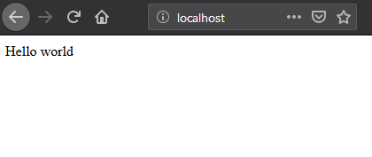

# Ansible

This section tries to provide key knowledge about Ansible to at least be able to reproduce what was done in [servers farm deployment tutorial](sysadmin_servers_farm_deployment.md) in an automated way.

**IMPORTANT**: We will assume here that user used to perform operations is a passwordless sudo able user on the target system.

## Install Ansible

There are multiple ways to install Ansible. Everything is described on the
[main Ansible documentation](https://docs.ansible.com/ansible/latest/installation_guide/intro_installation.html).

If you wish only to learn Ansible, simplest way is
[to use pip (or pip3](https://docs.ansible.com/ansible/latest/installation_guide/intro_installation.html#installing-ansible-with-pip).

<div class="comment-tile">
    <div class="comment-tile-image">
        
    </div>
    <div class="comment-tile-text">
        <p>If you wish to install Ansible on a production system, you can use your operating system
packages manager, but I strongly recommend using a python venv to avoid conflicting with system python modules and be able to pull an up to date Ansible version.</p>
    </div>
</div>

## Minimal inventory

Now that Ansible is installed on your system, edit /etc/hosts file, and add
"management1" on localhost line:

```
127.0.0.1   localhost localhost.localdomain localhost4 localhost4.localdomain4 management1
::1         localhost localhost.localdomain localhost6 localhost6.localdomain6
```

Then, create some needed directories and files:

```
mkdir -p $HOME/ansible/inventory
mkdir $HOME/ansible/inventory/group_vars
mkdir $HOME/ansible/inventory/group_vars/all
mkdir $HOME/ansible/roles
mkdir $HOME/ansible/playbooks
```

Now add **management1** host into the inventory. Create a file called
$HOME/ansible/inventory/myhosts.yml with the following content:

```
all:
  hosts:
    management1:
```

Our very basic Ansible configuration is done. But one thing remains: we need to
ensure our host (management1) can ssh to itself without password, as Ansible
relies fully on the ssh to connect to remote hosts.

Let's generate a ssh key (press enter multiple time):

```
ssh-keygen -N ""
```

Ensure you can ssh on management1 using a password:

```
# ssh management1
The authenticity of host 'management1 (10.10.0.1)' can't be established.
ECDSA key fingerprint is SHA256:XXXXXXXXXXXXXXXXXXXXXXXXXXXXXXXXXXXXXXXX
ECDSA key fingerprint is MD5:XXXXXXXXXXXXXXXXXXXXXXXXXXXXXXXXXXXXXXX.
Are you sure you want to continue connecting (yes/no)? yes
Warning: Permanently added 'management1,10.10.0.1' (ECDSA) to the list of known hosts.
root@management1's password:
#
```

If ok, then deploy ssh public key to allow password less authentication, and
ensure you can now ssh with the key:

```
# ssh-copy-id management1
/usr/bin/ssh-copy-id: INFO: Source of key(s) to be installed: "/root/.ssh/id_rsa.pub"
root@management1's password:
Number of key(s) added: 1
# ssh management1
```

Finally, check Ansible can connect to management1, and report hosts is up:

```
# ansible all -m ping
management1 | SUCCESS => {
    "changed": false,
    "ping": "pong"
}
#
```

Let's see the available and useful commands now.

## Ansible commands

### ansible

The `ansible` command provides few interesting features.

#### Version

First command is to check current Ansible version. It should be >= 2.9.13:

```
ansible --version
```

#### Ping an host or all hosts

Use the following command to check if Ansible can contact a specific registered
host:

```
ansible management1 -m ping
```

Or all hosts:

```
ansible all -m ping
```

Also, it is possible to gather **facts**. Facts are dynamic variables,
accessible only when Ansible is running on the target. Facts provides live
information about the target: it's running kernel, it's Linux distribution,
network or cpu information, etc.

```
ansible -m setup --tree /dev/shm/ management1
```

Then, open file /dev/shm/management1 to check its content and the result of
facts gathering.

#### ansible-inventory

Ansible inventory command is extremely useful and will be massively used on this
documentation.

This command allows to gather information from your inventory and check the
expected output.

##### Groups and hosts

The command:

```
ansible-inventory --graph
```

Provide information about groups and hosts inside each group:

```
@all:
  |--@ungrouped:
  |  |--management1
```

It is possible to see here that management1 is member of group @ungrouped,
which is part of group @all.
More will be seen later in this documentation.

##### Host variables

To output variables for a specific host, and check for example your variable
precedence mechanism provided what is expected, use:

```
ansible-inventory --yaml --host management1
```

For now, there are no available variables in the inventories, so output will
be {}.

### ansible-playbook

This command is used to run playbooks, and ask Ansible to execute tasks on
desired host(s). This is the most used command when using **BlueBanquise**.

Important parameters are:

* `-e` or `--extra-vars`, which allows to provide additional variables for execution (keep in mind that variables set here win the whole precedence)
* `-t` or `--tags`, which allows to execute only specific tasks or part of tasks (seen later)
* `-s` or `--skip-tags`, which allows to not execute some specific tasks or part of tasks (seen later)
* `--list-tasks`, which allows to list all tasks related to roles used in the playbook, and order they will be executed
* `--start-at-task`, which allows to start/restart playbook at a desired task (to be combined with `--list-tasks`)
* `--list-tags`, which allows to list all tags seen during this playbook execution
* `--limit`, which limit the playbook execution to a specific list of hosts (if using a group has default host for example)

### Debug

All of these commands accept verbose flags with -v, -vv, -vvv, etc. The more v,
the more verbose.

Also, it is possible to execute all of them with the variable ANSIBLE_DEBUG=1
set, which will dramatically increase output information (but unfortunately not
always relevant to our needs...).

For example, a very verbose execution would be:

```
ANSIBLE_DEBUG=1 ansible -m ping management1 -vvv
```

## Variables and groups

Now that all important commands have been seen, it is time to add some variables
inside the inventory, and play with groups.

### Adding variables

We are going to add few variables, at different positions in the inventories.

Create file $HOME/ansible/inventory/group_vars/all/my_ship.yml with the following
content:

```yaml
destination: Deliani
my_ship:
  model: USP Talon Light Fighter
  price: 6000 # in cr
  equipment:
    generator: Advanced MicroFusion
    shield: Structural Integrity Field
    front_gun: Pulse-Cannon
    sidekicks:
      - Plasma Storm
      - Zica SuperCharger
```

Now, ensure management1 can see these variables:

```
[root@ ~]# ansible-inventory --yaml --host management1
destination: Deliani
my_ship:
  equipment:
    front_gun: Pulse-Cannon
    generator: Advanced MicroFusion
    shield: Structural Integrity Field
    sidekicks:
    - Plasma Storm
    - Zica SuperCharger
  model: USP Talon Light Fighter
  price: 6000
[root@ ~]#
```

Nice, we can now use these variables for management1 when working on it.

Let's add 2 other hosts: login1 and nfs1.

Edit file $HOME/ansible/inventory/myhosts.yml to obtain:

```
management1
login1
nfs1
```

And now let's check login1 (when will exist) can also access these variables:

```
[root@ ~]# ansible-inventory --yaml --host login1
destination: Deliani
my_ship:
  equipment:
    front_gun: Pulse-Cannon
    generator: Advanced MicroFusion
    shield: Structural Integrity Field
    sidekicks:
    - Plasma Storm
    - Zica SuperCharger
  model: USP Talon Light Fighter
  price: 6000
[root@ ~]#
```

Perfect. It is time to play with groups, before coming back to variables to work
on variables precedence.

### Configuring groups

Lets check current groups:

```
[root@ ~]# ansible-inventory --graph
@all:
  |--@ungrouped:
  |  |--login1
  |  |--management1
  |  |--nfs1
[root@ ~]#
```

All our hosts belong to the ungrouped group and to the all group. But we want to
be able to assign specific variables to each kind of equipment. We need to
create groups.

There are two ways to create groups. In YAML, directly in the hosts files, or
using specific Ansible syntax in separate files. Both are useful, and we will
combine them.

#### In YAML

Edit again the $HOME/ansible/inventory/myhosts.yml file, and this time let's use
real YAML:

```yaml
managements:
  hosts:
    management1:
clients:
  hosts:
    login1:
    nfs1:
```

Now, let's check again groups:

```
[root@ ~]# ansible-inventory --graph
@all:
  |--@managements:
  |  |--management1
  |--@clients:
  |  |--login1
  |  |--nfs1
  |--@ungrouped:
[root@ ~]#
```

We can see that management1 is now member of group managements, and that login1 and
nfs1 are member of group clients.

The special string **hosts** in this file define that the string above is a
group, and that strings bellow are hosts member of this group.

It is also possible to set groups in a group in this same file. Edit it again:

```yaml
my_nodes:
  children:
    managements:
      hosts:
        management1:
    clients:
      hosts:
        login1:
        nfs1:
```

And result:

```
[root@ ~]# ansible-inventory --graph
@all:
  |--@my_nodes:
  |  |--@managements:
  |  |  |--management1
  |  |--@clients:
  |  |  |--login1
  |  |  |--nfs1
  |--@ungrouped:
[root@ ~]#
```

The **children** string define that the string above is a group that contains
bellow group(s).

#### In Ansible syntax

The second way to create groups is to use the Ansible native syntax, which can
be simpler in some cases.

Create a file $HOME/ansible/inventory/mygroups and set the following content:

```INI
[colors:children]
blue
red

[blue]
management1
login1

[red]
nfs1
```

And check the result:

```
[root@ ~]# ansible-inventory --graph
@all:
  |--@colors:
  |  |--@blue:
  |  |  |--login1
  |  |  |--management1
  |  |--@red:
  |  |  |--nfs1
  |--@my_nodes:
  |  |--@managements:
  |  |  |--management1
  |  |--@clients:
  |  |  |--login1
  |  |  |--nfs1
  |--@ungrouped:
[root@ ~]#
```

Same concept applies here, with different syntax.

Note that a host can be part of multiple groups.

You can find more information and examples
[here on intro_inventory](https://docs.ansible.com/ansible/latest/user_guide/intro_inventory.html).

#### Variables precedence

Time to use all these groups and make full usage of the inventory structure.

If you remember precedence system in Vocabulary section
(more [here on Ansible dedicated page](https://docs.ansible.com/ansible/latest/user_guide/playbooks_variables.html#variable-precedence-where-should-i-put-a-variable))
group_vars/all is in position 4 in the precedence. This is where we set our
spaceship variables.

Let's say now we wish to change our ship destination for management1 node only.

Check current destination for all hosts:

```
[root@ ~]# ansible-inventory --yaml --host management1 | grep destination
  destination: Deliani
[root@ ~]# ansible-inventory --yaml --host login1 | grep destination
  destination: Deliani
[root@ ~]# ansible-inventory --yaml --host nfs1 | grep destination
  destination: Deliani
[root@ ~]#
```

We can redefine the variable in group_vars/all (that apply to all hosts in the
@all group, so everyone), but we only want to impact management1 node.

In the precedence list, you can see that inventory host_vars are in position 9,
so they will win against position 4 of group_vars/all. Let’s use this.

Edit file $HOME/ansible/inventory/myhosts.yml and add a destination
variable under management1:

```yaml
my_nodes:
  children:
    managements:
      hosts:
        management1:
          destination: Ixmucane
    clients:
      hosts:
        login1:
        nfs1:
```

And check destinations again:

```
[root@ ~]# ansible-inventory --yaml --host management1 | grep destination
  destination: Ixmucane
[root@ ~]# ansible-inventory --yaml --host login1 | grep destination
  destination: Deliani
[root@ ~]# ansible-inventory --yaml --host nfs1 | grep destination
  destination: Deliani
[root@ ~]#
```

Perfect.

<div class="comment-tile">
    <div class="comment-tile-image">
        
    </div>
    <div class="comment-tile-text">
        <p>Note: We could also have used a file in inventory/host_vars/management1/new_values..
  Setting a variable in the host definition file above the host is equivalent to
  using host_vars folder. But host_vars folder is difficult to use when having a
  very large number of hosts.</p>
    </div>
</div>

Let's say now we want to change the model of spaceship of all the slave nodes.
So not a single host, but all slave members hosts.

We are going to use level 6 in variables precedence: group_vars/. Create a
directory called *slave* (same name than the group we want to work with) in
group_vars:

```
mkdir $HOME/ansible/inventory/group_vars/clients
```

Then, create file $HOME/ansible/inventory/group_vars/clients/myship.yml with the
following content:

```yaml
my_ship:
  equipment:
    front_gun: Pulse-Cannon
    generator: Advanced MicroFusion
    shield: Structural Integrity Field
    sidekicks:
    - Plasma Storm
    - Zica SuperCharger
  model: Gencore Maelstrom
  price: 6000
```

And check variables of hosts:

```
[root@ ~]# ansible-inventory --yaml --host management1 | grep model
  model: USP Talon Light Fighter
[root@ ~]# ansible-inventory --yaml --host login1 | grep model
  model: Gencore Maelstrom
[root@ ~]# ansible-inventory --yaml --host nfs1 | grep model
  model: Gencore Maelstrom
[root@ ~]#
```

<div class="comment-tile">
    <div class="comment-tile-image">
        
    </div>
    <div class="comment-tile-text">
        <p>We had to add the whole dictionary in group_vars/clients/myship.yml.
  This is due to the <b>replace</b> hash_behaviour of Ansible, as the <b>merge</b>
  version is deprecated. If you wish to avoid having to replace all variables
  like here, try to avoid massive dictionaries when not needed.</p>
    </div>
</div>

Perfect. Remember the pizza in Vocabulary section. Ansible just flatten the
whole inventory, using precedence, and you obtain variables.

Last point for this part, remember that in variable’s precedence, extra_vars is
level 22 and always win, so adding extra vars when executing Ansible later will
allow us to force variables at execution time for testing purposes or just
because we need it.

## Roles and playbooks

Time to apply some configuration on our target host.

We are going to create a role that install a web server package, create a very
basic web page with our ship’s information, and start the web server service.

### Role

Create a role called "shipyard", with needed folders:

```
mkdir $HOME/ansible/roles/shipyard
mkdir $HOME/ansible/roles/shipyard/tasks
mkdir $HOME/ansible/roles/shipyard/templates
```

Tasks folder contains tasks to perform, and main.yml file inside will be the
starting point for Ansible. Templates folder will contain our templates
(configuration files) in Jinja2 language.

### Task

Create file $HOME/ansible/roles/shipyard/tasks/main.yml with the following
content:

```yaml
---
- name: Package
  ansible.builtin.package:
    name: httpd
    state: present

- name: Template >> /var/www/html/index.html
  ansible.builtin.template:
    src: index.html.j2
    dest: /var/www/html/index.html
    owner: root
    group: root
    mode: 0644
  tags:
    - templates

- name: Start services
  ansible.builtin.service:
    name: httpd
    state: started
    enabled: yes
```

Content is pretty simple:

* Ansible installs httpd package (or do nothing if present)
* Then Ansible render the template index.html.j2 and write the result in /var/www/html/index.html
* Then Ansible ensure httpd service is started and enabled at boot

You can find all Ansible modules here in the
[official documentation](https://docs.ansible.com/ansible/latest/collections/index_module.html).

#### Template

Templates are probably the key feature of Ansible and all automation tools.

The idea is simple: you provide Ansible with a copy of your desired
configuration file, with variables to be dynamically replaced in order to fill
on the fly some parts of the file.

Let's do this with a simple html page, and first with a static page.

Create the template $HOME/ansible/roles/shipyard/templates/index.html.j2 with the
following static content:

```html
  <html>
  <header>
    <title>This is title</title>
  </header>
  <body>
    Hello world
  </body>
  </html>
```

The current template is static, we will make it dynamic later.

### Playbook

Lets create our playbook, which will contains a list of roles to apply on
management1 host.

Create file $HOME/ansible/playbooks/myplaybook.yml with the following content:

```yaml
---
- name: myplaybook
  hosts: "management1"
  roles:
    - role: shipyard
      tags: shipyard
```

Simply put, target of the playbook is host management1, and role to apply is
shipyard.

Skip the tags for now.

Note that hosts can be a list of hosts (comma separated: management1,login1,nfs1), or a group of hosts (all, clients, color, etc.).

Now, execute the playbook, and let Ansible do its job:

```
ansible-playbook /path/to/myplaybook.yml
```

Note that you need to provide full path to the playbook, as there are no default
folder for playbooks in Ansible.
Also note that if your shell is currently in the playbook folder, you can skip
full path as relative path are accepted.

If all goes well, you should now have the file /var/www/html/index.html
generated on management1, and using a web browser you can check the result.

Note that if you cannot reach the web browser, for example you are working in a
VM or a server without screen attached, you can use ssh forwarding. From you
current computer, open a new terminal and use:

```
ssh root@my_vm_or_my_server -L 9999:localhost:80
```

And then open a local web browser and open http://localhost:9999 .
Check the web for more on ssh port forwarding.



But this is not very interesting, let's add some dynamic part into our template.

### Jinja2

Edit file $HOME/ansible/roles/shipyard/templates/index.html.j2 to make it this
way:

```html
<html>
<header>
  <title>Shipyard</title>
</header>
<body>
  <h1>I am {{inventory_hostname}} << this is me, the current target</h1>
  <h2>Variables access</h2>
  Ship list: {{groups['all']}} << this is an access to a group members list <br>
  management1 ship model: {{hostvars['management1']['my_ship']['model']}} << this is an access to an host specific variable <br>
  login1 ship model: {{hostvars['login1']['my_ship']['model']}} <br>
  nfs1 ship model: {{hostvars['nfs1']['my_ship']['model']}} <br>
  My ship model: {{hostvars[inventory_hostname]['my_ship']['model']}} <br>
  Or a better way to get my ship model: {{my_ship.model}} <br>
  <h2>Loops</h2>
  
  Ship {{ship}} is in the shipyard, and has destination {{hostvars[ship]['destination']}}. <br>
  
</body>
</html>
```

And let's re-execute the playbook. But we have already installed the package and
started the service, so let's ask Ansible to only work on the tags 'templates'
to fasten the execution (this tag was defined in the tasks/mail.yml file
previously seen):

```
ansible-playbook myplaybook.yml -t templates
```

And check again our web page.


You can see multiple things:

* We executed the task on management1, so inventory_hostname variable content is 'management1'. This is an Ansible reserved variable that contains the target hostname.
* `groups['mygroup']` allows to get a list with all the hosts member of the group.
* `hostvars['myhosts']` allows to access variables of this host, using the variable precedence mechanism.
* `hostvars[inventory_hostname]` is equivalent to a direct variables access has we are accessing our current target variables.

Now regarding to Jinja2:

* `{{ }}` allows to insert a variable in the destination file.
* `` are Jinja2 instructions (for, if, etc.).
* `{# #}` are Jinja2 commentaries.
* The remaining is put in the destination file "as is".

You can experiment with this template to understand the whole mechanism. The
whole Jinja2 documentation can be found here:
[Jinja2 template designer](https://jinja.palletsprojects.com/en/2.10.x/templates/)

You should now understand the very basis of Ansible.

Please note also that Ansible provides some built in filters, to be used with
Jinja2. A list can be found here:
[Ansible Filters](https://docs.ansible.com/ansible/latest/user_guide/playbooks_filters.html)

Time to investigate tasks advanced elements.

### Task again

As discussed before, all task available modules can be found in the
[Ansible modules documentation](https://docs.ansible.com/ansible/latest/collections/index_module.html).

Each of these modules can be combined with general tasks actions. But first,
let's define the basic debug module and registers, that will allow us to play
more easily with tasks.

At this point, use previously created task, or create a new role to add
following tasks.

#### Debug module

This is a very simple module, to display a message in the shell.

For example:

```yaml
- name: My message module
  debug:
    msg: "Hello world ! I am the debug module. You will use me a lot."
```

You can also display variables this way:

```yaml
- name: My message module
  debug:
    msg: "Hello world ! I am host {{ inventory_hostname }}"
```

#### Registers

Create a file /tmp/valkyrie, and add the string "lenneth" inside, using:

```
echo "lenneth" > /tmp/valkyrie
```

Now, lets use a register to gather this content. Registers are a way to gather
data about executed modules. Input data, output data, etc.
A good usage example is combining registers with templates. Register can inform
later tasks that a template was updated or not, and trigger other tasks if
needed.

One of the possible usages is registers combined with shell or commands, to
gather very specific data from the system.

Try:

```yaml
- name: Get output from a shell command
  ansible.builtin.shell: "cat /tmp/valkyrie"
  register: my_result
  ignore_errors: True

- name: Display content of the register
  debug:
    msg: "{{ my_result }}"
```

And when running, output is:

```
TASK [debug : Get output from a shell command] *******************************
changed: [management1]

TASK [debug : My message module] *********************************************
ok: [management1] =>
  msg:
    changed: true
    cmd: cat /tmp/valkyrie
    delta: '0:00:00.016261'
    end: '2020-04-17 14:46:04.490684'
    failed: false
    rc: 0
    start: '2020-04-17 14:46:04.474423'
    stderr: ''
    stderr_lines: []
    stdout: lenneth
    stdout_lines:
    - lenneth
```

So, you can use the register to get status (changed: true, so something
happens), to get return code (*rc: 0* here), stderr and stdout, if it failed,
etc.

For example:

```yaml
- name: My message module
  debug:
    msg: "{{ my_result.stdout }}"
```

Will display "lenneth".

We are going to use register and debug module to learn generic tasks actions.

#### Loops

It is possible to make modules iterate. All possibilities are available here in
[loop documentation](https://docs.ansible.com/ansible/latest/user_guide/playbooks_loops.html).

Most roles rely on two methods: *with_items* and *loop*. *with_items* is
considered deprecated by the Ansible team. *loop*, the replacement, is
progressively being added into new roles.

A first loop example can be:

```yaml
- name: My message module
  debug:
    msg: "Values: {{ item }}"
  loop:
      - Blue
      - Red
      - Green
      - Yellow
```

This will execute this module 4 times, with each time an element of the list
given as item. When using loops in ansible, the variable **item** stores the
value of the current loop index.

It is also possible to provide the loop with a list from the inventory, like the
one we wrote before:

```yaml
- name: My message module
  debug:
    msg: "Values: {{ item }}"
  loop: "{{ my_ship.equipment.sidekicks }}"
```

Loop action can accept advanced filters or patterns. Refer to the Ansible
documentation.

with_items works the same way:

```yaml
- name: My message module
  debug:
    msg: "Values: {{ item }}"
  with_items:
      - Blue
      - Red
      - Green
      - Yellow

- name: My message module
  debug:
    msg: "Values: {{ item }}"
  with_items: "{{ my_ship.equipment.sidekicks }}"
```

#### Conditionals

Conditionals are used to skip some modules when not required or optional (or
just don't meet a specific condition).
All information can be found in
[conditionals documentation](https://docs.ansible.com/ansible/latest/user_guide/playbooks_conditionals.html).

Let's re-use our previous register, and display a message only if content is
"lenneth":

```yaml
- name: Get output from a shell command
  ansible.builtin.shell: "cat /tmp/valkyrie"
  register: my_result
  ignore_errors: True

- name: Display content of the register
  debug:
    msg: "Profile"
  when:
    - my_result.stdout == "lenneth"
```

If content is not "lenneth", you will see:

```
TASK [debug : Display content of the register] *******************************
skipping: [management1]
```

So this part of the task was skipped, because our my_result.stdout does not meet
the condition.

Now, let’s combine loop and conditions.

Fill /tmp/valkyrie file with multiple lines:

```
echo "freya" > /tmp/valkyrie
echo "lenneth" >> /tmp/valkyrie
echo "odin" >> /tmp/valkyrie
echo "loki" >> /tmp/valkyrie
```

We are now going to use the stdout_lines of our register, as it is a list
containing line by line the output of stdout, so here the content of our file.

```yaml
- name: Get output from a shell command
  ansible.builtin.shell: "cat /tmp/valkyrie"
  register: my_result
  ignore_errors: True

- name: Display content of the register
  debug:
    msg: "Profile"
  loop: "{{my_result.stdout_lines}}"
  when:
    - item == "lenneth"
```

And result should be:

```
TASK [debug : Display content of the register] *******************************
skipping: [management1] => (item=freya)
ok: [management1] => (item=lenneth) =>
  msg: Profile
skipping: [management1] => (item=odin)
skipping: [management1] => (item=loki)
```

Note that all the items are displayed here.

Last part is to combine conditions. It is possible to stack conditions,
considering that the list is interpreted as AND conditions by Ansible.

For example:

```yaml
- name: Get output from a shell command
  ansible.builtin.shell: "cat /tmp/valkyrie"
  register: my_result
  ignore_errors: True

- name: Display content of the register
  debug:
    msg: "Profile"
  loop: "{{my_result.stdout_lines}}"
  when:
    - item == "lenneth"
    - sys_admin_is_managements == "yes"  # <<< this is added as an AND with other conditions
```

Now execute playbook with an additional variable as extra vars, first with "no",
then with "yes":

```
ansible-playbook ... -e sys_admin_is_managements=no
ansible-playbook ... -e sys_admin_is_managements=yes
```

First time, you get:

```
TASK [debug : Display content of the register] *******************************
skipping: [management1] => (item=freya)
skipping: [management1] => (item=lenneth)
skipping: [management1] => (item=odin)
skipping: [management1] => (item=loki)
```

And second time:

```
TASK [debug : Display content of the register] *******************************
skipping: [management1] => (item=freya)
ok: [management1] => (item=lenneth) =>
  msg: Profile
skipping: [management1] => (item=odin)
skipping: [management1] => (item=loki)
```

So it acted as a logical AND.

#### Tags

Tags act like the name: they tag part of the task, or role, so you can execute
only this part, or skip it.

For example:

```yaml
- name: Display content of the register
  debug:
    msg: "Les sanglots longs"
  tags:
    - first

- name: Display content of the register
  debug:
    msg: "des violons de l'automne"
  tags:
    - second
```

And at execution, use ``--tags first,second`` to execute both, ``--tags second``
to execute second only, or ``--skip-tags first`` that will skip the first one.

#### Notify

Sometime, you may wish that some actions take place at the end of each role, if
a module returned a **changed** status.
Best example: your role is dedicated to a service, and Ansible generate the
configuration file using a template.
You may want that this service is restarted if Ansible detect changes in the
file when executing.

Notify will be your friend for such cases.

Create a new directory at root of your role, called **handlers**, and then
inside a file called **main.yml**, with the following content:

```yaml
- name: There was a change
  debug:
    msg: "THE FILE WAS CHANGED!! HOW DARE YOU!!"
```

Note that the name of this task (``There was a change``) is important and will
be targeted by the notify.

Create also a template, called our_file.j2 in templates folder (like handlers
above), with the following content:

```
{{ my_value }}
```

Now, in the main task, use this code:

```yaml
- name: Display message
  debug:
    msg: "Hello world"

- name: Template /tmp/out
  ansible.builtin.template:
    src: "our_file.j2"
    dest: /tmp/out
    owner: root
    group: root
    mode: 0644
  notify: There was a change

- name: Display another message
  debug:
    msg: "Hello world again. How do you do by the way ?"
```

And execute adding an extra var:

```
ansible-playbook ... -e my_value=kirk
```

First time execution, of course, you will see both:

```
TASK [debug : Template /tmp/out] *********************************************
changed: [management1]

...

RUNNING HANDLER [debug : There was a change] *********************************
ok: [management1] =>
  msg: THE FILE WAS CHANGED!! HOW DARE YOU!!
```

As expected, because there was a change, so the handler was called **at the end
of the role**.

Now do the exact same command again.

```
TASK [debug : Template /tmp/out] *********************************************
ok: [management1]
```

Handler was not activated, because there was no changes.

Last test, change captain of the enterprise (Kirk is on a mission).

```
ansible-playbook ... -e my_value=spock
```

And again:

```
TASK [debug : Template /tmp/out] *********************************************
changed: [management1]

...

RUNNING HANDLER [debug : There was a change] *********************************
ok: [management1] =>
  msg: THE FILE WAS CHANGED!! HOW DARE YOU!!
```

Handler was activated.

#### Other useful modules

A full list of all Ansible modules can be found on the
[Ansible documentation](https://docs.ansible.com/ansible/latest/modules/list_of_all_modules.html).

However, lets review the most commonly used modules:

##### Package

This module simply installs a list of packages. It can be used instead of the yum
or dnf modules, as it covers both.

Example:

```yaml
- name: Install wget package
  ansible.builtin.package:
    name: wget
    state: present

- name: Install a list of packages
  ansible.builtin.package:
    name: "{{ my_packages_list }}"
    state: present
```

[Documentation for this module can be found at here](https://docs.ansible.com/ansible/latest/modules/package_module.html)

##### Service

Manage services, to start/stop/restart, enable/disable.

Example:

```yaml
- name: Start and enable httpd service
  ansible.builtin.service:
    name: httpd
    enabled: yes
    state: started
```

[Documentation for this module can be found at here](https://docs.ansible.com/ansible/latest/modules/service_module.html)

##### File

This module allows to create folders.

Example:

```yaml
- name: Create custom folders
  ansible.builtin.file:
    path: "{{ item }}"
    state: directory
    mode: 0755
  loop:
    - /etc/my_folder
    - /var/lib/my_other_folder
```

[Documentation for this module can be found at here](https://docs.ansible.com/ansible/latest/modules/file_module.html)

##### Copy

Act like template, but simply copy file, no rendering.
Files to be copied must be put into a **files** folder, at root of the role.

For example, create file my_role/files/slurm.conf

```yaml
- name: Copy slurm static file
  ansible.builtin.copy:
    src: slurm.conf
    dest: /etc/slurm/slurm.conf
    mode: 0644
    owner: slurm
    group: slurm
```

[Documentation for this module can be found at here](https://docs.ansible.com/ansible/latest/modules/copy_module.html)

##### Lineinfile

This module allows to manipulate files, using regex. For example, set a value to
0 in a file.

Example:

```yaml
- name: Add mymanagement string to localhost in /etc/hosts
  ansible.builtin.lineinfile:
    path: /etc/hosts
    regexp: '^127\.0\.0\.1'
    line: 127.0.0.1 localhost mymanagement
```

[Documentation for this module can be found at here](https://docs.ansible.com/ansible/latest/modules/lineinfile_module.html)

##### Include_vars

Allow to include vars from a file. Mostly used to allow compatibility with
multiple architectures / OS versions, etc. To be used when "defaults" cannot be
used.
Vars file must be placed in a dedicated vars folder at root of the role
(myrole/vars/myvars.yml).

Example:

```yaml
- name: Include vars from file "myvars.yml"
  ansible.builtin.include_vars: myvars.yml
```

[Documentation for this module can be found at here](https://docs.ansible.com/ansible/latest/modules/include_vars_module.html)

##### Include_tasks

Allows to split the main.yml task file into multiple chunks (using or not
conditionals).

Example:

```yaml
- name: Include addon tasks
  ansible.builtin.include_tasks: addon.yml
  when: my_role_addon == true
```

[Documentation for this module can be found at here](https://docs.ansible.com/ansible/latest/modules/include_tasks_module.html)

##### Command and shell

Sometime, you need to do things manually. Two modules allows that: command and
shell.

* Command is to be used when you need to execute a very basic command.
* Shell is to be used when you need to execute a command inside a shell (to benefit from it).

When using pipes, or output redirections, shell is preferred for example.

```yaml
- name: Store content of a file into a register
  ansible.builtin.command: cat /etc/myfile
  register: myfile_content

- name: Execute a script, pipe it, and stdout goes to log.txt on the remote host
  ansible.builtin.shell: myscript.sh | grep -E "in|out">> log.txt
```

[Documentation for command module can be found at here](https://docs.ansible.com/ansible/latest/modules/command_module)

[Documentation for shell module can be found at here](https://docs.ansible.com/ansible/latest/modules/shell_module.html#shell-module)

## Advanced usage

If you use Ansible a lot, you will quickly reach some limits, especially with loops in tasks or conditionals.
There is a way to break these limits: inject jinja code into variables. Ansible will always "evaluate" content of variables, and so execute jinja code inside string variables if present. This is extremly powerfull.

Example:

Create a minimal inventory:

```
mkdir $HOME/min_inventory/group_vars/all -p
```

Then create a minimal hosts list into the inventory. Add file $HOME/min_inventory/hosts with the following content:

```INI
[all]
localhost
```

Now create a yaml variables file $HOME/min_inventory/group_vars/all/my_jinja_vars.yml with the following content:

```yaml
toto: "I am not localhostI am {{tata}}"
tata: "localhost"
```

You can see that we defined `tata` variable, and that another variable called `toto` contains Jinja code, and a call to `tata` variable if some condition is met.

Now create a minimal playbook at $HOME/minimal_playbook.yml with the following content:

```yaml title="minimal_playbook.yml"
---
  - name: "Playing with Ansible and Git"
    hosts: localhost
    connection: local 
    tasks:
      - name: tutu
        debug:
          msg: "{{ toto }}"
```

And execute it:

```
:~/$ ansible-playbook minimal_playbook.yml -i minimal_inventory 

PLAY [Playing with Ansible and Git] **********************************************************************************************************************************************************

TASK [Gathering Facts] ***********************************************************************************************************************************************************************
Monday 09 October 2023  08:20:50 +0000 (0:00:00.009)       0:00:00.009 ******** 
ok: [localhost]

TASK [tutu] **********************************************************************************************************************************************************************************
Monday 09 October 2023  08:20:51 +0000 (0:00:01.012)       0:00:01.022 ******** 
ok: [localhost] => 
  msg: I am localhost

PLAY RECAP ***********************************************************************************************************************************************************************************
localhost                  : ok=2    changed=0    unreachable=0    failed=0    skipped=0    rescued=0    ignored=0   

Monday 09 October 2023  08:20:51 +0000 (0:00:00.044)       0:00:01.066 ******** 
=============================================================================== 
gather_facts ------------------------------------------------------------ 1.01s
debug ------------------------------------------------------------------- 0.04s
~~~~~~~~~~~~~~~~~~~~~~~~~~~~~~~~~~~~~~~~~~~~~~~~~~~~~~~~~~~~~~~~~~~~~~~~~~~~~~~ 
total ------------------------------------------------------------------- 1.06s
:~/$
```

You can see that jinja code was evaluated, and that toto loaded tata variable.
You can even creates lists, dicts, etc. this way to create advanced logic.

----------

## Conclusion

You can find a lot more on the web regarding Ansible. However, this small guide
should have provided you the very basis of Ansible.

If you feel something is missing in this quick Ansible training, please do not
hesitate to ask me to add elements.

<div class="comment-tile">
    <div class="comment-tile-image">
        
    </div>
    <div class="comment-tile-text">
        <p>Thank you for following this tutorial! One last word: Configuration tools like Ansible are not made to replace administration commands and scripts. Trying to do everything with an automation tool is wrong and a huge waste of efforts and time. It has been made to deploy configurations in an idempotent manner.</p>
    </div>
</div>
