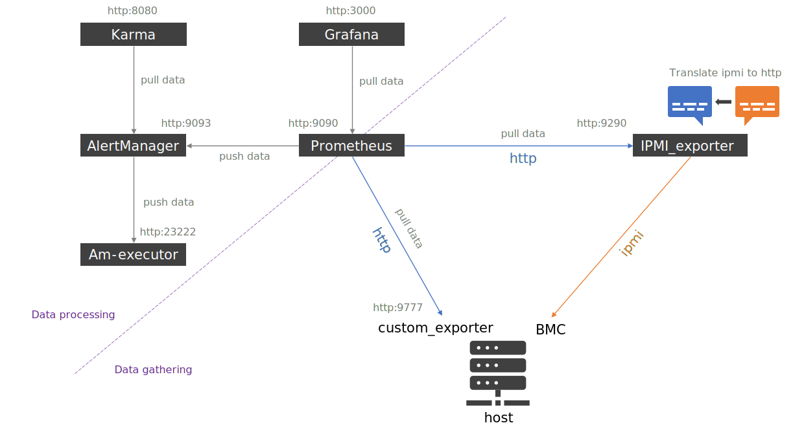

# Monitoring

Now that our cluster is ready and running, it important to deploy a monitoring. Tool proposed here is Prometheus.

<div class="comment-tile">
    <div class="comment-tile-image">
        
    </div>
    <div class="comment-tile-text">
        <p>In order to allow you to understand how all of this works, we will first launch every tools manually. Once everything is working fine, we will implement service files so tools start via systemd at system startup.</p>
    </div>
</div>

## Global ecosystem schema



## Prometheus

Open a first shell on server, using an ssh connection with 9090 local port forwarding (`ssh username@server -L 9090:localhost:9090`). Then on server, using wget command, download prometheus linux-amd64 binary from releases section on https://github.com/prometheus/prometheus (files are in "assets").

Extract archive using tar command (`tar xvzf file.tar.gz`). In extracted folder, you will see the prometheus static binary, and a configuration file sample prometheus.yml.

Launch manually prometheus using:

```
./prometheus --config.file prometheus.yml
```

Prometheus should start. Once started, let it run (you can stop it with a single Ctrl+c).

Since you connected with a port forwarding on port 9090, your local port is now linked to the server port. Open a web browser on your local system and go to `http://localhost:9090` . Prometheus interface should start.

Take the time to browse the interface. Have a special look on status:targets and status:configuration .
You will see that currently prometheus as a single target: himself (which we can disable if desired).

Let now this prometheus shell open and let prometheus running. We will come back to it later.

## Node exporter

We now want to grab some data from our current node. To do so, we are going to use node_exporter. Remember that node_exporter exports a huge amount of data, and so this exporter should not be deployed on all nodes (only important ones) to avoid overloading prometheus.

Open a new ssh connection, this time with a local port forwarding on port 9100 (`-L 9100:localhost:9100`).

Then, on server, using wget, download latest node_exporter release from releases (linux-amd64) on https://github.com/prometheus/node_exporter/ .

Extract archive, and start node_exporter binary without any specific configuration (some configuration is available if needed, but for this training, default parameters are enough).

```
./node_exporter
```

Then, since we linked our local port 9100 to the same one on remote server, using your local browser, connect to http://localhost:9100/metrics . You will see all metrics provided by node_exporter running on the server.

Now we need to make prometheus aware of this exporter so it can pull data from it.

Let node_exporter running, and go back to prometheus shell, and stop prometheus (Ctrl+c). Then edit prometheus.yml configuration file, and add our node_exporter as a new target:

```yaml title="prometheus.yml"
# A scrape configuration containing exactly one endpoint to scrape:
# Here it's Prometheus itself.
scrape_configs:
  - job_name: "node_exporter"
    static_configs:
      - targets: ["localhost:9100"]
  # The job name is added as a label `job=<job_name>` to any timeseries scraped from this config.
  - job_name: "prometheus"
    # metrics_path defaults to '/metrics'
    # scheme defaults to 'http'.
    static_configs:
      - targets: ["localhost:9090"]
```

Note that we are using `localhost:9100` here since node_exporter is running on the same server than prometheus (`localhost` means on the same system, it is equivalent to `127.0.0.1`). If we need to pull data from a remote server, we would replace localhost by the remote server ip or hostname.

And restart prometheus the same way than before. Now on your local browser, connect to prometheus as before (http://localhost:9090), and go into status:targets. Node exporter target should now be displayed here, and should be tagged as "UP" after few seconds. Prometheus will now pull data from this exporter every 15s (default value, can be changed in configuration file).

Wait 1-2 minutes, and go into graph tab. Ask for a table first, and request latest value of `node_network_transmit_bytes_total` and click execute to display it. You should see the current total value for each network interfaces your server posses. You can also ask for `node_load1` value for example. You can browse node_exporter page (http://localhost:9100/metrics) to see all values provided by node_exporter, with comments.

Now ask for `node_load1` or any other value, and ask for a graph instead of a table. You should see a graphic of your value over time. Prometheus graphics are made for system administrator. We will see more shiny graphics with grafana later.

## Alertmanager

We now want to create some alerts, and we want to manage these alerts using Alertmanager. Alertmanager job is to pack alerts and send emails/sms/etc to system administrator(s). For example, if your whole cluster go down, you do not want to receive 1000 alerts (one per node if you have 1000 nodes). Alertmanager job is to pack all these alerts and send system administrator a single email with a summary.

<div class="comment-tile">
    <div class="comment-tile-image">
        
    </div>
    <div class="comment-tile-text">
        <p>It is important to understand who do what: Prometheus is in charge of evaluating alert rules agains its data, and then it "Fires" alerts and send them to Alertmanager, who is in charge of organizing and pack them. This is not Alertmanager job to evaluate rules and Fire alerts!</p>
    </div>
</div>

Open a new shell, and connect to server using this time `-L 9093:localhost:9093`.

Once connected, download latest Alertmanager binary from https://github.com/prometheus/alertmanager/ .

Extract the archive, and you will find inside extracted folder the alertmanager static binary and a sample configuration file, which will be enough for this training.

Launch now alertmanager using:

```
./alertmanager --config.file alertmanager.yml 
```

You can reach alertmanager web interface on your http://localhost:9093 .

Right now, alertmanager will not report any alerts, since we haven't created any alerts for prometheus, and we haven't made prometheus aware of alertmanager.

### Create new alert

Let's create a new alert that will check if all exporters are up and reachable. (so if our node_exporter go down, alert will trigger).

In prometheus shell, stop prometheus, and at the same place, create a file called my_rules.yml with the following content:

```yaml title="my_rules.yml"
groups:
  - name: General alerts
    rules:
      - alert: Exporter_down
        expr: up == 0
        for: 1m
        labels:
          severity: critical
        annotations:
          summary: "Exporter down (instance {{ $labels.instance }})"
          description: "Prometheus exporter down\n  VALUE = {{ $value }}\n  LABELS: {{ $labels }}"
```

This means that if for any exporter, up value is equal to 0 (up is a value you can get in graph table of prometheus interface), then if this happen during more than 1 minute, then prometheus should consider it as a critical alert.

Now open prometheus.yml file, and register this new rules file by adding:

```yaml
# Load rules once and periodically evaluate them according to the global 'evaluation_interval'.
rule_files:
  - "my_rules.yml"
```

We now need to make prometheus aware of alertmanager.

### Send alerts to alertmanager

Edit again prometheus.yml file, and ask prometheus to send alerts that trigger (fire) to our local alertmanager at port 9093, by adding:

```yaml
# Alertmanager configuration
alerting:
  alertmanagers:
    - static_configs:
        - targets:
          - localhost:9093
```

You can see that we can define multiple alertmanager instances for redundancy.

Now restart prometheus, and browse interface. In Alerts tab, you should now see your new alert. It should be (0 active) since our node_exporter is running.

### Trigger an alert

Go into your node_exporter shell, and stop node_exporter (Ctrl+c). Then wait 1-2 minute and refresh Alerts page or prometheus web interface. You will see that alert status went to "pending", which means it is now waiting 1 minute more, and if after 1 minute exporter is still down, the alert will be triggered. Wait again 1-2 minutes, refresh, and you will see alert is now in red, which means it triggered. You can expand the alert to get more details on what is going on.

Now, connect to alertmanager interface (http://localhost:9093) and you will be able to see the alert. We haven't configured alertmanager to send alerts via mails, so alertmanager will only display sorted alerts (alerts are sorted by groups for convenient reading). Alertmanager interface is not very user friendly for day to day usage as alertmanager job is more focused on packing and sending alerts, we will now see Karma later to improve that.

## Karma

Karma is an optional tool, but useful for day to day monitoring. Karma allows to organize alerts on a dashboard, to be displayed on a permanent screen in system administrator's room.

Open a new terminal and ssh using `-L 8080:localhost:8080`.

Download karma binary from https://github.com/prymitive/karma, extract archive, and launch karma without a configuration file:

```
./karma-linux-amd64 --alertmanager.uri http://localhost:9093
```

And then reach your http://localhost:8080 to reach Karma web interface.
You should see the alert reported by prometheus via alertmanager. Feel free to use filters to sort issues, organize panel, etc.

Note that Karma can accept a configuration file, to customize interface, setup identification, etc. You can report to karma documentation on how to create this configuration file.

## Grafana

Grafana allows to create nice day to day dashboards to visualize metrics.

<div class="comment-tile">
    <div class="comment-tile-image">
        
    </div>
    <div class="comment-tile-text">
        <p>Never neglect Grafana and Karma. A nice display is key to make cluster administrators efficients and happy. A good Grafana organisation will be composed of a main page with a summary of all part of the cluster (with red/yellow/green colors to instantly see if all is ok or not), and then dedicated sub-pages for details on each part.</p>
    </div>
</div>

Open a new terminal, and this time connect on server using `-L 3000:localhost:3000`.

Then download grafana OSS (be sure to take the OSS version, not the enterprise version) from https://grafana.com/grafana/download?edition=oss

Url should be similar to https://dl.grafana.com/oss/release/grafana-9.4.3.linux-amd64.tar.gz.

Once downloaded, extract archive, and inside extracted folder, go into bin folder, and launch grafana server this way:

```
./grafana-server
```

Now connect to your http://localhost:3000 on local web browser, and uses admin / admin as credentials to connect. You will be asked to update password, keep it "admin" for this training or update it if needed.

Once inside grafana interface, add a new source, and request a Prometheus source, and use http://localhost:9090 URL as source endpoint. Validate and test it.

Once source has been setup, create a new dashboard, and add a new panel on it.

Use our prometheus as source, and try to use `node_load1` as query to display it. You can then customize legend, title, etc. Add other elements to dashboard, etc. Remember to save your changes on the top right corner every time.

If you want to go further, a nide tutorial is available at https://grafana.com/tutorials/grafana-fundamentals/ .

## Custom exporter

There is a long list of available exporters: https://prometheus.io/docs/instrumenting/exporters/

However, you may need to create your own exporter, to get very specific data. There are multiple ways to do that, I will expose here how to do it in Python.
As usual, either install modules into system, or use a python venv for better portability.

Open another tunnel and bind port 8777 to your local host at the same time: `-L 8777:localhost:8777`.

Install now Prometheus Client python modules:

```
pip3 install prometheus-client
```

And create a custom exporter to monitor a specific command output. We will try to parse the output of `df` command to get system root file system usage in percent.

To do so, we are going to use the following pipeline command: `df -h | grep '/$' | awk -F ' ' '{print $5}' | sed 's/%//'`

Create a file **my_exporter.py** with the following content:

```python
#!/usr/bin/env python3
# This is a minimal exporter, to be used as a reference.

import time
import subprocess
import sys
from prometheus_client.core import GaugeMetricFamily, REGISTRY
from prometheus_client import start_http_server


class CustomCollector(object):
    def __init__(self):
        pass

    def collect(self):
        try:
            stdout, stderr = subprocess.Popen("df -h | grep '/$' | awk -F ' ' '{print $5}' | sed 's/%//'", stdout=subprocess.PIPE, stderr=subprocess.STDOUT, shell=True).communicate()
        except OSError as e:
            print("Execution failed:", e, file=sys.stderr)
        print("Get root FS usage: " + str(stdout))
        g = GaugeMetricFamily("root_fs_percent", 'Root FS usage in percent')
        g.add_metric(["root_fs_percent"], int(stdout))
        yield g


if __name__ == '__main__':
    start_http_server(8777)
    REGISTRY.register(CustomCollector())
    while True:
        time.sleep(1)
```

Make this file executable, and launch the exporter:

```
chmod +x my_exporter.py
./my_exporter.py
```

You can now browse to http://localhost:8777 and see metrics provided by the exporter. At the very bottom, you should see your FS usage in percent.

Try now to add this exporter into prometheus main configuration so prometheus pulls it, and add a new gauge item into grafana dashboard with your FS usage.

## Create services files

Now that all daemons are running fine, you will need to register them as services, so they can be managed by systemd and so automatically start/restart.

For each daemon, we will create a dedicated service file in /etc/systemd/system/ folder.

### Prometheus

Create file /etc/systemd/system/prometheus.service with the following content:

```INI title="prometheus.service"
[Unit]
  Description=Prometheus Monitoring
  Wants=network-online.target
  After=network-online.target

[Service]
  User=prometheus
  Group=prometheus
  Type=simple
  ExecStart=/bin/prometheus \
    --config.file /etc/prometheus/prometheus.yml \
    --storage.tsdb.path /var/lib/prometheus/ \
    --web.console.templates=/etc/prometheus/consoles \
    --web.console.libraries=/etc/prometheus/console_libraries $PROMETHEUS_OPTIONS

[Install]
  WantedBy=multi-user.target
```

And ensure you have copied binary to bin, created needed folders like /var/lib/prometheus/ and that you have copied prometheus.yml configuration file to /etc/prometheus/prometheus.yml.
Also ensure you have created prometheus user to avoid running prometheus as root.
Note that you can add a specific argument to manage data rententions. For 1 year for example: `--storage.tsdb.retention.time=1y`. Refer to Prometheus main documentation for available parameters.

### Alertmanager

Create file /etc/systemd/system/alertmanager.service with the following content:

```INI title="alertmanager.service"
[Unit]
  Description=Alertmanager
  Wants=network-online.target
  After=network-online.target

[Service]
  User=alertmanager
  Group=alertmanager
  Type=simple
  WorkingDirectory=/etc/alertmanager/
  ExecStart=/bin/alertmanager \
    --config.file=/etc/alertmanager/alertmanager.yml

[Install]
  WantedBy=multi-user.target
```

Ensure to copy binary to /bin and ensure to create /etc/alertmanager folder and related alertmanager.yml file.
Also ensure you have created alertmanager user to avoid running alertmanager as root.

### Node_exporter

Same concept, but this time we need to run node exporter as root. You can run node exporter as standard user, but you will not get all data. It is up to you to choose depending of security needs and data needs.

```INI title="node_exporter.service"
[Unit]
  Description=node_exporter
  Wants=network-online.target
  After=network-online.target

[Service]
  User=root
  Group=root
  Type=simple
  WorkingDirectory=/etc/node_exporter/
  ExecStart=/bin/node_exporter

[Install]
  WantedBy=multi-user.target
```

### Karma

Again, same concept for Karma:

```INI title="karma.service"
[Unit]
  Description=karma
  Wants=network-online.target
  After=network-online.target

[Service]
  User=karma
  Group=karma
  Type=simple
  WorkingDirectory=/etc/karma/
  ExecStart=/bin/karma \
    --config.file=/etc/karma/karma.yml

[Install]
  WantedBy=multi-user.target
```

### Start all services

Now start all tools one by one and enable them at boot:

```
systemctl daemon-reload
systemctl start prometheus
systemctl start alertmanager
systemctl start karma
systemctl start node_exporter
systemctl enable prometheus
systemctl enable alertmanager
systemctl enable karma
systemctl enable node_exporter
```

## IPMI exporter

An ipmi exporter is available at https://github.com/prometheus-community/ipmi_exporter

This exporter acts as a "translator" between IPMI protocol and HTTP. Basically, each time you send a request to this exporter, it will contact the requested target BMC via IPMI, get data via IPMI, format them to HTTP and answer to Prometheus pull.

```yaml title="ipmi_config.yml"
modules:
  server_type_A:
    user: ADMIN
    pass: ADMIN
    driver: "LAN_2_0"
    privilege: "user"
    timeout: 10000
    collectors:
    - bmc
    - ipmi
    - chassis
    exclude_sensor_ids:
```

You will need to tune this with your BMCs credentials.

Create now dedicated service file:

```INI title="ipmi_exporter.service"
[Unit]
  Description=ipmi_exporter
  Wants=network-online.target
  After=network-online.target

[Service]
  User=ipmi_exporter
  Group=ipmi_exporter
  Type=simple
  WorkingDirectory=/etc/ipmi_exporter/
  ExecStart=/bin/ipmi_exporter \
    --config.file=/etc/ipmi_exporter/ipmi_config.yml

[Install]
  WantedBy=multi-user.target
```

And under `scrape_configs:` key in prometheus.yml config file, you will need to add:

```yaml
  - job_name: ipmi_server_type_A
    params:
      module: [server_type_A]
    metrics_path: /ipmi
    scheme: http
    static_configs:
      - targets: ['c001-bmc']
      - targets: ['c002-bmc']
      - targets: ['c003-bmc']
    relabel_configs:
    - source_labels: [__address__]
      separator: ;
      regex: (.*)
      target_label: __param_target
      replacement: ${1}
      action: replace
    - source_labels: [__param_target]
      separator: ;
      regex: (.*)
      target_label: instance
      replacement: ${1}
      action: replace
    - separator: ;
      regex: .*
      target_label: __address__
      replacement: localhost:9290
      action: replace
```

You may need to replace `localhost:9290` by your ipmi_exporter host.
